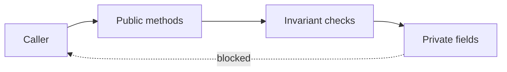

import { ConceptTemplate } from '@/features/kb/components/templates/ConceptTemplate'
import { Callout } from '@/features/kb/components/mdx/Callout'
import { ComparisonTable } from '@/features/kb/components/mdx/ComparisonTable'

export default function Layout({ children }) {
  return (
    <ConceptTemplate title="Encapsulation">
      {children}
    </ConceptTemplate>
  )
}

**Encapsulation** keeps representation and invariant-checking in the same place. Callers mutate state only through methods that refuse illegal combinations.

## 1. Deep Dive and Mechanics

Access modifiers (`private`, `protected`, package, `internal`) are the usual language tool. They are not sufficient. A public getter that returns a live mutable list still leaks the representation.

**Invariant preservation.** A money type that stores cents as an integer must reject negative values in every constructor and factory. If any path writes the field raw, the invariant is gone.

**Boundary types.** Encapsulation is strongest at module or package edges. Inside a package, friend access can be fine. Across teams, treat every public type as a published API.

<Callout icon="warning" title="Getter-and-setter is not encapsulation">
A pair of public accessors for every field is a remote control for the same structure. Encapsulate behavior, not just names.
</Callout>

## 2. Mathematical / Theoretical Foundation

An encapsulated object is a state machine. Methods are the only transitions. The reachable state set should be exactly the legal one. Representation exposure is a transition that escapes the machine.

Privacy is a static scoping property. Some languages enforce it in the type system; others rely on convention and closures.

<ComparisonTable
  headers={['Technique', 'What it protects', 'Failure mode']}
  rows={[
    ['Private fields', 'Casual writes', 'Reflection, same-package friends'],
    ['Defensive copies', 'Aliasing of internals', 'Forgotten on a new getter'],
    ['Immutable types', 'All mutation', 'Hidden caches that mutate'],
    ['Modules / packages', 'Cross-team access', 'Re-exporting internals'],
  ]}
/>

## 3. Real-World Implementation

```python
class Money:
    def __init__(self, cents):
        if cents < 0:
            raise ValueError("cents must be non-negative")
        self._cents = cents

    def add(self, other):
        return Money(self._cents + other._cents)

    @property
    def cents(self):
        return self._cents
```

There is no setter. The only way to get a new amount is `add` or a new `Money`. The invariant cannot be bypassed without touching `_cents` on purpose.

## 4. Visualizations



## 5. Interview Prep

**Q: Why not public fields for a DTO?**
**A:** For a pure data bag that crosses a process boundary, public fields can be honest. For a domain object with rules, public fields invite broken states.

**Q: Encapsulation versus information hiding?**
**A:** Information hiding is the design goal. Encapsulation is how OOP languages usually implement it: data and methods in one type, access rules on members.

**Q: Can you encapsulate in a language with no access modifiers?**
**A:** Yes. Closures, naming conventions, and separate modules all work. Python's leading underscore is social; the module boundary is the real wall.

## 6. Production Use Cases

- **Ledger and money types** that must never go negative or mix currencies silently.
- **Connection pools** that expose checkout and release, never the raw list of sockets.
- **Security principals** whose roles cannot be appended by a casual field write.

<Callout icon="tip" title="Return copies or views">
If you must expose a collection, return an immutable view or a copy. Returning the internal list is an open door.
</Callout>
