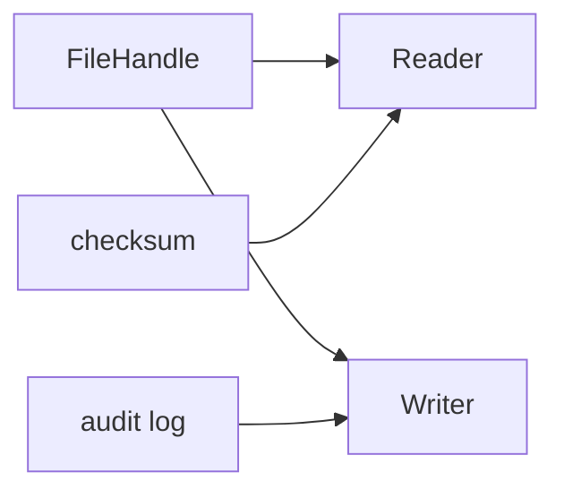

import { ConceptTemplate } from '@/features/kb/components/templates/ConceptTemplate'
import { Callout } from '@/features/kb/components/mdx/Callout'
import { ComparisonTable } from '@/features/kb/components/mdx/ComparisonTable'

export default function Layout({ children }) {
  return (
    <ConceptTemplate title="Interface Segregation Principle (ISP)">
      {children}
    </ConceptTemplate>
  )
}

The **Interface Segregation Principle** says a fat interface is a coupling tax. If a caller only needs `read`, do not make it compile against `write`, `flush`, and `adminWipe`.

## 1. Deep Dive and Mechanics

A `Worker` interface with `work` and `eat` forces a `Robot` to stub `eat`. Split into `Workable` and `Eatable`. The robot implements one. Humans implement both.

**Role interfaces.** Each interface should match a client role, not the implementor's entire surface. One class may implement many small interfaces.

**Header / package impact.** In compiled languages, a fat interface means extra rebuilds and extra mocks. In dynamic languages you still pay in test doubles and accidental calls.

<Callout icon="info" title="ISP is about clients">
You do not split an interface because the implementor is large. You split it because different callers need different slices.
</Callout>

## 2. Mathematical / Theoretical Foundation

Dependence is a set of names a client mentions. ISP minimizes that set. The implementor still provides a union of roles. Clients depend on projections of that union.

This is the type-theoretic cousin of the Interface Segregation slogan: width subtyping lets a richer object satisfy a thinner required type.

<ComparisonTable
  headers={['Shape', 'Client burden', 'When it fits']}
  rows={[
    ['Fat interface', 'Mock every method', 'Closed, tiny API'],
    ['Role interfaces', 'Mock one role', 'Several client kinds'],
    ['One method interfaces', 'Very small mocks', 'True single operations'],
  ]}
/>

## 3. Real-World Implementation

```python
class Reader:
    def read(self, n):
        raise NotImplementedError

class Writer:
    def write(self, data):
        raise NotImplementedError

class FileHandle(Reader, Writer):
    def __init__(self, buf):
        self.buf = buf

    def read(self, n):
        return self.buf[:n]

    def write(self, data):
        self.buf += data

def checksum(source: Reader):
    return hash(source.read(64))
```

`checksum` depends only on `Reader`. A write-only test fake is never required.

## 4. Visualizations



## 5. Interview Prep

**Q: ISP versus SRP?**
**A:** SRP splits implementations by reason to change. ISP splits contracts by client need. A class can have one reason to change and still expose three role interfaces.

**Q: Is a one-method interface always better?**
**A:** No. If every client always uses `read` and `skip` together, splitting them makes call sites noisy. Segregate along real usage seams.

**Q: How does this show up in Java streams or C-sharp collections?**
**A:** `ReadOnlyList` versus `IList`, `ReadableByteChannel` versus `ByteChannel`. The thin type is the one you accept in a method parameter.

## 6. Production Use Cases

- **Repository ports** split into `OrderReader` and `OrderWriter` for query versus command paths.
- **Device APIs** with separate control and telemetry interfaces.
- **Auth**: `IdentityLookup` versus `PasswordReset` so a public page does not depend on admin methods.

<Callout icon="tip" title="Parameter types should be thin">
Take the smallest interface the method needs. Return a richer type if the caller is likely to need more.
</Callout>
