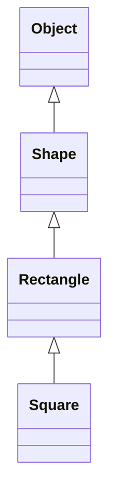

import { ConceptTemplate } from '@/features/kb/components/templates/ConceptTemplate'
import { Callout } from '@/features/kb/components/mdx/Callout'
import { ComparisonTable } from '@/features/kb/components/mdx/ComparisonTable'

export default function Layout({ children }) {
  return (
    <ConceptTemplate title="Inheritance">
      {children}
    </ConceptTemplate>
  )
}

**Single inheritance** means a class names at most one parent class. Java, C-sharp, and Smalltalk take this path. You still get a chain: `Square` extends `Rectangle` extends `Shape` extends `Object`.

## 1. Deep Dive and Mechanics

The subclass obtains the parent's fields and methods, then adds or overrides. Construction walks the chain from the root down. Dispatch walks from the concrete class up until it finds an implementation.

**Why single?** One superclass gives a single vtable layout and no diamond of ambiguous state. Multiple capabilities are expressed as interfaces, not extra superclasses.

**Costs.** The subclass is tightly coupled to the parent's protected surface. A change in a mid-level class ripples to every descendant. Deep chains become archaeology.

<Callout icon="warning" title="Inheritance is not for reuse alone">
If you only want helper methods, extract a function or collaborator. Inherit when there is a genuine is-a relation that must hold at every call site.
</Callout>

## 2. Mathematical / Theoretical Foundation

Single inheritance induces a tree (or a forest) of types. The subclass relation is a partial order. Liskov substitution says every theorem true of the parent type must remain true of the child.

Layout: fields are concatenated along the chain. A pointer to the subclass can be adjusted to a parent view with a constant offset of zero in single inheritance without virtual bases.

<ComparisonTable
  headers={['Style', 'Parents allowed', 'State reuse', 'Ambiguity']}
  rows={[
    ['Single class inheritance', 'One class', 'Yes', 'None from multiple classes'],
    ['Plus interfaces', 'Many interfaces', 'No', 'Default-method clashes'],
    ['Multiple class inheritance', 'Many classes', 'Yes', 'Diamond problem'],
  ]}
/>

## 3. Real-World Implementation

```python
class Shape:
    def area(self):
        raise NotImplementedError

class Rectangle(Shape):
    def __init__(self, w, h):
        self.w = w
        self.h = h

    def area(self):
        return self.w * self.h

class Square(Rectangle):
    def __init__(self, side):
        super().__init__(side, side)
```

`Square` has one superclass. Extra capabilities would be mixins or protocols, not a second class parent.

## 4. Visualizations



## 5. Interview Prep

**Q: Why did Java forbid multiple class inheritance?**
**A:** To avoid the diamond problem for fields and constructor order, and to keep a simple binary layout. Interfaces later regained some multiple-inheritance-of-behavior via default methods.

**Q: Single inheritance versus composition?**
**A:** Composition keeps a has-a link you can change at runtime. Inheritance is a compile-time is-a link. Prefer composition unless you need polymorphism through the parent type.

**Q: What is `super` for?**
**A:** It names the next implementation up the chain. Use it to extend, not silently replace, parent behavior when the parent invariant still matters.

## 6. Production Use Cases

- **Framework base classes**: `HttpServlet`, `unittest.TestCase`, UI `Widget`.
- **Exception hierarchies** with a single parent per class.
- **ORM entity bases** that share id and timestamp fields.

<Callout icon="tip" title="Keep the chain short">
Two or three levels is usually enough. If you need a family tree chart to explain a bug, flatten the design.
</Callout>
