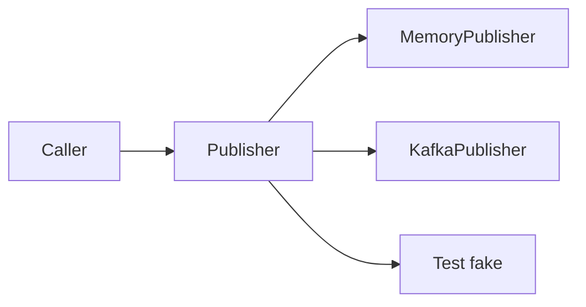

import { ConceptTemplate } from '@/features/kb/components/templates/ConceptTemplate'
import { Callout } from '@/features/kb/components/mdx/Callout'
import { ComparisonTable } from '@/features/kb/components/mdx/ComparisonTable'

export default function Layout({ children }) {
  return (
    <ConceptTemplate title="Interfaces">
      {children}
    </ConceptTemplate>
  )
}

An **interface** (protocol, trait-like surface) lists methods a type must provide. It says what you can ask, not how the answer is computed.

## 1. Deep Dive and Mechanics

Callers take the interface. Concrete classes implement it. At runtime, an invokevirtual or invokeinterface instruction loads the object's type and finds the matching method.

**Default methods** (Java 8+, C-sharp default interface methods) let you add behavior without breaking every implementor. They blur the old "interfaces have no code" rule.

**Structural vs nominal.** Go and TypeScript treat a type as satisfying a surface if the methods exist. Java and C-sharp require an explicit `implements` clause. Structural typing is flexible; nominal typing makes the contract searchable and versionable.

<Callout icon="info" title="Interfaces are types">
A variable of interface type holds a reference to some implementor. The static type is the contract. The dynamic type is the class that actually runs.
</Callout>

## 2. Mathematical / Theoretical Foundation

An interface is a signature: a set of method names and function types. Implementation is a proof that a class provides inhabitants for every name. Subtyping on interfaces is width and depth: you may add methods (in some systems) and refine return types covariantly when the language allows it.

Dispatch through an interface is often a second-level lookup (itables) rather than a single vtable slot, which is why it can be slightly slower until the JIT speculates a concrete class.

<ComparisonTable
  headers={['Feature', 'Classic interface', 'Abstract class']}
  rows={[
    ['Multiple on one class', 'Yes', 'No in Java / C-sharp'],
    ['Fields / state', 'No (except constants)', 'Yes'],
    ['Constructors', 'No', 'Yes'],
    ['Adding methods later', 'Default methods help', 'Concrete methods help'],
  ]}
/>

## 3. Real-World Implementation

```python
from typing import Protocol

class Publisher(Protocol):
    def publish(self, topic: str, payload: bytes) -> None: ...

class MemoryPublisher:
    def __init__(self):
        self.messages = []

    def publish(self, topic: str, payload: bytes) -> None:
        self.messages.append((topic, payload))

def emit_created(bus: Publisher, order_id: str) -> None:
    bus.publish("orders.created", order_id.encode())
```

`emit_created` never names `MemoryPublisher`. A Kafka adapter can replace it without touching callers.

## 4. Visualizations



## 5. Interview Prep

**Q: Interface versus abstract class?**
**A:** Use an interface for a capability. Use an abstract class when you must share fields or a template algorithm and you only need one parent.

**Q: Why are fat interfaces a problem?**
**A:** Implementors are forced to stub methods they do not use. That is the Interface Segregation Principle: split by client need.

**Q: Can interfaces have state?**
**A:** Historically no. Some languages now allow static fields or default methods that reach static storage. Instance fields still belong on a class.

## 6. Production Use Cases

- **Ports** in hexagonal architecture: mailer, clock, repository.
- **Plugin systems** where third parties implement a published interface.
- **Test fakes** that implement the same contract as production adapters.

<Callout icon="tip" title="Own the interface on the consumer side">
If you do not control the implementor, define the interface in the calling module and adapt the vendor type. That is dependency inversion in practice.
</Callout>
