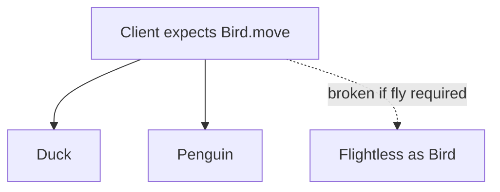

import { ConceptTemplate } from '@/features/kb/components/templates/ConceptTemplate'
import { Callout } from '@/features/kb/components/mdx/Callout'
import { ComparisonTable } from '@/features/kb/components/mdx/ComparisonTable'

export default function Layout({ children }) {
  return (
    <ConceptTemplate title="Liskov Substitution Principle (LSP)">
      {children}
    </ConceptTemplate>
  )
}

**Liskov Substitution** is the behavioral contract behind inheritance. If a function works with a `Bird`, it must still work when you pass a `Duck`. A `Penguin` that throws on `fly` is not a behavioral subtype of a flying `Bird`.

## 1. Deep Dive and Mechanics

Barbara Liskov and Jeannette Wing formalized this with preconditions, postconditions, and invariants. A subtype may:

- **Weaken preconditions** (accept more inputs).
- **Strengthen postconditions** (promise more about outputs).
- **Preserve invariants** of the parent.

It may not require extra setup the parent did not require, or return values the parent forbade, or throw new unchecked surprises for cases the parent handled.

The classic `Square extends Rectangle` bug: code that sets width and height independently breaks when a square forces them equal.

<Callout icon="warning" title="Is-a in English is not is-a in types">
A square is a rectangle in geometry. In mutable code it is not a rectangle if rectangle clients expect independent sides.
</Callout>

## 2. Mathematical / Theoretical Foundation

For all properties P that you can prove about objects of type T, P must hold for objects of type S if S <: T. That is the original slogan.

In contract terms: pre_S ≤ pre_T (weaker), post_S ≥ post_T (stronger), history constraints of T still hold when methods of S run.

History constraint: a subtype cannot add methods that let callers break a parent invariant even if the inherited methods look fine.

<ComparisonTable
  headers={['Change in subtype', 'LSP', 'Typical smell']}
  rows={[
    ['Throws new error on valid parent input', 'Breaks', 'UnsupportedOperation'],
    ['Accepts extra input formats', 'OK', 'More tolerant parse'],
    ['Narrows return type covariantly', 'Usually OK', 'Factory returns child'],
    ['Strengthens input requirements', 'Breaks', 'Casts or extra flags'],
  ]}
/>

## 3. Real-World Implementation

```python
class Bird:
    def move(self):
        return "moves"

class Duck(Bird):
    def move(self):
        return "swims or flies"

class Penguin(Bird):
    def move(self):
        return "swims"
```

Do not put `fly` on `Bird` if not every bird flies. Put `fly` on a `FlyingBird` type, or use a capability interface.

## 4. Visualizations



## 5. Interview Prep

**Q: How do you detect LSP violations?**
**A:** Look for `instanceof` checks, empty overrides, and `UnsupportedOperationException` in a subtype. Those are the subtype admitting it is not substitutable.

**Q: Does immutability help?**
**A:** Yes. Immutable `Square` and `Rectangle` can share a read-only shape type. Mutation is what made the square-rectangle example fail.

**Q: LSP versus type checkers?**
**A:** The compiler checks signatures. LSP is about behavior. A program can type-check and still violate LSP.

## 6. Production Use Cases

- **Repository implementations** that honor the same failure model as the interface.
- **Test fakes** that must not be "stricter" than production (rejecting inputs production accepts).
- **Collections**: a `ReadOnlyList` is not a `List` if `List` promises `add`.

<Callout icon="tip" title="Split types by behavior">
If a method does not apply to every subtype, it does not belong on the parent. That is how you keep substitution honest.
</Callout>
