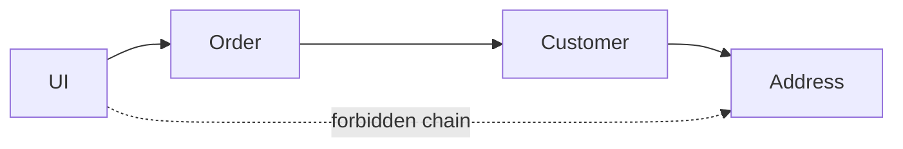

import { ConceptTemplate } from '@/features/kb/components/templates/ConceptTemplate'
import { Callout } from '@/features/kb/components/mdx/Callout'
import { ComparisonTable } from '@/features/kb/components/mdx/ComparisonTable'

export default function Layout({ children }) {
  return (
    <ConceptTemplate title="Law of Demeter">
      {children}
    </ConceptTemplate>
  )
}

The **Law of Demeter** (LoD, "don't talk to strangers") limits which objects a method may send messages to. A method of `A` should talk to `A` itself, `A`'s fields, objects created in the method, and objects passed as arguments — not to `a.getB().getC().do()`.

## 1. Deep Dive and Mechanics

The chain `order.getCustomer().getAddress().getZip()` couples the caller to the entire path. If address moves, every chain breaks. LoD says: ask `order` for the zip, and let `order` know how to get it.

**Tell, don't ask.** Instead of pulling data out and deciding, tell the friend to do the work. That keeps knowledge next to the data.

**DTOs and builders.** A chain of immutable withers or a fluent builder is not the same smell. LoD is about reaching through owned internals of living domain objects, not about a one-shot data bag.

<Callout icon="info" title="It is a coupling rule">
LoD is not a performance rule. One extra method on `Order` is cheaper than twelve callers knowing `Customer` and `Address`.
</Callout>

## 2. Mathematical / Theoretical Foundation

Treat the object graph as a directed graph. A method may send messages to nodes at distance 0 (self) and 1 (friends). Chains of length 2 or more increase the cut set of types you depend on.

Each extra hop multiplies the reasons the caller must change (fragile base along the path).

<ComparisonTable
  headers={['Call', 'LoD', 'Fix']}
  rows={[
    ['this.field.method', 'OK, friend'],
    ['arg.method', 'OK, argument'],
    ['arg.getX().getY()', 'Violation', 'arg.doY() or a query on arg'],
    ['factory().method', 'OK, created here'],
  ]}
/>

## 3. Real-World Implementation

```python
class Address:
    def __init__(self, zip_code):
        self._zip = zip_code

    def zip_code(self):
        return self._zip

class Customer:
    def __init__(self, address):
        self._address = address

    def zip_code(self):
        return self._address.zip_code()

class Order:
    def __init__(self, customer):
        self._customer = customer

    def shipping_zip(self):
        return self._customer.zip_code()
```

The UI asks `order.shipping_zip()`. It never names `Address`.

## 4. Visualizations



## 5. Interview Prep

**Q: Is `a.getB().getC()` always wrong?**
**A:** It is a smell on mutable domain models. It is normal for navigating a JSON tree or a compiled AST in a single module. Apply LoD where independent teams own the middle objects.

**Q: Does LoD cause huge facade classes?**
**A:** If `Order` grows thirty forwarding methods, the model is wrong. Split operations, or pass a small view object created for that use case.

**Q: How does this relate to encapsulation?**
**A:** Encapsulation hides fields. LoD hides the graph. You can have private fields and still leak structure through getters.

## 6. Production Use Cases

- **Domain services** that ask aggregates for outcomes, not for nested entities.
- **UI view-models** that flatten a path once at the edge.
- **API resources** that do not expose internal entity navigation.

<Callout icon="tip" title="Name the question you are asking">
`shipping_zip` is a question. `getCustomer().getAddress().getZip()` is a scavenger hunt. Write the question.
</Callout>
