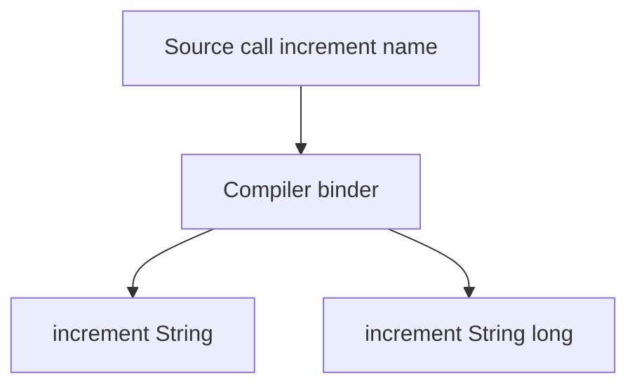

import { ConceptTemplate } from '@/features/kb/components/templates/ConceptTemplate'
import { Callout } from '@/features/kb/components/mdx/Callout'
import { ComparisonTable } from '@/features/kb/components/mdx/ComparisonTable'

export default function Layout({ children }) {
  return (
    <ConceptTemplate title="Method Overloading">
      {children}
    </ConceptTemplate>
  )
}

**Method overloading** is one name, many signatures. The compiler picks the best match from the argument types it can see. After compilation, the methods are distinct symbols.

## 1. Deep Dive and Mechanics

Java and C-sharp allow overloading on arity and parameter types, not on return type alone. C++ can also overload operators. Python does not overload in this sense: a second `def` of the same name replaces the first.

**Resolution.** Candidates are collected, inapplicable ones dropped, then the most specific remaining method wins. Ties are compile errors. Varargs, generics, and boxing expand the candidate set.

**Bridge methods.** Generics and covariant returns may cause the compiler to emit extra methods so the JVM can still pick by descriptor.

<Callout icon="warning" title="Overloads plus overrides">
The static argument types pick the overload. The runtime receiver type picks the override. Debug both steps when a call looks "wrong."
</Callout>

## 2. Mathematical / Theoretical Foundation

Overloading is ad-hoc polymorphism. Each signature is a separate function. Name resolution is a partial function from a tuple of static types to a declaration.

Because return types are not inputs to that function in Java, you cannot overload on return type: the input tuple would be identical.

<ComparisonTable
  headers={['Feature', 'Overloading', 'Overriding']}
  rows={[
    ['Same signature', 'No, must differ', 'Yes, must match'],
    ['When chosen', 'Compile time', 'Run time'],
    ['Languages', 'Java, C-sharp, C++', 'Any with virtual methods'],
    ['Python', 'Not supported', 'Supported'],
  ]}
/>

## 3. Real-World Implementation

```java
public final class Metrics {
    public void increment(String name) {
        increment(name, 1);
    }

    public void increment(String name, long delta) {
        // write to the backend
    }
}
```

The one-argument form is syntax sugar that forwards to the canonical two-argument form.

## 4. Visualizations



## 5. Interview Prep

**Q: Can you overload by return type?**
**A:** Not in Java or C-sharp. The call site might ignore the return value, so the compiler would not know which method you meant.

**Q: Overloading versus default arguments?**
**A:** Default arguments (Kotlin, C++, Python) keep one method and fill missing parameters. Overloading creates several methods. Defaults avoid combinatorial explosion.

**Q: Why does `null` break overload resolution?**
**A:** `null` is a valid value for every reference type. Several overloads may remain applicable, and the most specific type wins — or the compiler gives up.

## 6. Production Use Cases

- **Fluent APIs** with overloads for primitives, arrays, and collections.
- **JNI / interop layers** that expose both buffer and array forms.
- **Test helpers** such as `assertEquals` with many type-specific overloads.

<Callout icon="tip" title="Keep a single core method">
Let thin overloads delegate to one implementation. Otherwise bug fixes land in only one of the twins.
</Callout>
