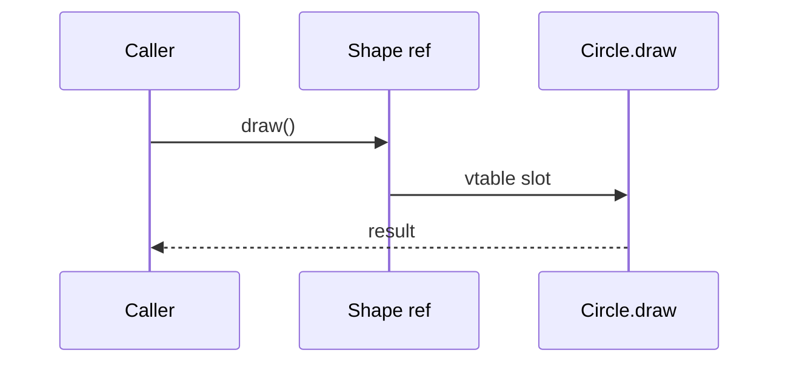

import { ConceptTemplate } from '@/features/kb/components/templates/ConceptTemplate'
import { Callout } from '@/features/kb/components/mdx/Callout'
import { ComparisonTable } from '@/features/kb/components/mdx/ComparisonTable'

export default function Layout({ children }) {
  return (
    <ConceptTemplate title="Method Overriding">
      {children}
    </ConceptTemplate>
  )
}

**Method overriding** is how a subclass customizes inherited behavior. The signature stays compatible. The body is new. Calls through a parent-typed reference still land on the child body if the method is virtual.

## 1. Deep Dive and Mechanics

Java instance methods are virtual by default. C-sharp requires `virtual` on the parent and `override` on the child; `new` hides instead of overriding. C++ requires `virtual` on the parent. Use `@Override` or `override` so a typo becomes a compile error instead of an accidental overload.

**Compatibility.** Return types may be covariant (a more specific type). Parameter types generally must match; making them more specific is overloading, not overriding. Checked exceptions in Java cannot widen.

**`super`.** Call the parent implementation when you are extending rather than replacing. Forgetting `super` in lifecycle methods (`onCreate`, `setUp`) is a common production bug.

<Callout icon="error" title="Hiding is not overriding">
A same-named static method, or C-sharp `new`, binds to the static type. You will think you overrode the method and then watch the parent body run.
</Callout>

## 2. Mathematical / Theoretical Foundation

An override replaces the function at a vtable slot. Behavioral subtyping requires: weaker or equal preconditions, stronger or equal postconditions, and no new surprising exceptions. That is LSP applied to one method.

Final / sealed methods remove the slot from further replacement, which restores local reasoning.

<ComparisonTable
  headers={['Keyword / mark', 'Language', 'Effect']}
  rows={[
    ['@Override', 'Java', 'Compile error if not an override'],
    ['override', 'C-sharp, C++11', 'Same, plus required for true override'],
    ['final / sealed', 'Java / C-sharp', 'Forbids further overrides'],
    ['new', 'C-sharp', 'Hides, does not dispatch'],
  ]}
/>

## 3. Real-World Implementation

```python
class Notification:
    def deliver(self, user, body):
        self.validate(user)
        return self.send(user, body)

    def validate(self, user):
        if not user:
            raise ValueError("user required")

    def send(self, user, body):
        raise NotImplementedError

class EmailNotification(Notification):
    def send(self, user, body):
        return f"email to {user}: {body}"
```

`deliver` stays on the parent. `send` is the override that varies per channel.

## 4. Visualizations



## 5. Interview Prep

**Q: Overriding versus overloading?**
**A:** Overriding: same signature, runtime choice on the receiver. Overloading: different signatures, compile-time choice on argument types.

**Q: Can you override a private method?**
**A:** No. Private methods are not in the subclass's contract. A same-named private method in the child is a new method.

**Q: What does `super.method()` do in a constructor?**
**A:** It runs the parent body now. If `method` is itself overridden, you may still be calling into a child whose fields are unset. Prefer calling only final or private helpers from constructors.

## 6. Production Use Cases

- **Framework hooks**: `doGet`, `render`, `configure`.
- **Policy objects** that share a template and override one step.
- **Test subclasses** that override a network call with a stub.

<Callout icon="tip" title="Override the smallest hook">
If you copy an entire parent method to change one line, extract that line as a protected hook and override only the hook.
</Callout>
