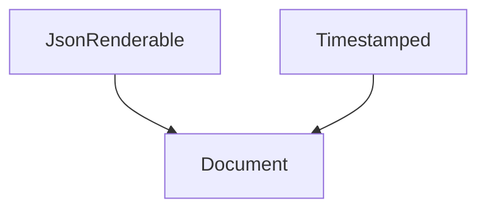

import { ConceptTemplate } from '@/features/kb/components/templates/ConceptTemplate'
import { Callout } from '@/features/kb/components/mdx/Callout'
import { ComparisonTable } from '@/features/kb/components/mdx/ComparisonTable'

export default function Layout({ children }) {
  return (
    <ConceptTemplate title="Mixins">
      {children}
    </ConceptTemplate>
  )
}

A **mixin** is a class (or class factory) that provides methods for other classes to absorb. You do not instantiate a mixin by itself. You fold it into a concrete type.

## 1. Deep Dive and Mechanics

Python mixins are extra bases, usually listed first so their methods win on the MRO: `class AdminView(LoginRequiredMixin, View)`. Ruby uses `include`. Scala has traits that can be mixed in linearization order. JavaScript used `Object.assign` and now prefers functions that close over helpers, or class-factory mixins.

**State.** The safest mixins are stateless. A mixin that adds fields collides with other mixins and with the host. If you need state, give it a unique prefix or compose an object instead.

**Cooperative `super`.** In Python, mixins that call `super()` must participate in a well-ordered MRO. That is powerful and easy to break when someone reorders bases.

<Callout icon="warning" title="Mixin soup">
Five mixins on one class is an implicit multiple-inheritance hierarchy. If you cannot recite the MRO, replace mixins with explicit collaborators.
</Callout>

## 2. Mathematical / Theoretical Foundation

A mixin is a function from a superclass to a subclass: `M(S) = S + methods`. Stacking mixins is function composition of those extensions. Linearization (C3) picks a total order so `super` has a single next hop.

This is inheritance-based composition of features, not the has-a composition slogan.

<ComparisonTable
  headers={['Feature pack', 'How it attaches', 'Instantiation']}
  rows={[
    ['Mixin', 'Base class / include', 'Not alone'],
    ['Trait', 'Flattened or linearized', 'Not alone'],
    ['Strategy object', 'Field', 'Yes, separately'],
  ]}
/>

## 3. Real-World Implementation

```python
class JsonRenderable:
    def as_json(self):
        return {"type": type(self).__name__, "id": self.id}

class Timestamped:
    def stamp(self, now):
        self.updated_at = now

class Document(JsonRenderable, Timestamped):
    def __init__(self, doc_id):
        self.id = doc_id
        self.updated_at = None
```

`Document` absorbs two feature packs. Neither mixin is constructed on its own.

## 4. Visualizations



## 5. Interview Prep

**Q: Mixin versus interface?**
**A:** An interface is a contract with no (or little) code. A mixin ships implementation. Java default methods sit in between.

**Q: Mixin versus trait?**
**A:** Traits (Rust, Scala, PHP) are the typed, conflict-aware version of the idea. Mixins in Python and Ruby are the dynamic version. See the Traits page for the type-system reading.

**Q: How do you unit-test a mixin?**
**A:** Build a tiny host class in the test file that only includes the mixin, then assert the added methods.

## 6. Production Use Cases

- **Django and DRF** permission and pagination mixins.
- **React higher-order components** (the historical mixin replacement).
- **Logging and metrics** packs attached to job classes.

<Callout icon="tip" title="One mixin, one verb">
`LoginRequiredMixin` is a good name. `UtilsMixin` is a junk drawer. Split it.
</Callout>
