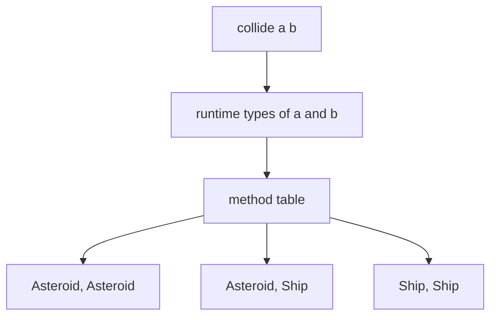

import { ConceptTemplate } from '@/features/kb/components/templates/ConceptTemplate'
import { Callout } from '@/features/kb/components/mdx/Callout'
import { ComparisonTable } from '@/features/kb/components/mdx/ComparisonTable'

export default function Layout({ children }) {
  return (
    <ConceptTemplate title="Multiple Dispatch">
      {children}
    </ConceptTemplate>
  )
}

**Multiple dispatch** picks an implementation using the dynamic types of more than one argument. Single dispatch (ordinary OOP) only looks at the receiver. Overloading only looks at static types.

## 1. Deep Dive and Mechanics

Consider `collide(a, b)`. With single dispatch you write `a.collide(b)` and then inspect `b` with `instanceof`. With multiple dispatch you define `collide(Asteroid, Spaceship)`, `collide(Asteroid, Asteroid)`, and the runtime picks the most specific pair.

**Julia** and **Common Lisp (CLOS)** are built this way. **C-sharp** `dynamic` can approximate it. **Python** `functools.singledispatch` is one argument; libraries add multimethods.

**Ambiguity.** If `collide(A, B)` and `collide(B, A)` are both applicable and neither is more specific, the system errors. You add a more specific method or a tie-break.

<Callout icon="info" title="Visitor is poor-man's double dispatch">
The visitor pattern bounces a call through `accept` so two types participate. Multiple dispatch languages just write the binary method.
</Callout>

## 2. Mathematical / Theoretical Foundation

A generic function is a set of methods with the same name. Applicability is a product order on argument types. Specificity is the product of the subtype orders. Dispatch finds the unique maximal applicable method, or fails.

Complexity: naive lookup is search over the method table. Production systems cache the tuple of concrete types (inline caches, decision trees).

<ComparisonTable
  headers={['Mechanism', 'Uses runtime types of', 'Typical home']}
  rows={[
    ['Single dispatch', 'Receiver only', 'Java, C-sharp, C++'],
    ['Overloading', 'None, static args', 'Java, C++'],
    ['Multiple dispatch', 'Several arguments', 'Julia, CLOS'],
    ['Visitor', 'Two, via callback', 'OOP languages'],
  ]}
/>

## 3. Real-World Implementation

```python
from functools import singledispatch

@singledispatch
def area(shape):
    raise TypeError(type(shape))

@area.register
def _(shape: tuple):
    w, h = shape
    return w * h

@area.register
def _(shape: float):
    return 3.14159 * shape * shape
```

That is single dispatch on the first argument. A true multimethod would key on two types, for example `intersect(shape, region)`.

## 4. Visualizations



## 5. Interview Prep

**Q: Multiple dispatch versus overloading?**
**A:** Overloading is compile-time and uses static types. Multiple dispatch is runtime and uses actual classes. You can add a method later without recompiling callers.

**Q: Why does Java not have it?**
**A:** History and vtables: one receiver makes a simple object model. Expression-problem variants (new operations on old types) are harder in Java and easier with generic functions.

**Q: What is the visitor pattern doing?**
**A:** Double dispatch: `element.accept(visitor)` then `visitor.visitConcrete(element)`. Two hops fake two runtime types.

## 6. Production Use Cases

- **Julia numerics**: `+` and `*` defined per pair of array/scalar types.
- **Game physics** collisions between many pair kinds.
- **Compilers / interpreters** evaluating operator plus operand type pairs.

<Callout icon="tip" title="Keep the generic function small">
A 40-method collide table needs a design. Group types, add an abstract pair, or move to data-driven tables when pairs explode.
</Callout>
