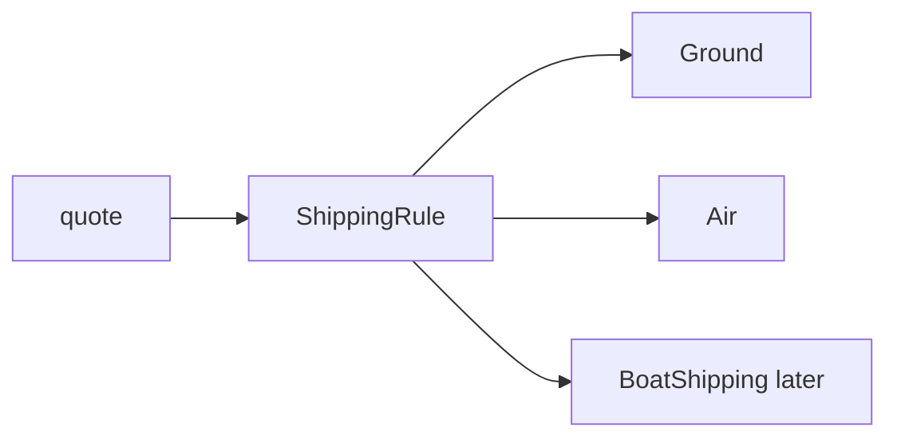

import { ConceptTemplate } from '@/features/kb/components/templates/ConceptTemplate'
import { Callout } from '@/features/kb/components/mdx/Callout'
import { ComparisonTable } from '@/features/kb/components/mdx/ComparisonTable'

export default function Layout({ children }) {
  return (
    <ConceptTemplate title="Open-Closed Principle (OCP)">
      {children}
    </ConceptTemplate>
  )
}

The **Open-Closed Principle** says you should add a new type or plugin rather than reopen a finished switch or a battle-tested class. Bertrand Meyer wrote it for modules; SOLID applies it to classes and functions.

## 1. Deep Dive and Mechanics

A shipping calculator with `if type == "ground"` / `"air"` / `"overnight"` must be edited for every new carrier. That class is open for modification. Replace the switch with a `ShippingRule` interface and a registry of implementations. New carriers are new classes.

**Closed** means the source you already shipped stays stable: fewer diffs, fewer regressions. **Open** means a well-chosen extension point (strategy, decorator, plugin loader).

OCP is not "never edit files." You edit when the abstraction is wrong. You avoid editing when the variation is the one you already predicted.

<Callout icon="warning" title="Do not invent extension points early">
Three speculative hooks for a second carrier that never arrives is worse than one switch you later replace. Wait for the second example.
</Callout>

## 2. Mathematical / Theoretical Foundation

OCP is about the direction of dependencies. Stable policy should depend on abstractions. New variants depend on those abstractions and are compiled in as extra leaves. The set of behaviors grows by union of types, not by mutation of a central function.

This pairs with the expression problem: OOP makes adding variants easy and adding operations harder. Functional programming often does the reverse.

<ComparisonTable
  headers={['Approach', 'Add a variant', 'Add an operation']}
  rows={[
    ['Switch / visitor data', 'Edit every switch', 'Add one function'],
    ['OOP strategies', 'Add a class', 'Edit every implementor'],
    ['Plugin registry', 'Register a module', 'Depends on the host API'],
  ]}
/>

## 3. Real-World Implementation

```python
class ShippingRule:
    def cost_cents(self, grams):
        raise NotImplementedError

class GroundShipping(ShippingRule):
    def cost_cents(self, grams):
        return 500 + grams // 10

class AirShipping(ShippingRule):
    def cost_cents(self, grams):
        return 1500 + grams // 5

def quote(rule, grams):
    return rule.cost_cents(grams)
```

`quote` does not change when you add `BoatShipping`.

## 4. Visualizations



## 5. Interview Prep

**Q: How do you apply OCP without inheritance?**
**A:** Higher-order functions, maps from name to handler, and decorators all extend behavior without editing the core. Inheritance is only one mechanism.

**Q: Is a giant if-else always a violation?**
**A:** If the set is closed and owned by one team (HTTP status mapping), a switch can be clearer. OCP matters when variants come from outside or grow often.

**Q: How does OCP relate to DIP?**
**A:** OCP needs an abstraction to extend. DIP says both the core and the variants depend on that abstraction. They usually appear together.

## 6. Production Use Cases

- **Payment and tax plugins** loaded from configuration.
- **Middleware / decorator pipelines** around HTTP handlers.
- **Pricing rules** registered per market without touching checkout.

<Callout icon="tip" title="Close the file that hurts when it changes">
If a module has a long git blame of unrelated features, that is the file OCP wants you to stop editing.
</Callout>
