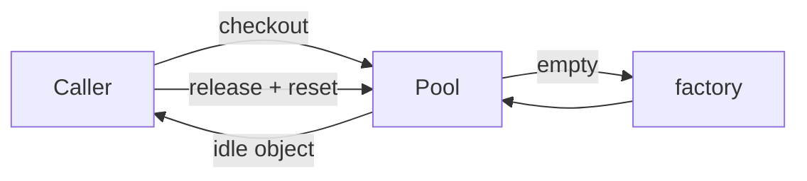

import { ConceptTemplate } from '@/features/kb/components/templates/ConceptTemplate'
import { Callout } from '@/features/kb/components/mdx/Callout'
import { ComparisonTable } from '@/features/kb/components/mdx/ComparisonTable'

export default function Layout({ children }) {
  return (
    <ConceptTemplate title="Object Pooling">
      {children}
    </ConceptTemplate>
  )
}

An **object pool** keeps a set of ready instances. Callers checkout, use, and release. The goal is to avoid repeated construction of objects that are costly to build: database connections, threads, buffers, GPU contexts.

## 1. Deep Dive and Mechanics

A pool has a factory, a free list (or idle queue), min/max sizes, and a checkout timeout. On release, the object is reset to a known state and returned to the idle set. If reset is incomplete, the next borrower inherits leftover data — a security and correctness bug.

**Versus GC.** In a tracing collector, pooling can be slower than bump allocation for tiny objects. Pool when the constructor talks to the network, the OS, or a native library.

**Lifetime.** Leaks happen when callers forget to release. Use try/finally, `with`, or a guard type that releases on scope exit.

<Callout icon="error" title="Always reset">
A pooled buffer that still holds last request's token is a data leak. Wipe secrets on release, not on checkout.
</Callout>

## 2. Mathematical / Theoretical Foundation

A pool is a bounded resource semaphore plus a free list. If max size is N, checkout is P(S) and release is V(S) on a semaphore of N. Expected wait time follows standard finite-server queueing when demand exceeds N.

Allocation cost is amortized: factory runs at most N times (plus replacement after eviction). Reset cost must stay cheaper than construct+destroy.

<ComparisonTable
  headers={['Resource', 'Pool?', 'Why']}
  rows={[
    ['DB connections', 'Yes', 'Handshake is expensive'],
    ['Tiny DTOs', 'Usually no', 'GC is cheaper'],
    ['Byte buffers', 'Sometimes', 'Avoids large-array churn'],
    ['Threads', 'Yes, executors', 'OS thread start is costly'],
  ]}
/>

## 3. Real-World Implementation

```python
class Pool:
    def __init__(self, factory, size):
        self._factory = factory
        self._idle = [factory() for _ in range(size)]

    def checkout(self):
        if not self._idle:
            raise RuntimeError("pool exhausted")
        return self._idle.pop()

    def release(self, obj):
        obj.reset()
        self._idle.append(obj)

class Conn:
    def reset(self):
        self.in_txn = False
```

Production pools add blocking, health checks, and a max lifetime so a bad connection is discarded.

## 4. Visualizations



## 5. Interview Prep

**Q: When is pooling a pessimization?**
**A:** Small, short-lived, managed objects. You pay synchronization and reset, and you keep memory that the GC could have reused. Measure.

**Q: How do you prevent leaks?**
**A:** Scope guards, leak detection (log checkouts that never return), and a max checkout time that forcibly reaps.

**Q: Pool versus cache?**
**A:** A cache is keyed and may evict unused values. A pool is a bag of equivalent instances. You do not look up a connection by id; you take any healthy one.

## 6. Production Use Cases

- **JDBC / ADO.NET / pg pools** in every web app.
- **HTTP connection pools** inside clients (keep-alive).
- **Game engines** pooling bullets and particles to avoid frame spikes.

<Callout icon="tip" title="Bound the pool">
An unbounded pool is a memory leak with extra steps. Set max size to something your downstream can actually accept.
</Callout>
