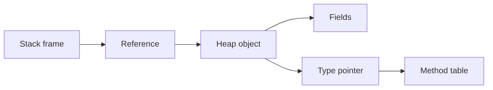

import { ConceptTemplate } from '@/features/kb/components/templates/ConceptTemplate'
import { Callout } from '@/features/kb/components/mdx/Callout'
import { ComparisonTable } from '@/features/kb/components/mdx/ComparisonTable'

export default function Layout({ children }) {
  return (
    <ConceptTemplate title="Objects">
      {children}
    </ConceptTemplate>
  )
}

An **object** is a living value: a bundle of state plus the ability to execute behavior. Classes and prototypes are recipes. Objects are what the program actually talks to at runtime.

## 1. Deep Dive and Mechanics

Creating an object typically: allocates bytes, writes a type pointer or hidden class, runs initialization, and returns a reference. Later, a method call loads that type pointer, finds the implementation, and passes the object as `this` or `self`.

**Identity.** Languages give objects an identity that survives field updates. Hash tables and caches often key on identity unless you override equality.

**Lifetime.** Tracing collectors find objects from roots. Reference counting frees an object when the last owner drops it, and needs a cycle breaker. Manual `delete` puts lifetime in the programmer's hands.

**Prototype systems.** JavaScript objects delegate missing properties along a prototype chain. There is still a hidden class for the JIT, but the programmer-facing model is delegation, not a closed class file.

<Callout icon="warning" title="Aliasing">
Two variables can name the same object. Mutating through one name is visible through the other. That is the source of many "impossible" bugs in concurrent and UI code.
</Callout>

## 2. Mathematical / Theoretical Foundation

In the object calculus, an object is a record of methods. Message send selects a method and binds the receiver. State can be encoded as methods that return updated objects (pure) or as mutable locations (imperative).

Complexity: field access is O(1) with a fixed layout. Prototype walks and dictionary objects are O(depth) or hash-table cost until the runtime stabilizes a hidden class.

<ComparisonTable
  headers={['Model', 'Where behavior lives', 'Typical language']}
  rows={[
    ['Class-based', 'Shared class / vtable', 'Java, C-sharp, C++'],
    ['Prototype-based', 'Object plus prototype chain', 'JavaScript, Lua'],
    ['Actor / isolate', 'Mailbox and isolated state', 'Erlang processes, some actor libs'],
  ]}
/>

## 3. Real-World Implementation

```python
class Order:
    def __init__(self, order_id):
        self.order_id = order_id
        self.lines = []

    def add_line(self, sku, qty):
        self.lines.append((sku, qty))

a = Order("A-100")
b = a
b.add_line("SKU-9", 2)
# a and b are the same object; a.lines now has one row
```

`a` and `b` are two names for one object. Copying the reference does not copy the state.

## 4. Visualizations



## 5. Interview Prep

**Q: Object versus class?**
**A:** The class is the definition. The object is an allocated instance with its own field storage and a link back to that definition.

**Q: What is object identity?**
**A:** The property that distinguishes two allocations even when their fields match. `is` in Python and reference equality in Java test identity.

**Q: Are primitives objects?**
**A:** In Smalltalk, yes. In Java, `int` is not an object; `Integer` is a boxed object. Autoboxing hides the allocation and can surprise you in caches and locks.

## 6. Production Use Cases

- **Entities** with identity that outlive a single request: users, orders, devices.
- **Value objects** that are objects in the language but are compared by value: money, date ranges.
- **Handles** to native resources: sockets, file descriptors, GPU buffers.

<Callout icon="tip" title="Prefer values when you can">
If you do not need identity or shared mutation, a value type or immutable record is cheaper to reason about than a long-lived mutable object.
</Callout>
