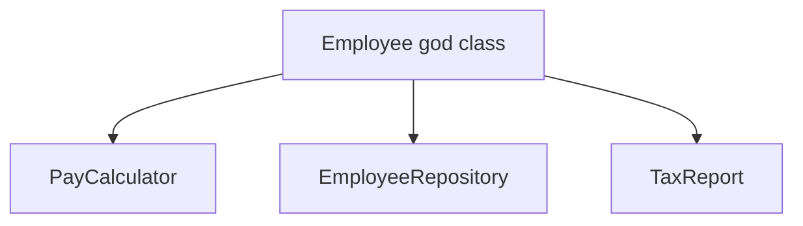

import { ConceptTemplate } from '@/features/kb/components/templates/ConceptTemplate'
import { Callout } from '@/features/kb/components/mdx/Callout'
import { ComparisonTable } from '@/features/kb/components/mdx/ComparisonTable'

export default function Layout({ children }) {
  return (
    <ConceptTemplate title="Single Responsibility Principle (SRP)">
      {children}
    </ConceptTemplate>
  )
}

The **Single Responsibility Principle** is the S in SOLID. Robert C. Martin phrased it as one reason to change. That reason is usually one stakeholder or one axis of policy, not "the class has one method."

## 1. Deep Dive and Mechanics

An `Employee` that computes pay, writes SQL, and renders a PDF has three owners: payroll, the DBA, and tax reporting. Any of those groups can force a change that risks the others.

The fix is to split along those axes: an `Employee` entity, a repository, a pay calculator, a report formatter. Each type still may contain many methods. They just change for the same reason.

**Cohesion.** SRP is a cohesion rule. If most methods use most fields, you are probably fine. If the class is two clumps of fields that never interact, you have two responsibilities.

<Callout icon="info" title="One reason, not one method">
A cohesive parser with ten methods can still be SRP. A two-method class that both talks to HTTP and writes a database is not.
</Callout>

## 2. Mathematical / Theoretical Foundation

Think of change requests as vectors. SRP wants the type's sensitivity to be aligned with one basis vector. Coupling between responsibilities is the off-diagonal: an edit in reporting recompiles and retests payroll.

Pamas's information hiding is the ancestor: a module should hide one secret.

<ComparisonTable
  headers={['Smell', 'What it mixes', 'Split toward']}
  rows={[
    ['God class', 'Many domains', 'One type per domain'],
    ['Dual-write service', 'Policy plus IO', 'Use case plus adapter'],
    ['Utility dump', 'Unrelated helpers', 'Modules named by topic'],
  ]}
/>

## 3. Real-World Implementation

```python
class Order:
    def __init__(self, order_id, lines):
        self.order_id = order_id
        self.lines = lines

class OrderTotal:
    def cents(self, order):
        return sum(qty * price for _, qty, price in order.lines)

class OrderRepository:
    def __init__(self, db):
        self._db = db

    def save(self, order):
        self._db.execute("upsert", order.order_id)
```

Totals change when pricing rules change. Persistence changes when the schema changes. Those are two reasons, two types.

## 4. Visualizations



## 5. Interview Prep

**Q: Does SRP mean a class can have only one method?**
**A:** No. It means one reason to change. A string class with many methods is still one responsibility: text.

**Q: How do you find the reasons to change?**
**A:** Ask who calls you asking for edits. If two teams file tickets against the same file for unrelated policies, split the file.

**Q: SRP versus microservices?**
**A:** SRP is a type-level cohesion rule. You can violate SRP inside a service and still have a "small" service. Do not use SRP as a pretext to explode the network.

## 6. Production Use Cases

- **Use-case classes** (application services) that orchestrate but do not own SQL.
- **Domain entities** that enforce invariants and leave persistence to repositories.
- **Report builders** isolated from the checkout flow they read.

<Callout icon="tip" title="Name the owner">
If you cannot name the person or team who owns a class, it probably has more than one.
</Callout>
