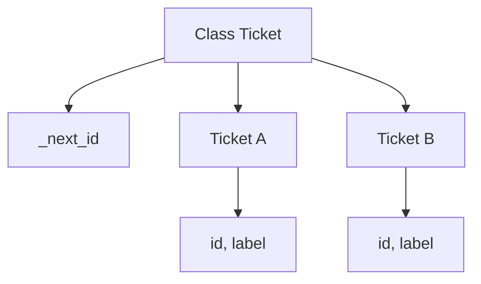

import { ConceptTemplate } from '@/features/kb/components/templates/ConceptTemplate'
import { Callout } from '@/features/kb/components/mdx/Callout'
import { ComparisonTable } from '@/features/kb/components/mdx/ComparisonTable'

export default function Layout({ children }) {
  return (
    <ConceptTemplate title="Static vs Instance Members">
      {children}
    </ConceptTemplate>
  )
}

**Instance members** belong to an object. **Static** (or class) members belong to the type. There is one static field for the whole class, shared by every instance — and visible with zero instances.

## 1. Deep Dive and Mechanics

An instance method receives a hidden receiver (`this` / `self`). A static method does not. Calling a static method through an instance reference is allowed in some languages and is still not polymorphism: the static type picks the method.

**Static state.** A counter, a cache, a logger. Convenient and global. Hard to test, hard to reset, dangerous in parallel code unless you synchronize.

**Static factories** (`of`, `from`, `valueOf`) are functions namespaced by the class. They are not a substitute for instance behavior.

<Callout icon="warning" title="Static is global">
A mutable static field is a process-wide variable. In web apps that is one value for every request on that JVM or process.
</Callout>

## 2. Mathematical / Theoretical Foundation

Instance fields are a function from object identity to value. Static fields are a single cell in the class object. Memory: n instances cost n times the instance layout plus one copy of the statics.

Dispatch: instance virtual methods use the receiver. Static methods are ordinary functions with a class-qualified name.

<ComparisonTable
  headers={['Member', 'Needs an instance', 'Polymorphic', 'Shared']}
  rows={[
    ['Instance field', 'Yes', 'N/A', 'No'],
    ['Instance method', 'Yes', 'If virtual', 'Code yes, state no'],
    ['Static field', 'No', 'No', 'Yes'],
    ['Static method', 'No', 'No', 'Yes'],
  ]}
/>

## 3. Real-World Implementation

```python
class Ticket:
    _next_id = 1

    def __init__(self, label):
        self.label = label
        self.id = Ticket._next_id
        Ticket._next_id += 1

    @staticmethod
    def validate_label(label):
        return bool(label)

    def describe(self):
        return f"{self.id}:{self.label}"
```

`_next_id` is class state. `label` and `id` are instance state. `validate_label` does not touch an instance.

## 4. Visualizations



## 5. Interview Prep

**Q: Can a static method call an instance method?**
**A:** Only if it has an instance in hand. There is no implicit `this`. The other direction is fine: an instance method may call static helpers.

**Q: Why are statics disliked in OOP interviews?**
**A:** They hide dependencies and block substitution. A static `Clock.now()` cannot be faked without extra tooling. Inject an instance instead.

**Q: What about Java `static` nested classes?**
**A:** A static nested class does not hold an implicit pointer to an outer instance. A non-static inner class does. That is about enclosing instances, not about static methods.

## 6. Production Use Cases

- **Constants and pure helpers** (`Math.max`, parsers) as static methods.
- **Flyweight / intern tables** as carefully locked static maps.
- **Per-object domain state** as instance fields — the default.

<Callout icon="tip" title="Prefer instance collaborators">
If a static method needs configuration or time, it wants to be an object you can inject.
</Callout>
