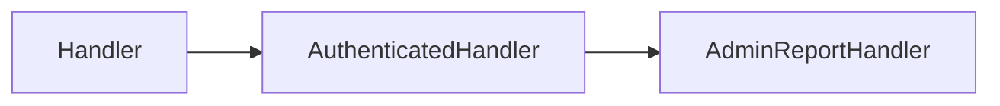

import { ConceptTemplate } from '@/features/kb/components/templates/ConceptTemplate'
import { Callout } from '@/features/kb/components/mdx/Callout'
import { ComparisonTable } from '@/features/kb/components/mdx/ComparisonTable'

export default function Layout({ children }) {
  return (
    <ConceptTemplate title="Multilevel Inheritance">
      {children}
    </ConceptTemplate>
  )
}

**Multilevel inheritance** is a chain: C extends B, B extends A. It is still single inheritance at each step. The design question is whether that extra level earns its keep.

## 1. Deep Dive and Mechanics

Each level can add fields, tighten invariants, and override methods. Construction still runs A, then B, then C. A bug in B's override hits every C.

**When it helps.** Frameworks use a short chain to layer concerns: `BaseHandler` then `AuthenticatedHandler` then `AdminReportHandler`. Each level adds a guarantee.

**When it hurts.** Domain taxonomies copied from biology (`Animal` / `Mammal` / `Dog` / `Poodle`) freeze decisions that later turn out to be mixins (can bark, is groomed). Deep chains also make LSP violations harder to see: a mid-level class changes a contract the leaves still advertise.

<Callout icon="warning" title="Fragile base class">
A "small fix" in a middle class can break distant leaves that compiled against the old behavior. The longer the chain, the larger the blast radius.
</Callout>

## 2. Mathematical / Theoretical Foundation

The chain is a total order of types A ⊑ B ⊑ C. Field offsets accumulate. Dispatch starts at C and walks toward A. Depth d means up to d lookups before a JIT caches the target.

Refactoring cost grows with the number of types that assume the intermediate contracts, not just with d itself.

<ComparisonTable
  headers={['Shape', 'Example', 'Risk']}
  rows={[
    ['One level', 'Dog extends Animal', 'Low coupling'],
    ['Multilevel', 'Poodle extends Dog extends Animal', 'Mid-chain changes'],
    ['Wide, not deep', 'Many siblings of Animal', 'Easier substitution'],
  ]}
/>

## 3. Real-World Implementation

```python
class Handler:
    def handle(self, request):
        self.before(request)
        self.run(request)
        self.after(request)

    def before(self, request):
        pass

    def run(self, request):
        raise NotImplementedError

    def after(self, request):
        pass

class AuthenticatedHandler(Handler):
    def before(self, request):
        if not request.get("user"):
            raise PermissionError("login required")

class AdminReportHandler(AuthenticatedHandler):
    def run(self, request):
        return {"report": "ok", "user": request["user"]}
```

Two levels above the leaf is enough for auth plus a concrete action.

## 4. Visualizations



## 5. Interview Prep

**Q: Multilevel versus multiple inheritance?**
**A:** Multilevel is a chain of one parent each. Multiple inheritance is several parents at the same class. You can have both (a chain where one class also mixes in extra bases).

**Q: How deep is too deep?**
**A:** If you cannot explain each level's extra invariant in one sentence, flatten. Many style guides treat more than three domain levels as a smell.

**Q: How do you refactor a tall chain?**
**A:** Extract strategy objects for the varying steps, keep a short template-method base, and delete the middle types that only forwarded calls.

## 6. Production Use Cases

- **HTTP handler stacks** with a shared base and a short auth layer.
- **Test case bases** (`TestCase` then `DBTestCase` then a suite-specific class).
- **Device drivers** with `Device` then `BlockDevice` then a vendor class.

<Callout icon="tip" title="Name the extra invariant">
If `AuthenticatedHandler` does not actually guarantee a user is present for all methods, the extra level is lying. Fix the contract or delete the class.
</Callout>
