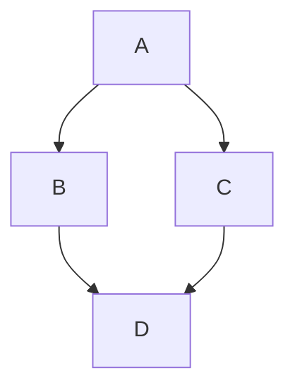

import { ConceptTemplate } from '@/features/kb/components/templates/ConceptTemplate'
import { Callout } from '@/features/kb/components/mdx/Callout'
import { ComparisonTable } from '@/features/kb/components/mdx/ComparisonTable'

export default function Layout({ children }) {
  return (
    <ConceptTemplate title="Multiple Inheritance">
      {children}
    </ConceptTemplate>
  )
}

**Multiple inheritance** lets a class list several superclasses. C++ and Python allow it. The payoff is combining two implementations. The bill is ambiguity when both parents define the same member or when a diamond shares a grandparent.

## 1. Deep Dive and Mechanics

**The diamond.** `D` extends `B` and `C`, both of which extend `A`. Does `D` contain one `A` subobject or two? C++ virtual inheritance shares one `A`. Ordinary C++ inheritance duplicates `A`. Python's MRO (C3 linearization) always sees each class once.

**Conflict resolution.** Python looks up attributes along the MRO. C++ requires you to qualify the parent or override the name in `D`. Mixins in Python are multiple inheritance used as stacked behavior.

**Why Java said no.** Fields plus two parents means two layouts and constructor orders. Interfaces plus default methods reintroduce a milder form of the problem without duplicating instance fields.

<Callout icon="warning" title="MRO is part of your API">
In Python, swapping the order of base classes can change which method wins. Treat base order as a contract, not a style choice.
</Callout>

## 2. Mathematical / Theoretical Foundation

C3 linearization computes a deterministic total order that preserves local precedence and monotonicity. If no such order exists, class creation fails.

C++ object layout with non-virtual bases is a concatenation of parent layouts plus a vptr per polymorphic base. Virtual bases add a thunk or offset table so a single shared subobject can be found from each path.

<ComparisonTable
  headers={['Language', 'State from many classes', 'Conflict rule', 'Shared grandparent']}
  rows={[
    ['Python', 'Yes', 'C3 MRO', 'Each class once'],
    ['C++', 'Yes', 'Qualify or override', 'Virtual base shares'],
    ['Java / C-sharp', 'No, interfaces only', 'Default-method rules', 'No class diamond'],
  ]}
/>

## 3. Real-World Implementation

```python
class LoggerMixin:
    def log(self, msg):
        print(type(self).__name__, msg)

class Repository:
    def save(self, row):
        raise NotImplementedError

class UserRepository(LoggerMixin, Repository):
    def save(self, row):
        self.log("saving user")
        return row["id"]
```

`UserRepository` inherits behavior from two bases. `LoggerMixin` should stay stateless or very thin.

## 4. Visualizations



## 5. Interview Prep

**Q: What is the diamond problem?**
**A:** Two paths to the same ancestor make it unclear whether state is shared and which override runs. Languages either linearize (Python), share via virtual bases (C++), or forbid the situation for classes (Java).

**Q: Are mixins multiple inheritance?**
**A:** Yes, used as a convention: mixin classes are not meant to stand alone, and they usually appear first in the base list so their methods win.

**Q: When is multiple inheritance justified?**
**A:** Combining orthogonal capabilities (serialization plus comparison) or matching a domain that truly has two parents. If the parents share mutable state, prefer composition.

## 6. Production Use Cases

- **Python mixins** in Django class-based views and test helpers.
- **C++ interface-style bases** (pure virtual) plus one concrete implementation base.
- **Numeric types** that mix a value base with an operator-mixin.

<Callout icon="tip" title="Prefer one real base plus mixins">
Let one superclass own identity and storage. Everything else should be a stateless mixin or an interface.
</Callout>
