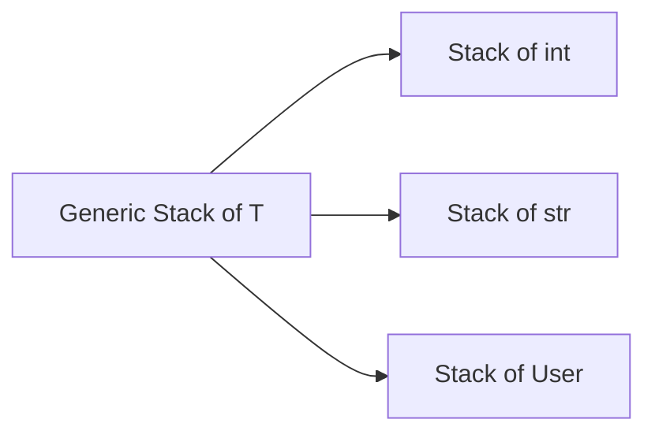

import { ConceptTemplate } from '@/features/kb/components/templates/ConceptTemplate'
import { Callout } from '@/features/kb/components/mdx/Callout'
import { ComparisonTable } from '@/features/kb/components/mdx/ComparisonTable'

export default function Layout({ children }) {
  return (
    <ConceptTemplate title="Parametric Polymorphism">
      {children}
    </ConceptTemplate>
  )
}

**Parametric polymorphism** writes an algorithm once, with holes for types. A list-of-T, a sort that needs only a comparison, a `Result` of T and E — the code does not mention concrete classes except as bounds.

## 1. Deep Dive and Mechanics

**Java / C-sharp generics** erase or reify type arguments and check casts at the boundary. Java erasure means `List` of String and `List` of Integer are the same class at runtime. C-sharp reifies, so you can ask for the type argument via reflection.

**C++ templates** are compile-time substitution. Each used combination of types may emit a fresh specialization. That is powerful and can explode binary size.

**Bounds.** `T extends Comparable` (or a trait bound) recovers operations without becoming ad-hoc soup. The implementation is still one algorithm; the bound is a requirement on T.

<Callout icon="warning" title="Erasure surprises">
You cannot new T or inspect T at runtime in ordinary Java generics. Pass a `Class` token or a factory if you must construct T.
</Callout>

## 2. Mathematical / Theoretical Foundation

System F (polymorphic lambda calculus) is the core model: a term `Λα. e` is a function from types to values. Parametricity (Reynolds, Wadler) says you can derive theorems for free: a function of type `∀α. α → α` can only be the identity or diverge.

That is the opposite of ad-hoc: the implementation is forbidden from branching on α.

<ComparisonTable
  headers={['Mechanism', 'When code is generated', 'Runtime type args']}
  rows={[
    ['Java generics', 'One erased class', 'No, erased'],
    ['C-sharp generics', 'Shared IL, specialized JIT', 'Yes, reified'],
    ['C++ templates', 'Per specialization', 'Yes, in the type'],
  ]}
/>

## 3. Real-World Implementation

```python
from typing import TypeVar, Generic, Optional

T = TypeVar("T")

class Stack(Generic[T]):
    def __init__(self):
        self._items: list[T] = []

    def push(self, item: T) -> None:
        self._items.append(item)

    def pop(self) -> Optional[T]:
        return self._items.pop() if self._items else None
```

`Stack` of int and `Stack` of str share the same method bodies. The type checker keeps the payloads from mixing.

## 4. Visualizations



## 5. Interview Prep

**Q: Parametric versus subtype polymorphism?**
**A:** Parametric abstracts a type variable and usually compiles one (or specialized) implementation. Subtype polymorphism picks an override from the receiver's class at run time.

**Q: What is PECS in Java?**
**A:** Producer-extends, consumer-super. A producer of T is `? extends T`. A consumer of T is `? super T`. That is how variance keeps collections safe.

**Q: Why not use `Object` instead of T?**
**A:** You lose static checking and force casts. Generics move the cast to the compiler and document the intended payload type.

## 6. Production Use Cases

- **Collections and caches** that must not mix keys or values.
- **Repository interfaces** parameterized by entity type.
- **Async result types** (`Future` of T, `Result` of T) shared across the stack.

<Callout icon="tip" title="Keep the type parameter meaningful">
If T is only used once in a setter and a getter, you may have a raw holder. If T appears in a real algorithm, you have parametric polymorphism.
</Callout>
