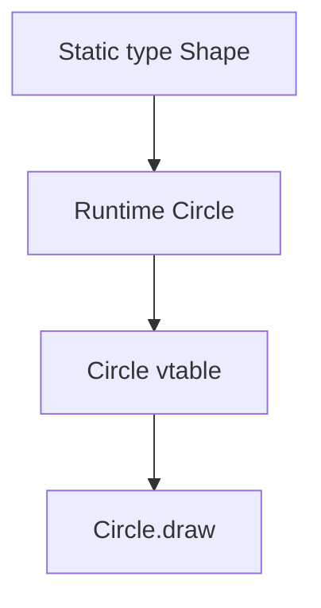

import { ConceptTemplate } from '@/features/kb/components/templates/ConceptTemplate'
import { Callout } from '@/features/kb/components/mdx/Callout'
import { ComparisonTable } from '@/features/kb/components/mdx/ComparisonTable'

export default function Layout({ children }) {
  return (
    <ConceptTemplate title="Subtype Polymorphism">
      {children}
    </ConceptTemplate>
  )
}

**Subtype polymorphism** is the OOP classic: a variable of type `Shape` may hold a `Circle` or a `Square`, and `draw` runs the version that belongs to the actual object.

## 1. Deep Dive and Mechanics

The compiler checks that the static type has the method. The runtime looks at the object's class (or prototype) and jumps to the override. That lookup is **dynamic dispatch** / **virtual call**.

**Inclusion.** Every Circle is a Shape in the type system if Circle is declared a subtype. The set of Circle values is treated as a subset of Shape values. LSP is the behavioral half of that claim.

**Open addition.** You can add `Triangle` later without editing the loop that calls `draw`. That is the Open-Closed Principle in the small.

<Callout icon="info" title="The static type still matters">
Dispatch uses the receiver's runtime class. Overload resolution does not. Mixing both on the same API is how people conclude "Java is broken."
</Callout>

## 2. Mathematical / Theoretical Foundation

A type S is a subtype of T (S <: T) when every context that expects T remains safe with an S. For function types, arguments are contravariant and returns are covariant.

Virtual dispatch is a map from concrete class to method body. A vtable makes that map an array load plus an indirect jump, amortized O(1).

<ComparisonTable
  headers={['Mechanism', 'What varies', 'Bound statically']}
  rows={[
    ['Subtype / virtual', 'Receiver implementation', 'Method exists on static type'],
    ['Overload', 'Compile-time signature', 'Exact argument types'],
    ['Generic method', 'Type argument', 'Bounds on T'],
  ]}
/>

## 3. Real-World Implementation

```python
class Shape:
    def draw(self):
        raise NotImplementedError

class Circle(Shape):
    def draw(self):
        return "circle"

class Square(Shape):
    def draw(self):
        return "square"

def render_all(shapes):
    return [s.draw() for s in shapes]
```

`render_all` never mentions Circle or Square. New shapes plug in as long as they honor `draw`.

## 4. Visualizations



## 5. Interview Prep

**Q: Is inheritance required for subtype polymorphism?**
**A:** Nominally, you need a declared subtype relation (class or interface). Structurally, matching methods are enough. Either way the runtime still dispatches on the actual object.

**Q: What breaks subtyping?**
**A:** A subclass that throws new unchecked errors, weakens postconditions, or strengthens preconditions. That is an LSP failure: the extra type is not a true subtype.

**Q: Virtual versus static methods?**
**A:** Static methods are namespaced functions. They do not dispatch on the receiver. Calling a static through a subclass name is not polymorphism.

## 6. Production Use Cases

- **Payment methods**, shipping carriers, and tax engines behind one interface.
- **UI widgets** drawn through a shared `paint` on a heterogeneous list.
- **Plugin handlers** registered by interface and invoked without a switch on type names.

<Callout icon="tip" title="Design the parent for the callers you have">
If every caller immediately casts to the child, you do not have subtype polymorphism. You have a tagged union in denial.
</Callout>
