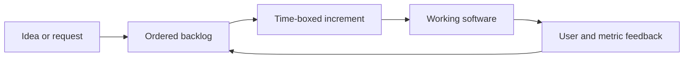

import { ConceptTemplate } from '@/features/kb/components/templates/ConceptTemplate'
import { Callout } from '@/features/kb/components/mdx/Callout'
import { ComparisonTable } from '@/features/kb/components/mdx/ComparisonTable'

export default function Layout({ children }) {
  return (
    <ConceptTemplate title="Agile">
      {children}
    </ConceptTemplate>
  )
}

Before 2001, most large software programs ran as **Waterfall**: months of requirements, then design, then a long build, then a late test phase. The market often moved before the first release. The **Agile Manifesto** flipped the bet: ship a thin slice of working software, learn from real users, and change the plan on purpose.

Agile is a **mindset and a set of principles**, not a vendor process. Scrum, Kanban, XP, and SAFe are implementations. If a team runs two-week sprints but never inspects outcomes, it is ceremony without agility.

## 1. Deep Dive and Mechanics

**Time-boxed increments.** Work lands in short cycles, commonly one to four weeks. The increment must be potentially shippable: integrated, tested, and demoable. That constraint forces hidden work (build, test, release) into the same cycle as feature work.

**Feedback as the control loop.** Each increment is an experiment. Product people watch usage, support tickets, and revenue, then reorder the backlog. The cost of being wrong is one cycle, not a year.

**Cross-functional ownership.** A feature team includes the skills to finish a slice: product, design, engineering, and often QA or SRE. Handoffs across departmental silos are the usual source of queueing delay.

**Continuous planning.** Release trains and Gantt charts still exist in large orgs, but the **near-term plan is renegotiated every cycle**. Scope is the usual shock absorber; date and quality are held steadier.

**Engineering practices that make Agile honest.** Short cycles collapse without automated tests, CI, trunk-based development, and a path to production. A two-week sprint that still needs a six-week hardening phase is Waterfall with stand-ups.

<Callout icon="warning" title="Agile is not no plan">
The manifesto prefers responding to change over following a plan. It does not say skip architecture, compliance, or capacity planning. Those become smaller, more frequent decisions instead of a single frozen spec.
</Callout>

## 2. Mathematical / Theoretical Foundation

Agile restates **empirical process control**: when the process is too noisy for a detailed predictive model, you inspect and adapt. Software delivery is a **queueing system**. Little's Law says work-in-progress (WIP) equals throughput times cycle time. High WIP (giant batches, many half-done features) lengthens cycle time even if people stay busy.

Batch size is the other lever. A one-year batch has high **variance** and late **information**. A two-week batch reduces both. Cost of delay models (CD3, WSJF) rank work by value over duration, which is why Agile backlogs should be ordered, not merely listed.

Cost of change also matters. If the cost of modifying software grows exponentially with time (typical of untested monoliths), late discovery is fatal. XP practices flatten that curve so late change stays cheap.

<ComparisonTable
  headers={['Dimension', 'Waterfall', 'Agile']}
  rows={[
    ['Planning', 'Months of locked scope up front', 'Replan every short iteration'],
    ['Delivery', 'One big-bang release', 'Incremental, potentially shippable slices'],
    ['Testing', 'A late, separate phase', 'Continuous, inside every cycle'],
    ['Risk', 'Wrong product discovered at the end', 'Wrong slice costs one iteration'],
    ['Change', 'Change requests are exceptions', 'Change is the expected input'],
  ]}
/>

## 3. Real-World Implementation

A lightweight iteration board can be a single ordered list plus WIP limits. The snippet below models a backlog pull: take the highest-priority ready item only if the in-progress column is under the limit.

```python
from dataclasses import dataclass

@dataclass
class Item:
    id: str
    priority: int
    status: str  # ready | doing | done

def pull_next(backlog: list[Item], wip_limit: int) -> Item | None:
    doing = [i for i in backlog if i.status == "doing"]
    if len(doing) >= wip_limit:
        return None
    ready = sorted(
        (i for i in backlog if i.status == "ready"),
        key=lambda i: i.priority,
    )
    if not ready:
        return None
    item = ready[0]
    item.status = "doing"
    return item
```

WIP limits are Kanban language, but the same math applies to Scrum teams that take on too many stories.

## 4. Visualizations



## 5. Interview Prep

**Q: Agile versus Waterfall — when is Waterfall still justified?**
**A:** When requirements are truly fixed and the cost of being late is dominated by regulatory or hardware gates (some medical, aerospace, and construction-adjacent software). Even then, teams often run Agile **inside** stages and keep a gated outer lifecycle.

**Q: Why do Agile transformations fail while still holding stand-ups?**
**A:** Local optimizations: teams iterate, but funding, architecture, and release still assume annual batches. Without test automation and a real path to production, inspection cannot change the system.

**Q: Story points versus hours?**
**A:** Hours pretend humans estimate absolute duration well. Relative size plus measured throughput (velocity or cycle time) is a forecasting tool, not a productivity KPI. Weaponizing velocity against the team destroys the signal.

**Q: Is SAFe Agile?**
**A:** SAFe can coordinate many teams with PI planning. Critics say it reintroduces big-batch planning. Interviewers want you to name the trade-off: alignment at scale versus local autonomy and small batches.

## 6. Production Use Cases

- **Product companies** shipping weekly or daily to production, using feature flags to decouple deploy from release.
- **Internal platforms** treating the platform as a product: short cycles, user research with application teams, not a once-a-year roadmap dump.
- **Regulated domains** pairing Agile delivery with a documented quality system: each increment still produces the evidence auditors need.

<Callout icon="tip" title="Measure flow, not theater">
Lead time, deployment frequency, change-fail rate, and time to restore (the DORA four) tell you if Agile is working. Counting ceremonies does not.
</Callout>
