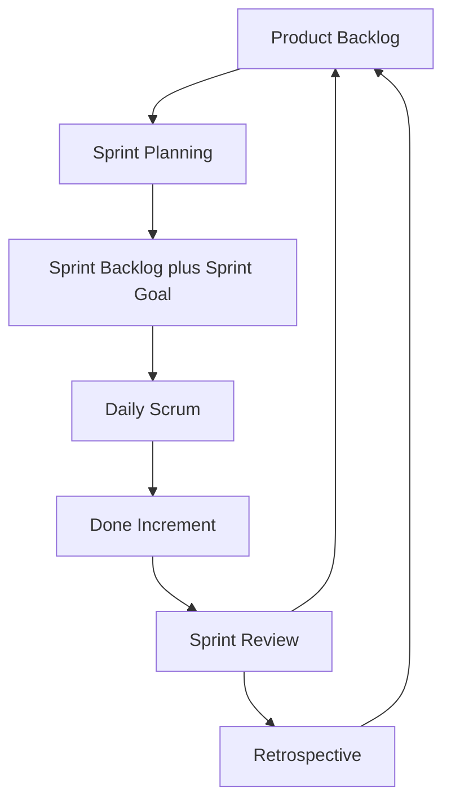

import { ConceptTemplate } from '@/features/kb/components/templates/ConceptTemplate'
import { Callout } from '@/features/kb/components/mdx/Callout'
import { ComparisonTable } from '@/features/kb/components/mdx/ComparisonTable'

export default function Layout({ children }) {
  return (
    <ConceptTemplate title="Scrum">
      {children}
    </ConceptTemplate>
  )
}

**Scrum** is a lightweight Agile framework built around a **Sprint**: a fixed-length iteration that produces a potentially shippable increment. It defines three accountabilities, five events, and three artifacts. The Scrum Guide is deliberately short; most pain in the wild comes from adding extra process or using Scrum as a status-reporting machine for a project manager.

Scrum assumes a complex domain where you cannot predict the whole product up front. You inspect the increment and the process every Sprint and adapt the backlog and the working agreements.

## 1. Deep Dive and Mechanics

**Sprint.** Commonly two weeks, never longer than one month. Scope is not supposed to change in a way that endangers the Sprint Goal. New work waits in the Product Backlog. That lock is what makes the forecast honest.

**Accountabilities.**
- **Product Owner** owns the Product Backlog and the **what** and **why**. One person, not a committee with a shared inbox.
- **Scrum Master** is a coach and impediment remover, not a line manager or a Jira clerk.
- **Developers** own the **how**, the Sprint forecast, and engineering quality.

**Events.** Sprint Planning selects a Sprint Goal and a forecast. The Daily Scrum is a 15-minute developer plan for the next 24 hours, not a status meeting for stakeholders. Sprint Review inspects the increment with stakeholders. Sprint Retrospective inspects the process. The Sprint itself contains all of these.

**Artifacts and commitments.** Product Backlog has a Product Goal. Sprint Backlog has a Sprint Goal. The Increment must meet the **Definition of Done**. Transparency fails when Done means compiled on my laptop.

<Callout icon="warning" title="Story points are not hours">
Teams often estimate relative complexity with Fibonacci-like sizes (1, 2, 3, 5, 8). Velocity is the count of those points finished in a Sprint. It forecasts capacity for this team. It is a terrible cross-team performance score.
</Callout>

## 2. Mathematical / Theoretical Foundation

Scrum is **empirical process control** with three pillars: transparency, inspection, and adaptation. The Sprint is a sampling interval. Too long, and you discover failure late. Too short, and planning overhead dominates useful work.

Forecasting uses **yesterday's weather**: next Sprint capacity is close to recent throughput, not to a wish. Monte Carlo methods on historical cycle times beat a single velocity number when the work mix is noisy.

Story-point math is ordinal, not interval. An 8 is not twice a 4 in any physical unit. Treating points as hours reintroduces false precision. Little's Law still applies: too many items in a Sprint (high WIP) inflates cycle time and unfinished work at Sprint end.

<ComparisonTable
  headers={['Accountability', 'Owns', 'Does not own']}
  rows={[
    ['Product Owner', 'Backlog order and Product Goal', 'Task-level assignment of developers'],
    ['Scrum Master', 'Process coaching and impediment removal', 'Delivery commitments on behalf of the team'],
    ['Developers', 'Sprint forecast, quality, and how to build', 'Unilateral product priority'],
  ]}
/>

## 3. Real-World Implementation

A Sprint forecast can be a simple capacity check: sum of planned points versus a rolling average of completed points. The code below is a planning helper, not a substitute for conversation.

```python
from collections import deque

class VelocityWindow:
    def __init__(self, n=5):
        self.recent = deque(maxlen=n)

    def record(self, completed_points: int) -> None:
        self.recent.append(completed_points)

    def forecast(self) -> float:
        if not self.recent:
            return 0.0
        return sum(self.recent) / len(self.recent)

    def fits(self, planned_points: int, buffer=0.85) -> bool:
        return planned_points <= self.forecast() * buffer
```

The buffer is honesty about interrupts, production support, and estimation error. A team that plans to 100 percent of peak velocity will fail the Sprint Goal often.

## 4. Visualizations



## 5. Interview Prep

**Q: Product Owner versus project manager?**
**A:** A PO maximizes product value through backlog order. A traditional PM tracks tasks, dates, and resources. Combining both roles often turns Scrum into a status factory and starves product discovery.

**Q: What if leadership adds work mid-Sprint?**
**A:** The Scrum Master protects the Sprint Goal. The PO can renegotiate scope with developers if the Goal is still achievable. Constant mid-Sprint injection means the organization is not using Scrum; it is using a two-week status cadence.

**Q: Scrum versus Kanban?**
**A:** Scrum uses a time-box and a Sprint Goal. Kanban uses a continuous flow with explicit WIP limits and no required Sprint. Many teams run Scrum events on a Kanban board. Pick the constraint you actually need: a shared goal cadence, or smoother flow of uneven work.

**Q: Why is the Daily Scrum for developers?**
**A:** It is a replan of the next day toward the Sprint Goal. When it becomes a report to a manager, people optimize for sounding busy instead of finishing the increment.

## 6. Production Use Cases

- **Feature teams** on a single product with a clear PO and a shared Definition of Done, releasing every Sprint or continuously via trunk-based development.
- **Platform teams** using Scrum for a Product Goal such as a self-service deploy path, with application teams as the Review audience.
- **Regulated delivery** attaching evidence (tests, threat models, change records) to the Increment so Done includes compliance, not a later hardening Sprint.

<Callout icon="tip" title="One Definition of Done">
If Done differs per person, the Increment is not transparent. Write Done as a checklist the team can fail in CI: tests, review, observability, and the release path.
</Callout>
