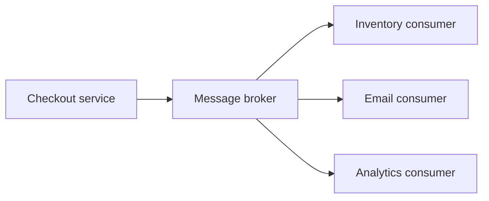

import { ConceptTemplate } from '@/features/kb/components/templates/ConceptTemplate'
import { Callout } from '@/features/kb/components/mdx/Callout'
import { ComparisonTable } from '@/features/kb/components/mdx/ComparisonTable'

export default function Layout({ children }) {
  return (
    <ConceptTemplate title="Event-Driven Architecture (EDA)">
      {children}
    </ConceptTemplate>
  )
}

In a request-response design, service A calls service B and waits. That creates **temporal and spatial coupling**: A must know where B lives, that B is up, and what B's API looks like. **Event-driven architecture** flips the conversation. A component **emits a fact** about something that already happened. Other components **react** when they choose. A broker (Kafka, RabbitMQ, NATS, EventBridge, Pulsar) is the usual meeting place.

An **event** is a past-tense, immutable record: OrderPlaced, PaymentCaptured, InventoryReserved. A **command** is a request to do work: PlaceOrder. Mixing the two in one topic is a common design smell.

## 1. Deep Dive and Mechanics

**Producer.** After a checkout commit, the checkout service writes OrderPlaced to a topic or exchange. It does not enumerate consumers. That is the decoupling win.

**Broker.** The broker stores or routes the message. Queues (competing consumers, work distribution) differ from logs (ordered, replayable, many independent consumer groups). Kafka-style logs make **replay** and **new subscribers** cheap. Classic queues make **work sharing** cheap.

**Consumer.** Inventory decrements stock, email sends a receipt, analytics updates a dashboard. Each consumer fails and scales on its own timeline. The producer already returned success to the user.

**Delivery semantics.** At-most-once drops messages. At-least-once duplicates them. Exactly-once is a marketing phrase that usually means **idempotent consumers plus transactional outbox or Kafka transactions** in a narrow window. Design for at-least-once.

**Consistency.** You lose a single ACID transaction across services. Patterns include the **transactional outbox** (write state and the event in one database transaction), **saga** choreography (each service emits the next event), and **event sourcing** (the log is the source of truth; current state is a fold over events).

<Callout icon="info" title="Event sourcing is not the same as EDA">
EDA is about how services communicate. Event sourcing is about how one service persists state. You can do EDA with CRUD databases and an outbox. You can event-source a service that still offers a synchronous API.
</Callout>

## 2. Mathematical / Theoretical Foundation

EDA is a **publish-subscribe** communication style from distributed systems. Coupling metrics drop because producers depend on a schema, not on N downstream endpoints. The cost moves to **schema evolution**, **ordering**, and **partial failure**.

A partitioned log gives a total order **per partition key**, not a global order. If inventory and billing must see the same sequence for one orderId, that id is the partition key. Cross-key joins are eventually consistent.

Consumer lag is a queue: lag equals produce rate minus consume rate, integrated over time. Backpressure is mandatory. Idempotency keys turn at-least-once into an effective once from the business point of view.

<ComparisonTable
  headers={['Dimension', 'Request-driven REST', 'Event-driven pub/sub']}
  rows={[
    ['Coupling', 'Caller knows endpoint and schema', 'Producer knows event schema only'],
    ['Failure', 'Downstream down fails the call', 'Broker retains; consumer catches up'],
    ['Extensibility', 'Producer adds another outbound call', 'New consumer attaches to the stream'],
    ['Consistency', 'Easier to hide behind one request', 'Explicitly eventual across services'],
  ]}
/>

## 3. Real-World Implementation

Never emit the event in a second step after a commit you cannot undo. The outbox pattern writes both rows together; a publisher drains the outbox.

```python
import json
import sqlite3

def place_order(conn: sqlite3.Connection, order_id: str, payload: dict) -> None:
    cur = conn.cursor()
    cur.execute(
        "INSERT INTO orders(id, status) VALUES (?, ?)",
        (order_id, "placed"),
    )
    cur.execute(
        "INSERT INTO outbox(id, topic, body) VALUES (?, ?, ?)",
        (order_id, "order.placed", json.dumps(payload)),
    )
    conn.commit()

def publish_outbox(conn: sqlite3.Connection, bus) -> None:
    rows = conn.execute("SELECT id, topic, body FROM outbox LIMIT 100").fetchall()
    for row_id, topic, body in rows:
        bus.publish(topic, body)
        conn.execute("DELETE FROM outbox WHERE id = ?", (row_id,))
        conn.commit()
```

Consumers should key side effects on the event id so a retry does not double-charge or double-email.

## 4. Visualizations



## 5. Interview Prep

**Q: Event versus command versus document message?**
**A:** An event states a fact others may react to. A command names an intent and usually has one logical owner. A document message carries a full payload for a known consumer. Using command topics as if they were events recreates point-to-point coupling on a bus.

**Q: How do you avoid dual-write bugs?**
**A:** Transactional outbox, change-data-capture from the database log, or a database that can publish atomically. Two separate commits (DB then Kafka) will eventually diverge.

**Q: When is EDA the wrong default?**
**A:** Chatty user-facing reads, workflows that need an immediate consistent answer in one request, and teams that cannot operate a broker or reason about eventual consistency.

**Q: How do you version events?**
**A:** Additive, backward-compatible fields; a schema registry; consumers that ignore unknown fields. Breaking changes get a new event type or a new topic, not a silent reinterpretation of old bytes.

## 6. Production Use Cases

- **Commerce checkout** fan-out: payments, fraud, warehouse, email, and loyalty all subscribe to the same order events.
- **Platform audit and analytics** as zero-touch consumers of existing streams.
- **Saga-based fulfillment** where each service emits success or compensation events instead of a distributed two-phase commit.

<Callout icon="tip" title="Name events in the past tense">
OrderPlaced is a fact. PlaceOrder is a command. Past-tense names stop teams from treating the broker as a remote function call.
</Callout>
