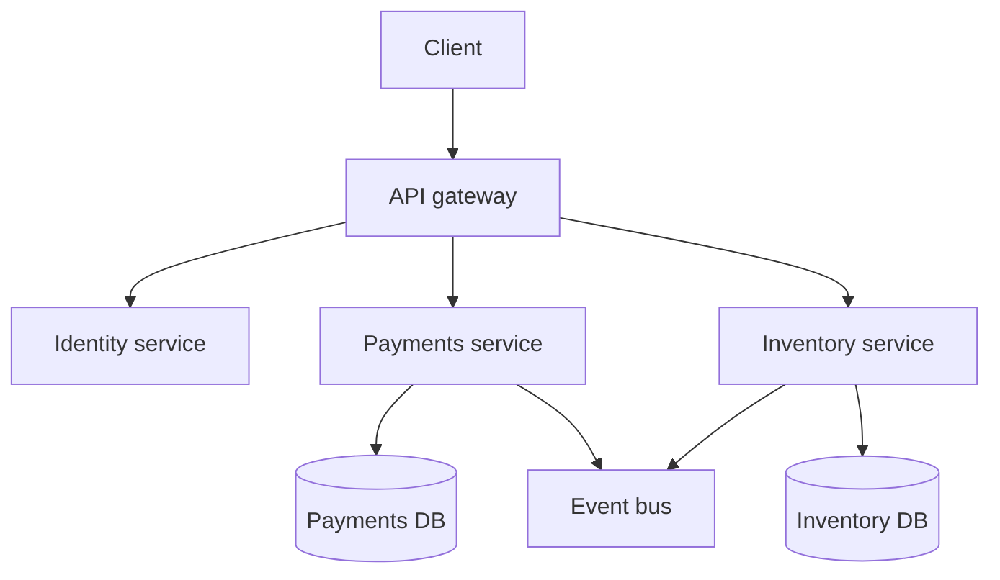

import { ConceptTemplate } from '@/features/kb/components/templates/ConceptTemplate'
import { Callout } from '@/features/kb/components/mdx/Callout'
import { ComparisonTable } from '@/features/kb/components/mdx/ComparisonTable'

export default function Layout({ children }) {
  return (
    <ConceptTemplate title="Microservices Architecture">
      {children}
    </ConceptTemplate>
  )
}

A **monolith** is one deployable unit: one process image, one release train, often one database. **Microservices** split that system into independently deployable services, each owning a business capability and, ideally, its own data. The style is an organizational and operational choice first, a code-structure choice second.

Sam Newman’s test is useful: can you deploy this service on its own, on its own schedule, without changing the others? If every release is a lockstep dance, you have a **distributed monolith**.

## 1. Deep Dive and Mechanics

**Service boundaries.** Good cuts follow **bounded contexts** (payments, catalog, identity), not technical layers (all controllers, all repositories). A wrong cut creates chatty, high-latency workflows and shared-database coupling.

**Independent deploy and scale.** You can add replicas of checkout on a peak day without scaling the CMS. That only works if the services do not share a process, a lock-step schema, or a single release artifact.

**Communication.** Synchronous HTTP or gRPC for queries that must complete in one user request. Events for fan-out and eventual consistency. An **API gateway** terminates public traffic; a **service mesh** can handle mTLS, retries, and telemetry between services.

**Data.** Each service owns its store. Cross-service joins become APIs or materialized views. Distributed ACID is replaced by **sagas**, outboxes, and compensating actions.

**Operations tax.** You now own many CI pipelines, many runtime identities, distributed tracing, and a story for partial failure. Function calls became network calls with timeouts, retries, and idempotency keys.

<Callout icon="warning" title="The microservice premium">
Martin Fowler’s warning still holds: the platform cost (orchestration, CI, gateways, observability) makes microservices slower to start than a modular monolith. Extract a service when a team or a scaling axis demands it, not because a diagram looked modern.
</Callout>

## 2. Mathematical / Theoretical Foundation

Microservices trade **in-process certainty** for **independent failure domains**. Availability of a synchronous chain is roughly the product of component availabilities. Ten services at 99.9 percent in series is about 99.0 percent if you wait on all of them. Timeouts, bulkheads, and caches exist to break that product.

Amdahl and queueing show up again: a hot service is a single queue. Independent scale helps only if that service is actually the bottleneck and is not serialized behind a shared database.

Conway’s Law is the organizational theorem: the architecture will copy the communication structure of the company. Microservices without aligned teams become a network of tickets.

<ComparisonTable
  headers={['Dimension', 'Monolith', 'Microservices']}
  rows={[
    ['Deploy unit', 'One artifact', 'Many independently released services'],
    ['Scale', 'Scale the whole process', 'Scale the hot capability'],
    ['Data', 'One database is common', 'Database per service is the ideal'],
    ['Failure', 'Process crash is total', 'Partial failure is the default'],
    ['Org fit', 'Small team, one codebase', 'Many teams, explicit contracts'],
  ]}
/>

## 3. Real-World Implementation

A gateway can route by path while each service stays ignorant of the others. The snippet is a teaching model, not a production proxy.

```python
from http.server import BaseHTTPRequestHandler

ROUTES = {
    "/payments": "http://payments:8080",
    "/catalog": "http://catalog:8080",
}

class Gateway(BaseHTTPRequestHandler):
    def do_GET(self):
        for prefix, upstream in ROUTES.items():
            if self.path.startswith(prefix):
                self.send_response(302)
                self.send_header("Location", upstream + self.path)
                self.end_headers()
                return
        self.send_error(404, "no service")
```

The interesting production work is not the route table. It is timeouts, authn propagation, and what happens when payments is slow: fail fast, serve a degraded catalog, or queue a retry.

## 4. Visualizations



## 5. Interview Prep

**Q: Microservices versus a modular monolith?**
**A:** A modular monolith keeps in-process calls and a single deploy, but enforces module boundaries and sometimes separate schemas. Extract a module when independent scale, independent release, or a separate team justifies the network tax.

**Q: How do you know a boundary is wrong?**
**A:** Frequent lock-step releases, shared tables, and chatty synchronous loops for one user action. Those are signs you split a single transaction or a single model.

**Q: What is a distributed monolith?**
**A:** Many repos and processes that still must ship together because of shared libraries, a shared database, or unversioned contracts. You paid the operational cost without buying independence.

**Q: Sync or async between services?**
**A:** Sync when the user is blocked on the answer and the callee is in the critical path. Async when you can confirm acceptance and finish work later. Mixing without timeouts and idempotency is how outages cascade.

## 6. Production Use Cases

- **Large product orgs** (streaming, commerce, ride-hail) where dozens of teams need independent release trains.
- **Uneven scale**: a recommendation or checkout path that needs 10x capacity while account settings stay quiet.
- **Polyglot islands**: a Python model-serving slice next to a Go I/O service, each with its own runtime — only after the contract is stable.

<Callout icon="tip" title="Start with modules">
Package-by-capability inside one deployable, with no cross-module table access, is the cheapest rehearsal for extraction. If you cannot keep modules honest, you will not keep services honest.
</Callout>
