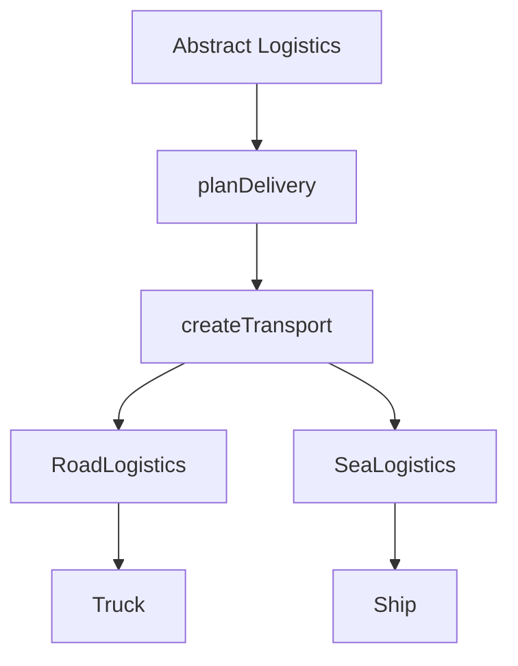

import { ConceptTemplate } from '@/features/kb/components/templates/ConceptTemplate'
import { Callout } from '@/features/kb/components/mdx/Callout'
import { ComparisonTable } from '@/features/kb/components/mdx/ComparisonTable'

export default function Layout({ children }) {
  return (
    <ConceptTemplate title="Factory Method Pattern">
      {children}
    </ConceptTemplate>
  )
}

Calling a constructor inside business logic **welds that logic to a concrete class**. The **Factory Method** (Gang of Four, creational) replaces `new Concrete` with a method the creator hierarchy can override. The rest of the algorithm talks only to a product interface.

This is not a giant `SimpleFactory` switch in a static helper, and it is not Abstract Factory (a family of related products). Factory Method is **inheritance-based variation of one product**.

## 1. Deep Dive and Mechanics

**Product.** An interface or abstract class: Transport with deliver. Concrete products: Truck, Ship.

**Creator.** An abstract class that implements the business algorithm (plan a delivery) and declares `createTransport`. Concrete creators (RoadLogistics, SeaLogistics) implement that method and return the matching product.

**Inversion.** High-level code no longer names Truck. Adding air freight is a new creator and product. Existing planning code stays closed (Open/Closed).

**When it pays.** Frameworks and libraries that must let applications plug in types: parsers, connection objects, UI toolkits, test fakes. **When it does not:** a single concrete type that will never vary. Then a factory is theater.

<Callout icon="info" title="Factory Method versus Abstract Factory">
Factory Method: one overridable create method, often via subclassing. Abstract Factory: an object that builds a family (Button plus Checkbox for a look-and-feel). If you only need one product kind, stay with Factory Method or a simple function.
</Callout>

## 2. Mathematical / Theoretical Foundation

The pattern is a **dependency inversion** move: the creator depends on the product abstraction; concrete types depend on that same abstraction. In type-system terms, the return type is a supertype; subclasses refine it (covariant returns are allowed in some languages).

It also encodes the **strategy of construction** separately from the **strategy of use**. Complexity is linear in the number of product variants you actually add, not in a combinatorial explosion of if-else branches inside the algorithm. The cost is an extra type per variant (creator plus product).

<ComparisonTable
  headers={['Approach', 'How types appear', 'Change cost']}
  rows={[
    ['Direct new', 'Business method names a class', 'Edit the algorithm for every variant'],
    ['Switch factory', 'One function with a type tag', 'Central function grows forever'],
    ['Factory Method', 'Subclass supplies the product', 'Add types; leave the algorithm'],
    ['Abstract Factory', 'Factory object builds a family', 'Swap families together'],
  ]}
/>

## 3. Real-World Implementation

```typescript
interface Transport {
  deliver(): string
}

class Truck implements Transport {
  deliver() { return "land" }
}

class Ship implements Transport {
  deliver() { return "sea" }
}

abstract class Logistics {
  abstract createTransport(): Transport

  planDelivery(): string {
    const transport = this.createTransport()
    return transport.deliver()
  }
}

class RoadLogistics extends Logistics {
  createTransport(): Transport { return new Truck() }
}

class SeaLogistics extends Logistics {
  createTransport(): Transport { return new Ship() }
}
```

The application picks RoadLogistics or SeaLogistics at composition time (config, DI). `planDelivery` never mentions Truck.

## 4. Visualizations



## 5. Interview Prep

**Q: Why not a static create method with a string type?**
**A:** That centralizes every variant and still requires an edit for each new type. Factory Method spreads the decision across types so each variant is closed in its own class. A small static factory is fine when the set is tiny and stable.

**Q: Factory Method versus Dependency Injection?**
**A:** DI injects the already-built collaborator. Factory Method creates the collaborator **during** the algorithm, often when the exact type depends on subclass or runtime data. Many DI containers also register factories.

**Q: Does this violate YAGNI?**
**A:** Yes, if you invent a hierarchy for one product. Introduce the method when a second product appears or when a test needs a fake product without patching constructors.

**Q: How does this relate to SOLID?**
**A:** It supports Open/Closed and Dependency Inversion. It can fight Single Responsibility if the creator also grows unrelated orchestration. Keep the factory method small.

## 6. Production Use Cases

- **SDK and plugin hosts** that load application-supplied products (payment processors, file exporters, auth backends).
- **Cross-platform UI** where each OS subclass creates native widgets behind a shared window-setup algorithm.
- **Tests** that subclass the creator and return fakes, avoiding a global monkeypatch of constructors.

<Callout icon="tip" title="Prefer a function until you need a hierarchy">
In languages with first-class functions, a create callback injected into the algorithm is often enough. Graduate to a creator class when several methods must stay consistent.
</Callout>
