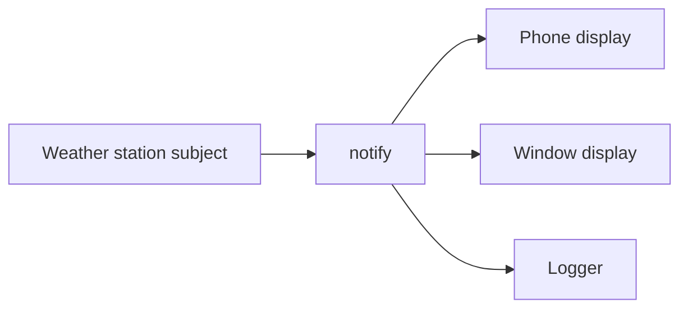

import { ConceptTemplate } from '@/features/kb/components/templates/ConceptTemplate'
import { Callout } from '@/features/kb/components/mdx/Callout'
import { ComparisonTable } from '@/features/kb/components/mdx/ComparisonTable'

export default function Layout({ children }) {
  return (
    <ConceptTemplate title="Observer Pattern">
      {children}
    </ConceptTemplate>
  )
}

The **Observer** pattern (Gang of Four, behavioral) sets up a **one-to-many** link: a **subject** holds state; **observers** register for changes. When the subject mutates, it notifies subscribers. You do not poll. You do not hard-code the list of UIs, loggers, or downstream services into the subject’s business methods.

Newspaper analogy: you do not visit the press each morning. The publisher keeps a subscriber list and pushes the edition.

GUI toolkits, event buses, ReactiveX, and store subscriptions in front-end frameworks are industrial versions of this idea. Pub/sub at the process or cluster boundary is the same shape with a broker in the middle.

## 1. Deep Dive and Mechanics

**Subject API.** attach, detach, notify. Notify walks the current list and calls update on each observer. Push models send the new data in the call. Pull models send a signal; observers query the subject.

**Registration lifetime.** Forgotten detach is a leak: a dead view stays in the list and keeps a heap object alive. Weak references or explicit unsubscribe in teardown are the usual fixes.

**Ordering and reentrancy.** If observer A updates the subject, notify can re-enter or see a list that mutates while you iterate. Copy the list before fan-out. Decide whether order is guaranteed (usually it should not be part of the contract).

**Error isolation.** One throwing observer should not cancel the rest unless you explicitly want fail-fast. Production subjects catch, log, and continue.

<Callout icon="warning" title="Observer is not a domain event bus">
In-process Observer is fine for UI and local reactions. Once you cross processes, you need delivery guarantees, identity, and schema — that is EDA, not a list of function pointers.
</Callout>

## 2. Mathematical / Theoretical Foundation

Observer implements **publish-subscribe** inside one address space. Fan-out cost is linear in the number of observers per notification. If each observer does heavy work on the subject’s thread, latency is the sum of those costs. Offload or make notify asynchronous if that sum is user-visible.

It inverts control: the subject does not name concrete observers, which is Dependency Inversion applied to reactions. The graph of subjects and observers must stay a DAG for a given update storm; cycles create infinite notify loops.

Rx and FRP add operators (map, filter, debounce) on top of the same subscribe/notify core, plus a story for backpressure and completion.

<ComparisonTable
  headers={['Style', 'Who initiates', 'Typical use']}
  rows={[
    ['Polling', 'Observer asks on a timer', 'Simple but wasteful'],
    ['Observer push', 'Subject calls update with data', 'UI widgets, in-process hooks'],
    ['Observer pull', 'Subject signals; observer reads', 'Large state, observers need slices'],
    ['Message pub/sub', 'Broker delivers across processes', 'Microservices, EDA'],
  ]}
/>

## 3. Real-World Implementation

```typescript
type Listener = (tempC: number) => void

class WeatherStation {
  private listeners: Listener[] = []
  private tempC = 0

  subscribe(fn: Listener): () => void {
    this.listeners.push(fn)
    return () => {
      this.listeners = this.listeners.filter((x) => x !== fn)
    }
  }

  setTemperature(tempC: number): void {
    this.tempC = tempC
    for (const fn of [...this.listeners]) {
      fn(this.tempC)
    }
  }
}

const station = new WeatherStation()
const stop = station.subscribe((t) => console.log(t))
station.setTemperature(25)
stop()
```

Returning an unsubscribe function matches how DOM events and Rx subscriptions work and makes leaks harder to ignore.

## 4. Visualizations



## 5. Interview Prep

**Q: Observer versus Pub/Sub?**
**A:** Observer usually means the subject holds references to observers. Pub/sub usually inserts a channel or broker so publishers do not know subscribers. Same idea, different coupling and lifetime.

**Q: How do you avoid memory leaks?**
**A:** Always detach on teardown. Prefer weak refs for views. In UIs, subscribe in mount and unsubscribe in unmount. Never leave an anonymous lambda you cannot remove.

**Q: Push or pull?**
**A:** Push is simple when the payload is small. Pull avoids broadcasting a huge object when each observer needs a different slice. Hybrid: push a change set or version, pull details.

**Q: What breaks in multithreaded subjects?**
**A:** Concurrent attach/detach versus notify needs a lock or a concurrent list. Do not hold the lock while calling user code (deadlock). Copy-on-notify is the usual pattern.

## 6. Production Use Cases

- **Desktop and mobile UI**: views subscribe to a model or store; a single state change refreshes many widgets.
- **Domain hooks** inside a monolith: after OrderPaid, notify tax, email, and audit modules without a dependency cycle.
- **Metrics and logging** as observers on a request context, so product code does not import every sink.

<Callout icon="tip" title="Copy the list before notify">
If an observer unsubscribes itself mid-broadcast, iterating the live array skips or double-calls neighbors. Snapshot the listeners first.
</Callout>
