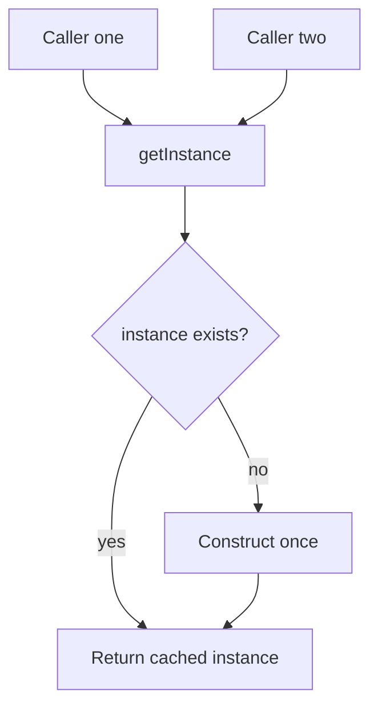

import { ConceptTemplate } from '@/features/kb/components/templates/ConceptTemplate'
import { Callout } from '@/features/kb/components/mdx/Callout'
import { ComparisonTable } from '@/features/kb/components/mdx/ComparisonTable'

export default function Layout({ children }) {
  return (
    <ConceptTemplate title="Singleton Pattern">
      {children}
    </ConceptTemplate>
  )
}

The **Singleton** (Gang of Four, creational) promises **exactly one instance** of a class and a **global access point**. Classic recipe: private constructor, a static slot, and a static getter that allocates on first use.

It is famous because it is easy to write and controversial because it is **hidden global state**. Modern systems usually want the *lifecycle* (one logger, one connection pool) without the *pattern* (hard-wired statics that tests cannot replace).

## 1. Deep Dive and Mechanics

**Construction gate.** Clients cannot call `new`. They call `getInstance`. First caller creates; later callers get the same object.

**Laziness versus eager.** Lazy saves startup cost and can fail on first use. Eager (static initializer) is simpler and easier to reason about in languages with well-defined class-init locks.

**Threads.** A naive null-check plus assign races: two threads can both see empty and both construct. Fixes: language-level class initialization, a mutex around create, or an enum/module that the runtime initializes once.

**Process and isolate boundaries.** A Singleton is one instance **per class loader, per process, per isolate** — not one per planet. In Java EE, multiple class loaders meant multiple singletons. In serverless, each runtime may have its own.

**Tests.** Static state survives between cases. You need a reset hook (ugly) or you stop using a Singleton and inject the dependency.

<Callout icon="warning" title="Often an anti-pattern">
A Singleton couples callers to a concrete type and a process-wide lifetime. Dependency injection can still give you one instance (a container-scoped object) without making the class police its own cardinality.
</Callout>

## 2. Mathematical / Theoretical Foundation

Cardinality is a **constraint on the object graph**: the type has a unique inhabitant at runtime. That is useful for scarce hardware (one serial port) and harmful for anything you might want two of in a test (two clocks, two feature-flag snapshots).

From a concurrency view, the initialize-once problem is the **safe publication** problem. Without a memory barrier, thread B can see a non-null reference to a partially constructed object. Language constructs (static init, `once_cell`, Python module import lock) exist so you do not write a broken double-checked lock.

Globally reachable mutable state also destroys **referential transparency** and makes effect order implicit. That is why functional and test-heavy codebases treat Singleton as a last resort.

<ComparisonTable
  headers={['Approach', 'One instance?', 'Testable?']}
  rows={[
    ['Classic Singleton', 'Yes, enforced in the class', 'Hard: hidden static'],
    ['Module-level object', 'Yes, per process import', 'Medium: patch the module'],
    ['DI singleton scope', 'Yes, container policy', 'Yes: bind a fake in tests'],
    ['Pass a value', 'Only if you pass the same one', 'Yes: call site is explicit'],
  ]}
/>

## 3. Real-World Implementation

```typescript
class DatabasePool {
  private static instance: DatabasePool | undefined

  private constructor(readonly dsn: string) {}

  static getInstance(dsn: string): DatabasePool {
    if (!DatabasePool.instance) {
      DatabasePool.instance = new DatabasePool(dsn)
    }
    return DatabasePool.instance
  }

  static resetForTests(): void {
    DatabasePool.instance = undefined
  }
}

const a = DatabasePool.getInstance("postgres://local")
const b = DatabasePool.getInstance("postgres://local")
console.log(a === b)
```

Note the second call ignores a different DSN: the Singleton froze the first configuration. That surprise is a frequent production bug.

## 4. Visualizations



## 5. Interview Prep

**Q: Why do interviewers still ask for a thread-safe Singleton?**
**A:** To hear you mention safe publication, class-init locks, and why double-checked locking is easy to get wrong. Then say you would rather inject a scoped service.

**Q: Singleton versus static class?**
**A:** Static methods cannot implement an interface cleanly and are even harder to replace. A Singleton at least is an object. Both are global.

**Q: Is a logger a good Singleton?**
**A:** Operationally you want one configured logger. Implement it as a process module or a DI singleton. Avoid baking `Logger.getInstance` into domain types; pass an interface so tests can silence I/O.

**Q: What about enums in Java?**
**A:** Joshua Bloch’s enum Singleton is concise and serialization-safe. It still is global state. Use it for true unique constants, not as a service locator.

## 6. Production Use Cases

- **Process-wide clients** that wrap a scarce resource: a metrics registry, a tracing tracer, a hardware handle.
- **Configuration snapshots** loaded once at boot — better as an immutable value constructed in main and passed down.
- **Legacy interop** where a C library truly allows one context; isolate that Singleton at the edge so the rest of the app stays injectable.

<Callout icon="tip" title="Prefer compose over getInstance">
If the call site can accept a parameter, pass the collaborator. The one-instance policy belongs in the composition root, not in every domain class.
</Callout>
