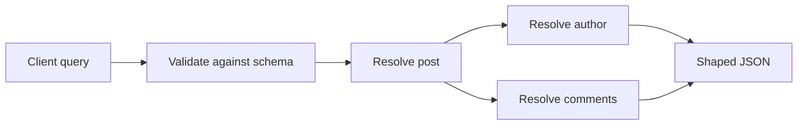

import { ConceptTemplate } from '@/features/kb/components/templates/ConceptTemplate'
import { Callout } from '@/features/kb/components/mdx/Callout'
import { ComparisonTable } from '@/features/kb/components/mdx/ComparisonTable'

export default function Layout({ children }) {
  return (
    <ConceptTemplate title="GraphQL">
      {children}
    </ConceptTemplate>
  )
}

**GraphQL** is a query language and runtime for APIs. Facebook built it in 2012 so mobile clients could fetch a **shaped graph** in one round trip instead of stitching many REST resources. The server publishes a **schema**. The client names the fields it wants. The JSON response mirrors that shape.

There is usually one HTTP endpoint, often POST to a path named graphql. That is a convention, not the interesting part. The interesting part is the **type system**, **resolvers**, and the risk of turning your database into an unbounded query engine.

## 1. Deep Dive and Mechanics

**Schema.** Object types, scalars, enums, interfaces, unions, and input types. Queries read. Mutations write and return the new graph. Subscriptions push updates (often over WebSockets).

**Resolvers.** Each field can have a function (parent, args, context, info) that returns the next value. Nested fields walk the graph. Naive resolvers issue one SQL query per child and recreate the **N plus one** problem you thought you left behind.

**Batching.** DataLoader-style caches coalesce loads in one tick: many author ids become one `WHERE id IN (...)` query. Without that, GraphQL is slower than the REST waterfall it replaced.

**Validation and execution.** The runtime validates the document against the schema, then executes a breadth-first plan. Clients can send named operations and variables. Persisted queries store the document on the server and send only a hash — useful for CDNs and allow-lists.

**Authz.** Field-level authorization must live in resolvers or a middleware that sees the path. A single endpoint does not mean a single permission.

<Callout icon="warning" title="The server now owns query cost">
Clients can ask for deep nests and wide lists. You need depth limits, complexity budgets, timeouts, and pagination (connections with cursors). A public GraphQL API without those is an easy denial-of-service.
</Callout>

## 2. Mathematical / Theoretical Foundation

GraphQL execution is a walk over a **directed graph** defined by the schema. Each selected field is a node expansion. Cost is roughly the number of resolver invocations, which can be exponential in depth if lists nest (comments of comments of comments).

Over-fetching in REST wastes bandwidth: payload size grows with the union of all clients. Under-fetching wastes **round trips** (latency adds). GraphQL trades those for **server CPU and fan-out**. The right model is a cost function: estimated nodes visited, not just request count.

Schema stitching and federation (Apollo Federation, GraphQL Mesh) compose subgraphs. The gateway planner becomes a distributed query optimizer. That is powerful and operationally heavy.

<ComparisonTable
  headers={['Operation', 'REST analogue', 'Role']}
  rows={[
    ['Query', 'GET', 'Read without side effects'],
    ['Mutation', 'POST, PUT, PATCH, DELETE', 'Write, then return new fields'],
    ['Subscription', 'WebSocket or SSE stream', 'Push when server data changes'],
  ]}
/>

## 3. Real-World Implementation

A tiny executor maps field names to functions. Real servers (graphql-js, gqlgen, graphql-java) add validation, fragments, and errors per field.

```python
SCHEMA = {
    "post": lambda args, db: db.post(args["id"]),
    "author": lambda post, db: db.user(post.author_id),
}

def resolve_post(db, post_id: int) -> dict:
    post = SCHEMA["post"]({"id": post_id}, db)
    return {
        "title": post.title,
        "author": {"name": SCHEMA["author"](post, db).name},
    }
```

In production, replace the lambda map with generated types and a DataLoader keyed by id so sibling fields share one batch.

## 4. Visualizations



## 5. Interview Prep

**Q: How does GraphQL fix over-fetching and under-fetching?**
**A:** The client lists fields, so unused REST attributes stay off the wire. Nested selections collapse several REST resources into one document. You still must paginate lists and authorize fields.

**Q: GraphQL versus REST for a public API?**
**A:** REST wins on HTTP caching, status codes, and CDN friendliness. GraphQL wins on client flexibility and versioning via additive schema. Many companies expose REST publicly and GraphQL to first-party apps.

**Q: What is the N plus one problem here?**
**A:** A list of N posts each resolving author hits the user table N times. Batch and cache loads per request. This is the first GraphQL backend review comment for a reason.

**Q: How do you version GraphQL?**
**A:** Prefer additive, nullable new fields. Deprecate old fields in the schema. Breaking removals need a sunset, not a silent v2 path — though some teams still run two graphs.

## 6. Production Use Cases

- **Mobile and SPA BFF**: one graph tailored to screens, hiding a zoo of internal REST and gRPC services.
- **Developer platforms** (GitHub, Shopify) where third parties need many shapes of the same entities.
- **Federated graphs** in large orgs: each domain team owns a subgraph; a gateway composes them.

<Callout icon="tip" title="Treat the schema as the contract">
Review schema changes like API reviews. A renamed field is a breaking change for every client document, not a private refactor.
</Callout>
