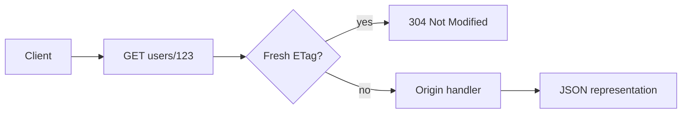

import { ConceptTemplate } from '@/features/kb/components/templates/ConceptTemplate'
import { Callout } from '@/features/kb/components/mdx/Callout'
import { ComparisonTable } from '@/features/kb/components/mdx/ComparisonTable'

export default function Layout({ children }) {
  return (
    <ConceptTemplate title="RESTful APIs">
      {children}
    </ConceptTemplate>
  )
}

**REST** (Representational State Transfer) is Roy Fielding’s 2000 architectural style for networked systems. It is not “JSON over HTTP.” True REST uses **resources**, **representations**, **uniform interface**, **stateless** interactions, and **hypermedia** as the engine of application state (HATEOAS). Most industry APIs are **pragmatic REST**: nouns as URLs, HTTP verbs as actions, JSON bodies, and little or no hypermedia.

That pragmatism still buys a lot: caches, proxies, status codes, and a model every HTTP client already speaks.

## 1. Deep Dive and Mechanics

**Resources and URIs.** A user, an order, a collection of orders. Identify them with nouns: `/users/123`, not `/getUserById`. Collections and items are different resources. Query strings filter and page; they should not hide a second verb.

**Uniform interface.** GET reads and must be safe. PUT replaces and is idempotent. PATCH patches. POST creates or triggers a non-idempotent action. DELETE removes. Idempotency means repeating the request leaves the same resource state (POST usually does not).

**Representations.** The same order can be JSON, XML, or a PDF via content negotiation (Accept). ETags and If-None-Match make conditional GET cheap.

**Statelessness.** The server does not keep session memory for the next call. Auth travels with the request (cookie, bearer token). Any replica can serve any request. That is how you scale horizontally.

**Hypermedia.** Fielding’s full vision: responses include links for the next legal actions. Few public APIs do this well. Interviewers still want you to know why it exists: clients should not hard-code every URL transition.

<Callout icon="info" title="RPC in REST clothing">
A POST to `/processPayment` with no resource model is RPC. It can be the right tool. Just do not call it REST in a design review. REST is the resource-and-verb discipline, not any HTTP JSON endpoint.
</Callout>

## 2. Mathematical / Theoretical Foundation

REST constraints are a **scalability argument**. Statelessness removes server affinity, so load balancing is a function of request rate, not session map size. Safe, cacheable GET lets intermediaries collapse N identical reads into one origin fetch (cache hit ratio).

Idempotency is the algebraic property f(f(x)) = f(x) on resource state. It is what makes retries under at-least-once networks safe for PUT and DELETE. POST needs **Idempotency-Key** headers if the client must retry.

Richardson’s maturity model is a teaching ladder: HTTP, then resources, then verbs, then hypermedia. Most teams live at level two.

<ComparisonTable
  headers={['HTTP method', 'CRUD', 'Idempotent?', 'Safe?']}
  rows={[
    ['GET', 'Read', 'Yes', 'Yes'],
    ['POST', 'Create or action', 'No', 'No'],
    ['PUT', 'Replace', 'Yes', 'No'],
    ['PATCH', 'Partial update', 'Often no', 'No'],
    ['DELETE', 'Delete', 'Yes', 'No'],
  ]}
/>

## 3. Real-World Implementation

A tiny resource router maps method plus path to handlers and returns proper status codes.

```python
from http.server import BaseHTTPRequestHandler
import json

USERS = {"123": {"id": "123", "name": "Ada"}}

class UsersApi(BaseHTTPRequestHandler):
    def do_GET(self):
        parts = self.path.strip("/").split("/")
        if parts == ["users", "123"]:
            body = json.dumps(USERS["123"]).encode()
            self.send_response(200)
            self.send_header("Content-Type", "application/json")
            self.send_header("ETag", '"v1"')
            self.end_headers()
            self.wfile.write(body)
            return
        self.send_error(404)

    def do_PUT(self):
        length = int(self.headers.get("Content-Length", 0))
        USERS["123"] = json.loads(self.rfile.read(length))
        self.send_response(204)
        self.end_headers()
```

PUT of the full user is idempotent: sending the same body twice leaves the same record.

## 4. Visualizations



## 5. Interview Prep

**Q: PUT versus PATCH?**
**A:** PUT replaces the representation; omitted fields disappear if you treat the body as the new whole. PATCH applies a partial document or a patch format (JSON Patch). PUT retries are safer. PATCH semantics depend on your spec.

**Q: Why must REST be stateless?**
**A:** Session memory on a specific box breaks horizontal scale and failover. Tokens and resource state in the database keep every instance interchangeable.

**Q: What does idempotent mean for DELETE?**
**A:** Deleting an already-missing resource should still return success or a consistent 404 policy you document — the resource stays gone. Clients can retry after a timeout.

**Q: REST versus GraphQL versus gRPC?**
**A:** REST: public HTTP, caches, simple clients. GraphQL: client-shaped reads, one endpoint, harder cache and cost control. gRPC: typed binary, streaming, best inside the data center.

## 6. Production Use Cases

- **Public SaaS APIs** where partners already have HTTP toolchains, API gateways, and OpenAPI docs.
- **Resource-oriented backends** for CRUDish domains: users, files, tickets, with CDN-cached GET on mostly-static resources.
- **Webhooks and callbacks** that POST event representations to customer URLs — REST as the lingua franca between companies.

<Callout icon="tip" title="Status codes are part of the API">
Use 201 with Location on create, 204 on empty success, 400 for bad input, 401/403 for auth, 404 for missing, 409 for conflict, 429 for rate limits. A blanket 200 with an error field in JSON fights every proxy and client library.
</Callout>
