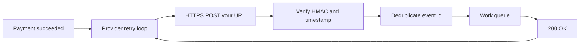

import { ConceptTemplate } from '@/features/kb/components/templates/ConceptTemplate'
import { Callout } from '@/features/kb/components/mdx/Callout'
import { ComparisonTable } from '@/features/kb/components/mdx/ComparisonTable'

export default function Layout({ children }) {
  return (
    <ConceptTemplate title="Webhooks">
      {children}
    </ConceptTemplate>
  )
}

A **webhook** is an HTTP callback you register so another system can **push** an event to your URL when something happens. People call them reverse APIs: you are no longer the client polling Stripe or GitHub; they become the client for one POST.

Polling asks “is order 123 paid yet?” every few seconds. A webhook says “POST this signed payload to my HTTPS endpoint when payment_intent.succeeded fires.” You trade a public, authenticated ingress surface for lower latency and far less wasted I/O.

## 1. Deep Dive and Mechanics

**Registration.** You store a destination URL, a secret, and a set of event types in the provider’s dashboard or API. The provider treats that URL as an untrusted remote.

**Delivery.** On the event, the provider POSTs a JSON body plus headers (event type, delivery id, signature). Your handler verifies the signature, enqueues work, and returns 2xx quickly. Slow handlers get retries and, eventually, disabled endpoints.

**Security.** Anyone who finds the URL can POST junk unless you **verify a MAC** (HMAC-SHA256 over the raw body plus a timestamp). Reject stale timestamps to stop replay. Require HTTPS. Optionally allow-list source IPs — a weak extra, not a substitute for signatures.

**Retries.** Providers promise **at-least-once**. Timeouts, 5xx, or connection errors replay the same delivery id. Your handler must be **idempotent**: fulfilling the same payment twice is the classic incident.

**Ordering.** Do not assume events arrive in causal order. A refund can race an authorization. Persist by event id and apply business rules that tolerate reorder.

<Callout icon="warning" title="Acknowledge first, work second">
If you run a five-second fulfillment inside the HTTP handler, the provider times out and retries while you also succeed. Return 200 after signature check and enqueue, then process asynchronously.
</Callout>

## 2. Mathematical / Theoretical Foundation

Webhooks are **callback-based integration** over an unreliable network. Delivery is a retry loop with exponential backoff: attempt k waits on the order of 2^k seconds up to a cap. That is the same transient-fault math as message queues, without a broker you control.

Idempotency is a function I such that I(e) = I(e) for duplicate event id e. The usual implementation is a unique index on provider delivery id or on a business key (payment id plus event type).

Trust is a **shared-secret MAC**. Without constant-time compare, you leak the secret via timing. Without a bound on timestamp skew, an old captured POST works forever.

<ComparisonTable
  headers={['Style', 'Who calls whom', 'Failure mode']}
  rows={[
    ['Polling', 'You call them on a timer', 'Waste and lag'],
    ['Webhook', 'They POST to your URL', 'You must be up, signed, idempotent'],
    ['Message bus', 'Both use a broker', 'Shared infra, richer semantics'],
  ]}
/>

## 3. Real-World Implementation

Verify the signature on the **raw body**, not a re-serialized JSON object. Then record the event id before side effects.

```python
import hmac
import hashlib
import time

def verify(secret: bytes, payload: bytes, header_ts: int, header_sig: str, skew=300) -> bool:
    if abs(time.time() - header_ts) > skew:
        return False
    expect = hmac.new(secret, payload, hashlib.sha256).hexdigest()
    return hmac.compare_digest(expect, header_sig)

def handle(secret, payload, header_ts, header_sig, event_id, seen: set[str]) -> int:
    if not verify(secret, payload, header_ts, header_sig):
        return 400
    if event_id in seen:
        return 200
    seen.add(event_id)
    # enqueue payload for workers
    return 200
```

In production, `seen` is a database unique constraint, not an in-memory set.

## 4. Visualizations



## 5. Interview Prep

**Q: How do you authenticate a webhook?**
**A:** Shared-secret HMAC over the raw bytes, plus a timestamp and replay window. Do not trust a shared password in a query string. mTLS is better when both sides can provision certs.

**Q: Why did we ship twice?**
**A:** At-least-once delivery plus a non-idempotent fulfill. Fix with a unique business key and a state machine (already_shipped is success).

**Q: Webhook versus message queue?**
**A:** Webhooks integrate **separate organizations** over the public internet with no shared Kafka. Queues win inside your own network for throughput, replay, and ordering. Some providers let you pull from a queue instead of exposing a URL.

**Q: How do you test locally?**
**A:** Tunnel tools, provider CLI forwarders, or recorded fixtures replayed through the verify function. Never disable signature checks in production configs.

## 6. Production Use Cases

- **Payments**: Stripe, Adyen, PayPal notify capture, dispute, and payout events.
- **Dev tools**: GitHub push and PR events drive CI; Slack interactivity posts to your app.
- **SaaS platforms**: you expose webhook subscriptions so your customers can automate their own workflows.

<Callout icon="tip" title="Log the delivery id">
When a customer says they missed an event, the delivery id plus your unique index tells you received-and-ignored versus never-arrived. That is the first debug question.
</Callout>
