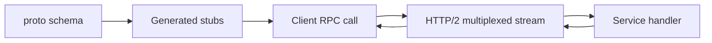

import { ConceptTemplate } from '@/features/kb/components/templates/ConceptTemplate'
import { Callout } from '@/features/kb/components/mdx/Callout'
import { ComparisonTable } from '@/features/kb/components/mdx/ComparisonTable'

export default function Layout({ children }) {
  return (
    <ConceptTemplate title="gRPC">
      {children}
    </ConceptTemplate>
  )
}

**gRPC** is Google’s modern RPC stack: you call a generated method that looks local, and the library ships a typed binary message over **HTTP/2**. It is the default choice for **service-to-service** traffic where you control both ends. Public browser clients still tend to speak REST or GraphQL; browsers do not expose the raw HTTP/2 primitives gRPC wants, so you add gRPC-Web or a proxy.

The contract lives in a `.proto` file. `protoc` (or Buf) generates stubs in Go, Java, Python, C++, TypeScript, and more. That generated surface is the API.

## 1. Deep Dive and Mechanics

**Protocol Buffers.** Fields have numbers, types, and optional/repeated labels. Serialization is binary and compact. Unknown fields are preserved, which makes additive evolution possible. JSON mapping exists for debugging, not for the hot path.

**Four method shapes.** Unary: one request, one response. Server streaming: one request, many responses. Client streaming: many requests, one response. Bidirectional streaming: both sides send a flow on one RPC.

**HTTP/2.** Many RPCs **multiplex** on one TCP or TLS connection. Headers compress (HPACK). Streams have flow control. That beats a pile of HTTP/1.1 connections with JSON parsers on each hop.

**Deadlines and status.** Every RPC should carry a deadline. Status codes (OK, INVALID_ARGUMENT, DEADLINE_EXCEEDED, UNAVAILABLE, ALREADY_EXISTS) are part of the API. Retries need idempotent methods and server-side dedupe.

**Interceptors.** Auth, tracing, and logging wrap the stub. Metadata (headers) carry bearer tokens and trace ids.

<Callout icon="info" title="Browsers need a translation layer">
gRPC-Web or Envoy turns browser-friendly HTTP into upstream gRPC. Do not promise a raw gRPC client inside a React bundle without that hop.
</Callout>

## 2. Mathematical / Theoretical Foundation

Protobuf encoding is **tag-length-value**. Small integers use varints. Field numbers — not names — travel on the wire, so renaming a field is cheap and **reusing a number with a new meaning is a silent corruption**. Backward compatibility is a numbering discipline.

RPC latency is serialization plus network plus handler. Binary plus HTTP/2 typically wins on both CPU and bytes versus JSON REST for chatty internal graphs. The gain is largest when messages are many and small, or when streaming avoids request storms.

Load balancing is trickier than REST: connections are long-lived. You need L7 balancers that understand gRPC, or client-side LB with a resolver (look at least-request, not only round-robin on stale sockets).

<ComparisonTable
  headers={['Dimension', 'REST plus JSON', 'gRPC plus Protobuf']}
  rows={[
    ['Payload', 'Text, larger, easy to read', 'Binary, compact, generated types'],
    ['Contract', 'OpenAPI optional', 'Proto required; stubs generated'],
    ['Transport', 'Often HTTP/1.1', 'HTTP/2 streams'],
    ['Streaming', 'Chunked or SSE hacks', 'First-class stream RPCs'],
    ['Browser', 'Native fetch', 'Needs gRPC-Web or a gateway'],
  ]}
/>

## 3. Real-World Implementation

Define the service once, then implement the generated interface. The Python below sketches a unary handler; generated classes replace the dicts.

```python
# inventory.proto idea:
# service Inventory { rpc Reserve(ReserveReq) returns (ReserveResp); }

class InventoryServicer:
    def Reserve(self, request, context):
        if request.qty <= 0:
            context.abort(400, "qty must be positive")
        ok = stock.try_reserve(request.sku, request.qty)
        if not ok:
            context.abort(409, "insufficient stock")
        return {"ok": True, "sku": request.sku}
```

In real gRPC you call `context.set_code` / `abort` with `grpc.StatusCode`, not raw HTTP numbers. Deadlines live on the client stub: `stub.Reserve(req, timeout=0.2)`.

## 4. Visualizations



## 5. Interview Prep

**Q: Why gRPC inside the mesh and REST at the edge?**
**A:** Internal callers can take generated stubs, binary payloads, and streaming. External and browser callers need human-debuggable HTTP, caches, and easier auth. A gateway translates.

**Q: How do you evolve a proto safely?**
**A:** Add fields with new numbers; never reuse numbers; keep old fields or reserve their numbers; do not change types in place. Consumers ignore unknown fields. Breaking changes get a new package or a new RPC name.

**Q: Unary versus streaming?**
**A:** Unary is a typed function call. Stream when the payload is a sequence (log tail, chunked upload, pubsub-like push) and you want one RPC and backpressure, not N unary calls.

**Q: What breaks load balancing?**
**A:** Long-lived HTTP/2 connections pin traffic to one backend. Use connection limits, periodic reconnect, or an L7 proxy that balances per RPC.

## 6. Production Use Cases

- **Microservice meshes** (payments talking to fraud, storage talking to metadata) where both sides are in your cluster.
- **High-rate streaming**: metrics ingest, telemetry, multiplayer state, ML feature streams.
- **Polyglot contracts**: one proto, Go server, Python worker, Java monolith leftover — all sharing field numbers.

<Callout icon="tip" title="Set deadlines on every call">
A missing deadline is an unbounded wait. When a dependency hangs, your thread pool hangs. Timeouts plus idempotent retries are the minimum production wrapper.
</Callout>
