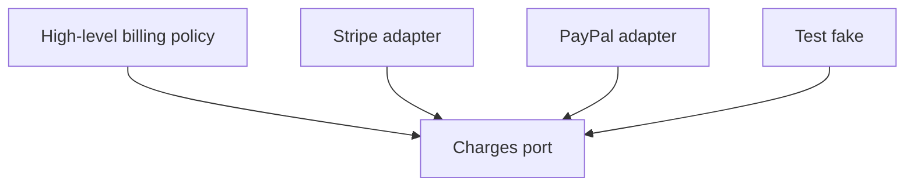

import { ConceptTemplate } from '@/features/kb/components/templates/ConceptTemplate'
import { Callout } from '@/features/kb/components/mdx/Callout'
import { ComparisonTable } from '@/features/kb/components/mdx/ComparisonTable'

export default function Layout({ children }) {
  return (
    <ConceptTemplate title="SOLID Principles">
      {children}
    </ConceptTemplate>
  )
}

**SOLID** is five object-oriented design principles popularized by Robert C. Martin. They fight the **big ball of mud**: a User type that also opens sockets, a switch statement that must be edited for every new payment rail, a subclass that breaks callers, a fat interface no implementer can satisfy, and high-level policy imported from low-level SQL.

The letters are a mnemonic, not a scoring rubric. Over-applying them produces a class explosion. Under-applying them produces brittle change.

## 1. Deep Dive and Mechanics

**S — Single Responsibility.** A module has one reason to change. User profile rules should not change when you migrate databases. Split persistence, transport, and domain policy. “One reason” is about **stakeholders and axes of change**, not “one method.”

**O — Open/Closed.** Open for extension, closed for modification. New behavior arrives as a new type or strategy, not as another branch in a sacred core function. Factory Method and Strategy exist to serve this letter.

**L — Liskov Substitution.** A subtype must honor the contract of its parent: stronger invariants are fine; weaker ones are not. A Square that inherits Rectangle and overrides setters to keep sides equal breaks callers that set width and height independently. Prefer composition when the taxonomy lies.

**I — Interface Segregation.** Do not force clients to depend on methods they never call. A Worker interface with fly and swim punishes Dog. Split into small role interfaces.

**D — Dependency Inversion.** High-level policy depends on abstractions; low-level details do too. The domain depends on a Repository interface; Postgres code implements it. DI containers are a delivery mechanism, not the principle.

<Callout icon="info" title="SOLID is about change">
Each letter names a way yesterday’s design makes tomorrow’s edit dangerous. If a module never changes, a pragmatic blob can be cheaper than five interfaces.
</Callout>

## 2. Mathematical / Theoretical Foundation

SOLID restates **information hiding** (Parnas) and **design by contract** (Meyer). SRP and ISP shrink the **blast radius** of a change: fewer callers recompile or retest. OCP is the expression problem in the wild: adding variants without editing old variants.

LSP is a behavioral subtype rule: preconditions must not strengthen, postconditions must not weaken, invariants must hold. In types, that is related to covariance of returns and contravariance of arguments. Violations show up as “impossible” runtime branches.

DIP inverts the compile-time (or import-time) graph so the core does not import the infrastructure. That is the Hexagonal / Ports-and-Adapters diagram in principle form.

<ComparisonTable
  headers={['Letter', 'Principle', 'Failure smell']}
  rows={[
    ['S', 'Single Responsibility', 'This class changes for two unrelated reasons'],
    ['O', 'Open/Closed', 'Every feature edits the same switch'],
    ['L', 'Liskov Substitution', 'Subtype needs special-case ifs in callers'],
    ['I', 'Interface Segregation', 'Empty methods or NotImplemented errors'],
    ['D', 'Dependency Inversion', 'Domain package imports the SQL driver'],
  ]}
/>

## 3. Real-World Implementation

A billing policy that depends on an abstraction stays testable. The Stripe adapter is a detail.

```python
from typing import Protocol

class Charges(Protocol):
    def capture(self, order_id: str, cents: int) -> None: ...

class BillingService:
    def __init__(self, charges: Charges):
        self.charges = charges

    def settle(self, order_id: str, cents: int) -> None:
        if cents <= 0:
            raise ValueError("cents")
        self.charges.capture(order_id, cents)

class StripeCharges:
    def capture(self, order_id: str, cents: int) -> None:
        stripe_capture(order_id, cents)
```

`BillingService` is closed when you add PayPal: you write another `Charges` implementer. Tests pass a fake. That is S, O, and D in one page.

## 4. Visualizations



## 5. Interview Prep

**Q: Give an SRP example that is not User versus UserDB.**
**A:** A report job that both computes totals and emails PDF. Finance changing the formula should not risk the mail template. Split compute and notify.

**Q: Does OCP forbid editing old files?**
**A:** No. It says the **stable policy** should not grow a branch for every variant. Bug fixes and genuine contract changes still edit existing code. If you never edit anything, you never refactor.

**Q: How do you explain LSP in an interview?**
**A:** Callers written against the parent must keep working. If they cannot, the inheritance is a lie. The Rectangle/Square story, or a read-only collection that throws on add, are the standard examples.

**Q: DIP versus a DI framework?**
**A:** DIP is the import direction and the interface. A container constructs the graph. You can invert dependencies with constructors and a main function and never use a framework.

## 6. Production Use Cases

- **Payment and notification adapters** behind ports so you can add a vendor without rewriting checkout.
- **Hexagonal services** where domain tests run with fakes and only a thin adapter suite hits the real database.
- **API surfaces** split by client need (admin versus public) so one fat service interface does not leak internal operations.

<Callout icon="tip" title="Refactor toward the next change">
Do not SOLID-wash a stable module. Apply the letter that would have made the last painful edit small. That keeps the principles tied to real cost.
</Callout>
