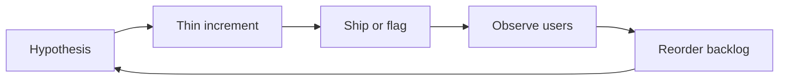

import { ConceptTemplate } from '@/features/kb/components/templates/ConceptTemplate'
import { Callout } from '@/features/kb/components/mdx/Callout'
import { ComparisonTable } from '@/features/kb/components/mdx/ComparisonTable'

export default function Layout({ children }) {
  return (
    <ConceptTemplate title="Agile">
      {children}
    </ConceptTemplate>
  )
}

**Agile** is not a ceremony pack and not a synonym for Scrum. It is a bet that software value is discovered, not specified: ship a thin slice, measure, adapt. The 2001 manifesto is a ranking of trade-offs, not a license to skip tests or design.

## 1. Deep Dive and Mechanics

**Time-box the risk.** Work is cut into short iterations (often 1–4 weeks). Each box must produce something a stakeholder can use or reject. If they hate it, you burned one box, not a fiscal year.

**Empirical control.** Inspect (demo, metrics, incidents) and adapt (re-order the backlog, change the team’s working agreements). Plans exist; they expire on contact with users.

**Cross-functional slice.** A story is not “backend done.” It is design, code, test, and operability for one outcome. Handoffs between silos recreate waterfall inside a two-week costume.

**Cadence versus flow.** Scrum uses a fixed sprint. Kanban uses WIP limits and continuous pull. Both are Agile if they keep feedback short and the increment releasable.

<Callout icon="warning" title="Agile theatre">
Stand-ups, story points, and a Jira board without a releasable increment are project management with extra meetings. The test is: could you ship this Friday if the business said go?
</Callout>

## 2. Mathematical / Theoretical Foundation

**Cost of delay.** Value V decaying over time t makes a late “perfect” release worth less than an early partial one. Agile maximises option value: after each increment you hold a call option on the next slice.

**Feedback gain.** Treat the product as a control loop. Sample period T (iteration length) must be short relative to how fast the market or defect process changes. A six-month “sprint” has the bandwidth of waterfall.

**Batch size.** Integration and rework cost grow superlinearly with batch size. Smaller batches reduce queueing (Little’s law: L = λW) and shrink the blast radius of a wrong bet.

<ComparisonTable
  headers={['Approach', 'Planning bet', 'Failure mode']}
  rows={[
    ['Agile increment', 'Short loop, change welcome', 'Theatre without shipping'],
    ['Waterfall', 'Up-front spec is truth', 'Late discovery of wrong product'],
    ['Death-march crunch', 'Hope and overtime', 'Burnout, hidden defects'],
    ['Feature factory', 'Output velocity', 'No outcome metrics'],
  ]}
/>

## 3. Real-World Implementation

```text
Definition of Done (team working agreement)
- Story maps to a user-visible or operable increment
- Automated tests green on the integration branch
- Feature flag or dark launch if the slice is risky
- Rollback path written before merge
- Demo or metric owner named
```

That list is the process. Tools only record it.

## 4. Visualizations



## 5. Interview Prep

**Q: Agile versus Scrum?**
**A:** Agile is the philosophy. Scrum is one process that implements it with roles, events, and artifacts. Kanban, XP, and dual-track discovery are also Agile when they keep empirical control.

**Q: How do you estimate in Agile without lying?**
**A:** Estimate to force conversation and slicing, not to forecast a date from story-point arithmetic. Forecast from throughput and remaining scope, and keep a buffer for discovery.

**Q: When is Agile the wrong default?**
**A:** Fixed-certification hardware, some regulated one-shot deliveries, and work where the increment cannot be exercised safely. Even then you can still iterate on design and test harnesses.

## 6. Production Use Cases

- **Product SaaS** where the roadmap is a bet portfolio, not a contract.
- **Platform teams** shipping paved roads in thin slices with feature flags.
- **Recovery from a failed big-bang** by carving a strangler increment around the old core.

<Callout icon="tip" title="Measure outcomes">
Lead time, change-fail rate, and a product metric beat story points as the health check. Velocity is a capacity hint, not a KPI to maximise.
</Callout>
