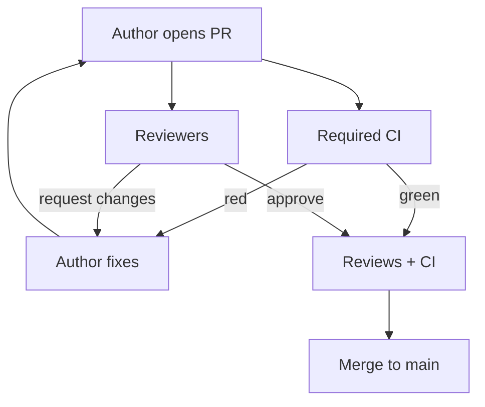

import { ConceptTemplate } from '@/features/kb/components/templates/ConceptTemplate'
import { Callout } from '@/features/kb/components/mdx/Callout'
import { ComparisonTable } from '@/features/kb/components/mdx/ComparisonTable'

export default function Layout({ children }) {
  return (
    <ConceptTemplate title="Code Review">
      {children}
    </ConceptTemplate>
  )
}

**Code review** is the last cheap place to catch a wrong abstraction, a missing authz check, or an untested failure path. Compilers and CI catch syntax and regressions you already thought to test. Reviewers catch the things the author did not think to test.

## 1. Deep Dive and Mechanics

**The artifact.** A pull or merge request: a diff plus intent (description, linked ticket, screenshots, risk notes). Reviewers read the delta against main, not the author’s private narrative.

**What humans own.** Architecture fit, data lifetime, concurrency, security boundaries, API compatibility, and whether the tests actually threaten the change. Style belongs to the linter.

**Latency.** Review delay is queueing delay. A 400-line Friday PR sits until Monday and ships unreviewed in spirit. Keep diffs small, SLA the first response (hours, not days), and use required reviewers plus CODEOWNERS for hot paths.

**Social contract.** Comments attack the change, not the person. Nitpicks are optional or automated. Blocking comments need a concrete alternative.

<Callout icon="warning" title="Rubber-stamp reviews">
Approve-to-clear-the-queue is worse than no review: it creates a false sense of control. If you did not run the happy path or read the tests, say so and do not approve.
</Callout>

## 2. Mathematical / Theoretical Foundation

**Defect removal.** Inspection catch-rate is highest when the change is small enough to hold in working memory. Defect density found per hour drops as diff size grows — a well-replicated finding from inspection studies.

**Information flow.** A review is a noisy channel: author encodes intent, reviewer decodes against a different mental model. Shared language (ADRs, style guides) raises mutual information.

**Cost of delay versus cost of escape.** Hours of review versus days of production incident. For security and data paths, false greens are far more expensive than a blocked merge.

<ComparisonTable
  headers={['Gate', 'Catches', 'Misses']}
  rows={[
    ['Linter / types', 'Style, many classes of bug', 'Wrong product, bad design'],
    ['CI tests', 'Regressions you asserted', 'Unspecified behaviour'],
    ['Human review', 'Design, authz, operability', 'Subtle races if unread'],
    ['Production', 'Everything leftover', 'Users'],
  ]}
/>

## 3. Real-World Implementation

```yaml
# GitHub branch protection (conceptual)
protection:
  required_reviews: 1
  dismiss_stale_reviews: true
  require_code_owner_review: true
  required_status_checks:
    - ci
  enforce_admins: true
```

Pair that with a short PR template: risk, rollback, test plan, screenshots for UI.

## 4. Visualizations



## 5. Interview Prep

**Q: What do you look for first in a review?**
**A:** The tests and the public interface. If those are wrong, the implementation is a sunk cost. Then security, data, and rollback.

**Q: How do you review a 2,000-line PR?**
**A:** You do not, as one review. Split by layer or behaviour, or pair-walk it. Large dumps hide the one dangerous line.

**Q: Review versus pair programming?**
**A:** Pairing moves the review into the writing. Both raise quality; pairing is better for hard design, async review is better for documentation of the decision.

## 6. Production Use Cases

- **Regulated code** where a second pair of eyes is an audit control.
- **Security-sensitive modules** with mandatory CODEOWNERS.
- **Open source** where maintainers review strangers’ patches for supply-chain and design fit.

<Callout icon="tip" title="Review the tests like production code">
A green suite that never asserts the new invariant is a costume. Ask “what would make this test fail if I broke the feature?”
</Callout>
