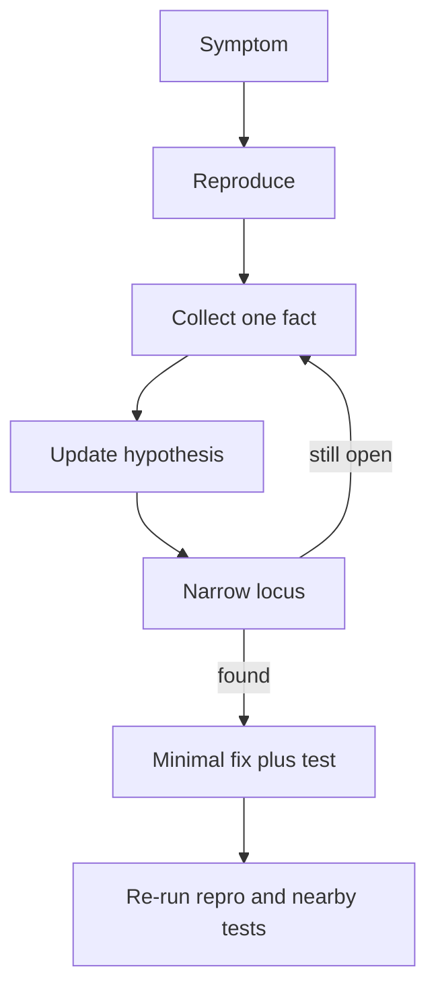

import { ConceptTemplate } from '@/features/kb/components/templates/ConceptTemplate'
import { Callout } from '@/features/kb/components/mdx/Callout'
import { ComparisonTable } from '@/features/kb/components/mdx/ComparisonTable'

export default function Layout({ children }) {
  return (
    <ConceptTemplate title="Debugging">
      {children}
    </ConceptTemplate>
  )
}

**Debugging** is scientific method under time pressure. The bug is a fact. Your story about the bug is a hypothesis. You win by shrinking the search space with observations, not by staring at the function you already distrust.

## 1. Deep Dive and Mechanics

**Reproduce.** If you cannot turn it on, you cannot know you turned it off. Capture inputs, versions, clocks, and feature flags. Flaky bugs need isolation (same seed, same shard, same race window).

**Observe.** Logs, traces, metrics, debugger, heap dumps, `git bisect`. Prefer one new fact per experiment. Changing five things at once is not a method.

**Localise.** Binary search the timeline (bisect), the call stack, the data path, or the feature-flag matrix. “It worked yesterday” is a bisect invitation.

**Fix and prove.** Change the smallest cause. Add a test that failed before the fix. Watch the nearby invariants; many “fixes” move the corpse.

<Callout icon="error" title="Print-and-pray">
Sprinkling logs without a question wastes the incident clock. Write the question: which branch ran, which id was missing, which lock was held?
</Callout>

## 2. Mathematical / Theoretical Foundation

**Search.** A defect lives in a space of program states. Each observation is a constraint. Binary search over commits is log2 of the window; over a pipeline of N stages, one probe can discard half if you pick a midpoint with a clear oracle.

**Heisenbugs.** Instrumentation changes timing (probe effect). Races vanish under a debugger. Prefer record-and-replay, thread sanitizers, and stress at the original concurrency.

**Bayes.** Prior: recent diffs and new deps are likelier than a five-year-old helper. Update with evidence; do not let the prior become superstition if the bisect points elsewhere.

<ComparisonTable
  headers={['Technique', 'Best for', 'Trap']}
  rows={[
    ['git bisect', 'Regressions with an oracle', 'Flaky oracle'],
    ['Debugger', 'Deterministic local state', 'Heisenbugs, prod-only'],
    ['Distributed trace', 'Cross-service latency', 'Missing spans'],
    ['Core dump / profiler', 'Crashes, hot loops', 'Need symbols'],
  ]}
/>

## 3. Real-World Implementation

```bash
# Regression window with a clear pass/fail command
git bisect start
git bisect bad HEAD
git bisect good v2.14.0
git bisect run ./scripts/repro-bug.sh
```

The script must exit 0 on good, 1 on bad, 125 to skip unbuildable commits.

## 4. Visualizations



## 5. Interview Prep

**Q: How do you debug a production-only failure?**
**A:** Preserve artifacts (logs, traces, core, request id). Recreate with captured traffic or a shadow. Avoid attaching an interactive debugger to a dying box unless you have a playbook.

**Q: What is the first question you ask?**
**A:** What is the last known-good and what changed? Version, config, traffic shape, dependency.

**Q: Debugging versus logging strategy?**
**A:** Structured logs with request ids and error budgets make debugging a query. Unstructured stdout makes it archaeology.

## 6. Production Use Cases

- **Incident response** with a single incident commander and a timeline of hypotheses.
- **Flaky CI** isolated by seed, shard, and timing.
- **Performance regressions** found by profiling the delta, not rewriting the hot file by folklore.

<Callout icon="tip" title="Write the timeline">
A shared doc of time, fact, and next experiment stops five people from repeating the same curl. That is debugging as a team sport.
</Callout>
