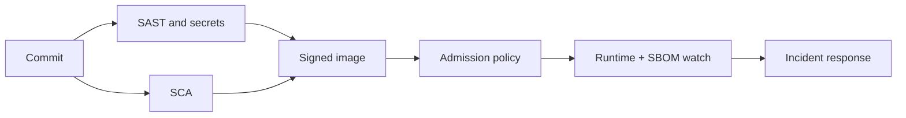

import { ConceptTemplate } from '@/features/kb/components/templates/ConceptTemplate'
import { Callout } from '@/features/kb/components/mdx/Callout'
import { ComparisonTable } from '@/features/kb/components/mdx/ComparisonTable'

export default function Layout({ children }) {
  return (
    <ConceptTemplate title="DevSecOps">
      {children}
    </ConceptTemplate>
  )
}

**DevSecOps** folds security into the same loop as build and deploy. The old model — ship, then throw the artifact over a wall to a quarterly pen-test — cannot keep up with daily deploys. Security becomes tests, gates, and telemetry that developers can run locally and CI can enforce.

## 1. Deep Dive and Mechanics

**Shift left, not dump left.** Developers get scanners and threat-model checklists, but security engineers still own hard reviews (crypto, authn/authz, tenancy). Shift left without specialists is a linter cult.

**Pipeline controls.** SAST on the diff, SCA on lockfiles, container and IaC scanners, secret detection, DAST or API fuzz on staging, signed artifacts, admission policy in the cluster. Each control has a false-positive budget.

**Runtime.** SBOMs, vulnerability intel on running images, WAF and RASP as layers, not as the design. Incident playbooks treat security events like SEV-1s.

**Culture.** Blameless handling of reports, a bounty or VDP, and a “security champion” in each squad so tickets do not die in a shared inbox.

<Callout icon="warning" title="Scanner theatre">
A thousand High findings nobody triages is not DevSecOps. Severity without exploitability and ownership is noise. Track mean time to remediate on reachable issues.
</Callout>

## 2. Mathematical / Theoretical Foundation

**Risk.** Approximate as likelihood × impact, then spend on the product. CVSS is a starting prior, not a ticket priority. Reachability (is the vulnerable function on the serve path?) dominates raw CVE count.

**Control theory.** Each gate is a filter with false-positive rate f and miss rate m. Too many noisy gates and developers route around them (the system gain goes to zero). Tune or suppress with justification.

**Supply chain.** The artifact is a DAG of dependencies. Compromise probability grows with unpinned, unsigned, and unreviewed nodes. SLSA levels are a maturity ladder on provenance.

<ComparisonTable
  headers={['Control', 'When it runs', 'Blind spot']}
  rows={[
    ['SAST', 'Commit / PR', 'Runtime config, business logic'],
    ['SCA', 'Lockfile change', 'Unreachable or transitive noise'],
    ['DAST / fuzz', 'Staging', 'Authz that needs a real user'],
    ['Pen-test', 'Release or yearly', 'Coverage between tests'],
  ]}
/>

## 3. Real-World Implementation

```yaml
# CI sketch — fail on reachable secrets and critical lockfile CVEs
jobs:
  security:
    steps:
      - run: gitleaks detect --redact
      - run: npm audit --audit-level=critical
      - run: trivy fs --severity CRITICAL --exit-code 1 .
```

Pair with a waiver file that expires, not a permanent ignore.

## 4. Visualizations



## 5. Interview Prep

**Q: DevSecOps versus a security team at the end?**
**A:** Same specialists, earlier and automated feedback. The security team writes controls and reviews high-risk designs; they do not become a ticket sink for every dependency bump.

**Q: How do you handle a critical CVE in a transitive library on Friday?**
**A:** Reachability first, then patch or isolate, then deploy. If you cannot patch, compensate (WAF rule, feature off) and calendar the real fix.

**Q: What is an SBOM for?**
**A:** Knowing what you shipped so the next Log4Shell-class event is a query, not a scavenger hunt.

## 6. Production Use Cases

- **Regulated SaaS** that must show continuous control evidence, not an annual PDF.
- **Container platforms** with signed images and policy engines at admit time.
- **Open-source products** where the supply chain is the product’s attack surface.

<Callout icon="tip" title="Threat-model the money path">
Authn, payments, tenancy, and admin tools deserve a written threat model. Scanning CSS does not.
</Callout>
