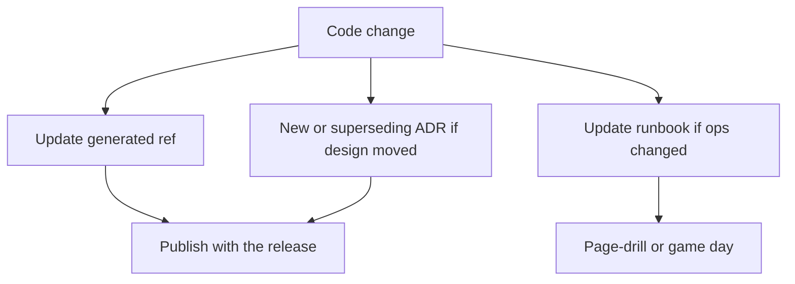

import { ConceptTemplate } from '@/features/kb/components/templates/ConceptTemplate'
import { Callout } from '@/features/kb/components/mdx/Callout'
import { ComparisonTable } from '@/features/kb/components/mdx/ComparisonTable'

export default function Layout({ children }) {
  return (
    <ConceptTemplate title="Documentation">
      {children}
    </ConceptTemplate>
  )
}

**Documentation** is a product with users: on-call engineers, API consumers, auditors, and future you. Code shows what the machine does today. Docs explain why, what is allowed to change, and how to recover when it does not.

## 1. Deep Dive and Mechanics

**Four audiences (Diátaxis-ish).** Tutorials (learn by doing), how-to (achieve a goal), reference (canonical facts), explanation (context and trade-offs). Mixing them produces novels nobody searches.

**Source of truth.** API reference should generate from OpenAPI or types. Runbooks live next to the service. Architecture Decision Records (ADRs) capture the choice and the rejected alternatives. Wiki pages without owners rot.

**Freshness.** A wrong doc is worse than none. Date it, own it, and fail CI when the example command exits non-zero. Link ADRs from the code that implements them.

**Minimal viable.** A README that says how to run, test, and where the design lives beats a 40-page PDF last touched in 2019.

<Callout icon="warning" title="Docs as a release leftover">
If writing happens after the launch party, it never happens. Treat “docs + runbook” as part of Done for anything on-call will touch.
</Callout>

## 2. Mathematical / Theoretical Foundation

**Information theory.** The reader arrives with entropy about the system. Good docs maximise useful bits per minute: headings, examples, and a search corpus. Buried caveats have near-zero mutual information with a 3am pager.

**Staleness as drift.** Let S be the system and D the docs. Every change to S without D is entropy. Coupling D to S (generated reference, tested snippets) keeps drift bounded.

**Cost.** Writing time versus repeated explanation and incidents. For interfaces with many consumers, documentation ROI is high; for a one-off script, a comment may suffice.

<ComparisonTable
  headers={['Kind', 'Lives with', 'Rot risk']}
  rows={[
    ['Generated API ref', 'Schema / types', 'Low if published in CI'],
    ['ADR', 'Repo, numbered', 'Low — historical'],
    ['Runbook', 'Service repo', 'Medium — must drill'],
    ['Wiki essay', 'Someone memory', 'High'],
  ]}
/>

## 3. Real-World Implementation

```markdown
# ADR 0017: Use outbox for billing events
Status: Accepted
Context: Dual-write to SQL and the bus dropped payments under crash.
Decision: Transactional outbox, publisher relay.
Consequences: Extra table and relay; at-least-once consumers must be idempotent.
```

Keep ADRs immutable; supersede with a new number.

## 4. Visualizations



## 5. Interview Prep

**Q: What documentation do you require for a new service?**
**A:** How to run and test, SLO and ownership, public API, threat notes, and a runbook for the top three failures.

**Q: Code versus comments versus docs?**
**A:** Names and types for local intent, comments for non-obvious why, docs for cross-cutting contracts and operations. Do not narrate the next line of code.

**Q: How do you keep docs honest?**
**A:** Test the snippets, generate the reference, review doc diffs in the same PR, and delete pages without owners.

## 6. Production Use Cases

- **Public APIs** where the docs are the product.
- **Multi-team platforms** that need a paved-road story, not Slack archaeology.
- **Compliance** that asks for decision history and operational procedures.

<Callout icon="tip" title="Write the runbook from the last incident">
Every SEV should leave a paragraph: symptom, query, fix, prevention. That is documentation with a blood sample.
</Callout>
