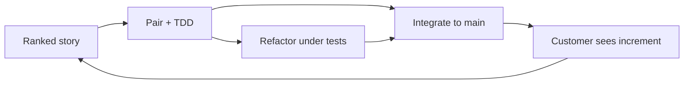

import { ConceptTemplate } from '@/features/kb/components/templates/ConceptTemplate'
import { Callout } from '@/features/kb/components/mdx/Callout'
import { ComparisonTable } from '@/features/kb/components/mdx/ComparisonTable'

export default function Layout({ children }) {
  return (
    <ConceptTemplate title="Extreme Programming">
      {children}
    </ConceptTemplate>
  )
}

**Extreme Programming (XP)** is Kent Beck’s answer to late, brittle projects: if a practice helps, do it all the time. Pairing, test-first, continuous integration, and simple design are not optional garnish. They are the method.

## 1. Deep Dive and Mechanics

**Customer on-site.** A real stakeholder ranks stories and answers questions in hours, not quarters. The team implements the next most valuable slice.

**Small releases.** Weekly or daily deployable increments. The planning game splits stories to fit the iteration.

**Pair programming.** Two people, one machine (or a shared editor). Knowledge spreads; review happens while typing. Rotate pairs to avoid silos.

**TDD and refactoring.** Red, green, refactor. The test suite is the design’s safety net so courage to change stays high. Simple design: enough for today, names that tell the truth.

**Sustainable pace.** Overtime as a process is a defect. Tired pairs ship defects.

<Callout icon="info" title="XP is not cowboy coding">
“Extreme” means extremely disciplined feedback, not extremely no process. Skipping tests and calling it XP is just haste.
</Callout>

## 2. Mathematical / Theoretical Foundation

**Cost of change curve.** Classic waterfall claimed cost rises exponentially with lifecycle phase. XP’s thesis: with tests, pairing, and simple design, the curve flattens — late change stays O(size of change), not O(system age).

**Defect insertion.** Two brains reduce certain classes of error (the pair is a real-time inspection). TDD increases assertion density, which raises the probability a regression fails CI instead of production.

**WIP.** Stories small enough to finish in days keep L (work in progress) low and W (lead time) short — Little’s law again.

<ComparisonTable
  headers={['Practice', 'XP emphasis', 'Common substitute']}
  rows={[
    ['Integration', 'Many times a day', 'Weekly merge train'],
    ['Review', 'Pair while writing', 'Async PR only'],
    ['Tests', 'TDD, high coverage of behaviour', 'Tests after, if time'],
    ['Design', 'Simple, incremental', 'Big design up front'],
  ]}
/>

## 3. Real-World Implementation

```text
XP iteration board (physical or digital)
- Customer-ranked stories in a short queue
- Pair list posted; rotate mid-week
- CI green required to start a new story
- Refactoring is scheduled work, not leftover minutes
- Ten-minute build or the build is the bug
```

The ten-minute build rule is a forcing function: slow builds kill the feedback XP depends on.

## 4. Visualizations



## 5. Interview Prep

**Q: XP versus Scrum?**
**A:** Scrum specifies roles and events; it is silent on TDD and pairing. Many teams run Scrum events with XP engineering. XP without a customer voice degrades into busy iteration.

**Q: Is pairing twice the cost?**
**A:** Wall-clock people-hours rise; cycle time, defect escape, and bus factor often fall. Measure those, not just two salaries on one keyboard.

**Q: What do you drop first when XP feels heavy?**
**A:** Do not drop the test suite or CI. Drop ceremonial extras. If pairing is culturally impossible, compensate with tight review and mob sessions on hard paths.

## 6. Production Use Cases

- **Greenfield product teams** that can sit with a customer and ship daily.
- **Legacy rescue** where characterisation tests plus pairing rebuild courage.
- **High-defect modules** (billing, auth) that need XP practices even if the rest of the org is Scrum-only.

<Callout icon="tip" title="Protect the build">
If CI is red, the pair’s job is the build. XP collapses the moment people work around a broken main.
</Callout>
