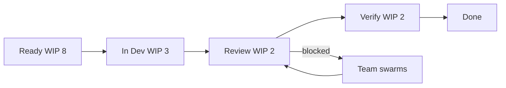

import { ConceptTemplate } from '@/features/kb/components/templates/ConceptTemplate'
import { Callout } from '@/features/kb/components/mdx/Callout'
import { ComparisonTable } from '@/features/kb/components/mdx/ComparisonTable'

export default function Layout({ children }) {
  return (
    <ConceptTemplate title="Kanban">
      {children}
    </ConceptTemplate>
  )
}

**Kanban** (from Toyota’s visual card system) is a method for knowledge work: make the workflow visible, cap work in progress, and improve the bottlenecks the board reveals. There is no prescribed sprint. Done means a card left the rightmost column.

## 1. Deep Dive and Mechanics

**Board.** Columns match the real process (Ready, In Dev, Review, Verify, Done) — not the org chart you wish you had. Cards carry class of service (standard, expedite, fixed date).

**WIP limits.** Each column has a number. Starting new work when the limit is full is the process violation. Idle people swarm the bottleneck instead of opening another half-done feature.

**Pull.** Downstream capacity pulls. You do not push a week of assignments onto developers on Monday.

**Policies.** Explicit entry/exit criteria per column. Without policies the board is decoration.

**Cadences.** Optional replenishment meetings and operations reviews. Improvement is continuous, not a sprint-boundary event.

<Callout icon="warning" title="Kanban without WIP limits">
An unlimited board is a to-do list on its side. Multitasking will fill every column and lead time will explode.
</Callout>

## 2. Mathematical / Theoretical Foundation

**Little’s law.** L = λW. For a stable system, average WIP L equals throughput λ times average lead time W. To cut lead time, cut WIP or raise throughput. Heroes raising λ without cutting L just run hotter.

**Queueing.** Variability (uneven story size, blockers, expedites) grows wait time. Classes of service and WIP caps dampen that. An expedite lane steals capacity — use it rarely.

**Cumulative flow.** A CFD chart shows arrivals versus departures. Widening bands are growing queues. That picture is the control chart of the team.

<ComparisonTable
  headers={['System', 'Cadence', 'Primary control']}
  rows={[
    ['Kanban', 'Continuous pull', 'WIP limits and policies'],
    ['Scrum', 'Fixed sprint', 'Sprint commitment'],
    ['Scrumban', 'Hybrid', 'Sprint events plus WIP'],
    ['Unlimited board', 'None', 'Hope'],
  ]}
/>

## 3. Real-World Implementation

```text
Column policies (example)
Ready: sized, has owner of the problem, test notes
In Dev: WIP 3 for a team of 5
Review: WIP 2; aging more than 1 day is a swarm
Verify: product or QA pull, not a dump
Done: in production or behind a flag that on-call knows
```

Measure lead time from Ready to Done, not from “I started typing.”

## 4. Visualizations



## 5. Interview Prep

**Q: Kanban versus Scrum?**
**A:** Scrum resets every sprint with a forecast. Kanban optimises flow without a batch boundary. Ops, platform, and interrupt-driven teams often fit Kanban better.

**Q: How do you forecast without story points?**
**A:** Historical lead-time distributions and Monte Carlo on remaining cards. Percentiles beat averages.

**Q: What if everything is expedite?**
**A:** Then you have no system. Cap the expedite lane at one and make the cost visible on the CFD.

## 6. Production Use Cases

- **SRE and platform** with incoming tickets and planned work on one board.
- **Support-engineering** hybrids that cannot freeze a sprint.
- **Mature product teams** that already ship continuously and need flow metrics more than sprint theatre.

<Callout icon="tip" title="Age the cards">
A card sitting in Review for five days is a process bug. Highlight aging; do not start the next shiny item.
</Callout>
