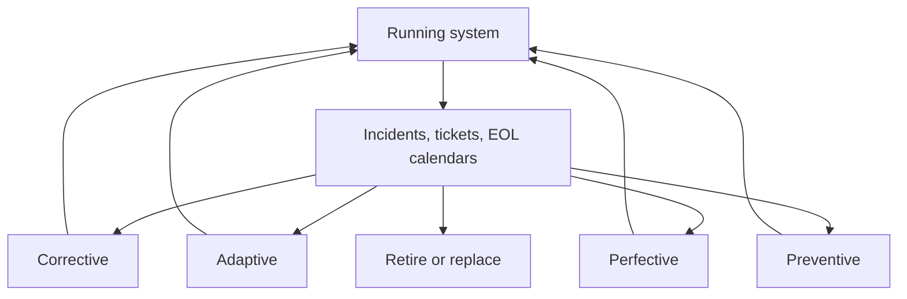

import { ConceptTemplate } from '@/features/kb/components/templates/ConceptTemplate'
import { Callout } from '@/features/kb/components/mdx/Callout'
import { ComparisonTable } from '@/features/kb/components/mdx/ComparisonTable'

export default function Layout({ children }) {
  return (
    <ConceptTemplate title="Maintenance">
      {children}
    </ConceptTemplate>
  )
}

Most of a successful system’s cost is **maintenance**: corrective (bugs), adaptive (new platforms and laws), perfective (better internals), and preventive (hardening before the next incident). Greenfield is a short prologue.

## 1. Deep Dive and Mechanics

**Four types (ISO/IEC 14764).** Corrective fixes failures. Adaptive tracks environment change (OS, browser, regulation). Perfective improves performance or maintainability without a new feature request. Preventive reduces future failure probability.

**Ownership.** An unowned service is already in hospice. On-call, a backlog of debt, and a budgeted capacity (the classic 20 percent) are the mechanism. “We will clean it up after the next launch” is how rot compounds.

**Observe then change.** Characterisation tests, production metrics, and a rollback path before you “just upgrade the framework.”

**End of life.** Maintenance includes saying no: retire, replace, or put behind a strangler. Eternal patches on a dead product line waste the team.

<Callout icon="warning" title="Heroic firefighting is not a strategy">
If the same class of bug returns every quarter, you are doing corrective work where preventive or perfective work was due. Track repeat incidents.
</Callout>

## 2. Mathematical / Theoretical Foundation

**Lehman’s laws.** Continuing systems grow, complexity rises unless work is done to reduce it, and quality appears to decline unless maintained. These are empirical regularities, not slogans.

**Interest on debt.** Unpaid debt increases the coefficient on every future change. Capacity spent only on features is a high-interest loan against tomorrow’s lead time.

**Reliability.** Preventive maintenance is the software analogue of replacing a worn bearing: you spend now to flatten the hazard rate. Weibull-style “infant mortality then wear-out” shows up as launch bugs then bit-rot.

<ComparisonTable
  headers={['Type', 'Trigger', 'Example']}
  rows={[
    ['Corrective', 'Defect report', 'Null on an empty cart'],
    ['Adaptive', 'Environment move', 'New TLS policy, new OS'],
    ['Perfective', 'Cost to change', 'Split a god class'],
    ['Preventive', 'Risk forecast', 'Upgrade before EOL'],
  ]}
/>

## 3. Real-World Implementation

```python
# Capacity policy encoded as a simple check on the sprint mix
FEATURES, MAINT = 0.7, 0.3

def plan_ok(feature_points, maint_points):
    total = feature_points + maint_points
    if total == 0:
        return False
    return maint_points / total >= MAINT - 0.05
```

The numbers are a policy, not physics. The point is that maintenance has a reserved slice.

## 4. Visualizations



## 5. Interview Prep

**Q: How do you justify maintenance to a feature-only roadmap?**
**A:** Show lead time and incident cost trending up. Put upgrades on the same board as features with risk if slipped (certificate expiry, framework EOL).

**Q: Maintenance versus refactoring?**
**A:** Refactoring is a technique inside perfective and preventive work. Maintenance is the lifecycle category.

**Q: When do you stop maintaining and rewrite?**
**A:** When characterisation is cheaper than another year of patches and you can strangler-cut, not when someone is bored. Big-bang rewrites fail often.

## 6. Production Use Cases

- **Enterprise line-of-business** apps that outlive their original team by a decade.
- **OS and runtime upgrades** as scheduled adaptive work.
- **SRE error-budget spend** funding preventive hardening.

<Callout icon="tip" title="Calendar the boring work">
Certificates, dependency EOL, and license renewals are maintenance with a clock. Put them in the same tracker as features.
</Callout>
