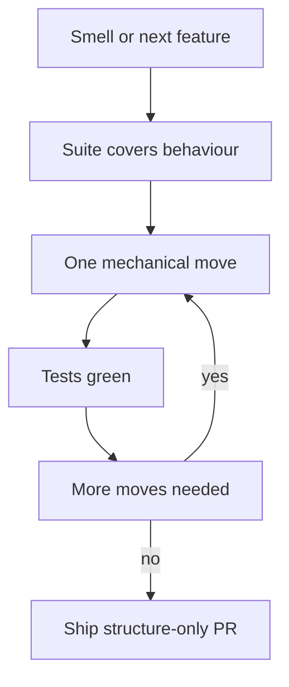

import { ConceptTemplate } from '@/features/kb/components/templates/ConceptTemplate'
import { Callout } from '@/features/kb/components/mdx/Callout'
import { ComparisonTable } from '@/features/kb/components/mdx/ComparisonTable'

export default function Layout({ children }) {
  return (
    <ConceptTemplate title="Refactoring">
      {children}
    </ConceptTemplate>
  )
}

**Refactoring** (Fowler) is behaviour-preserving structural change. Rename, extract, invert a dependency, replace a conditional with polymorphism. If the user-visible contract moves, that is a feature or a fix — keep it in a separate commit.

## 1. Deep Dive and Mechanics

**Safety net.** You cannot refactor what you cannot detect breaking. Characterisation tests, type systems, and a fast suite are the precondition. No tests means you are editing under anaesthesia.

**Small steps.** Each micro-refactor (extract function, move field) leaves the suite green. Large mixed PRs that also change behaviour are how you invent weekend incidents.

**Opportunistic versus campaign.** Boy Scout rule on the touched files versus a scheduled campaign (strangler, extract a module). Campaigns belong on main in thin slices, not on a months-old branch.

**Smell first.** Duplication, long methods, feature envy, shotgun surgery — the catalog tells you which move to apply. Do not clean up without a smell or a next feature that needs the new shape.

<Callout icon="error" title="Rewrite dressed as refactor">
If you change APIs, data, and behaviour in one PR titled refactor, reviewers cannot reason about risk. Split it or it is not refactoring.
</Callout>

## 2. Mathematical / Theoretical Foundation

**Behavioural equivalence.** Let P be the program and T a test suite approximating the specification S. A refactoring r should satisfy T of r of P equals T of P and, ideally, S of r of P equals S of P. Incomplete T means incomplete proof.

**Coupling reduction.** Moves that lower afferent and efferent coupling reduce the number of modules that must change together. That is a graph-cut problem: you want thin interfaces.

**Option value.** Refactoring buys cheaper future edits. Spend when the next change is known or when the module is on the hot path of defects.

<ComparisonTable
  headers={['Move', 'Smell', 'Risk if untested']}
  rows={[
    ['Extract function', 'Long method', 'Low'],
    ['Replace conditional with polymorphism', 'Switch on type', 'Medium'],
    ['Split module / extract service', 'God package', 'High'],
    ['Rename across public API', 'Misleading name', 'High if published'],
  ]}
/>

## 3. Real-World Implementation

```javascript
// Before: feature envy — pricing logic lives in the order printer
function printOrder(order) {
  const total = order.lines.reduce((s, l) => s + l.qty * l.price, 0)
  return `total=${total}`
}

// After: behaviour unchanged, money math sits on Order
function printOrder(order) {
  return `total=${order.total()}`
}
```

Commit this separately from any change to rounding rules.

## 4. Visualizations



## 5. Interview Prep

**Q: When is refactoring not the first move?**
**A:** When you do not have characterisation tests, when a deadline forbids risk, or when the module is about to be deleted. Add tests or isolate first.

**Q: How do you refactor a legacy module with no tests?**
**A:** Characterise from the outside (golden outputs), then seam in tests, then small moves. Do not start with a greenfield rewrite.

**Q: Refactoring versus technical debt paydown?**
**A:** Refactoring is the technique. Debt paydown is the portfolio decision about where to apply it.

## 6. Production Use Cases

- **Before a large feature** so the feature lands in a module that can accept it.
- **Hotspot files** identified by churn and defect density.
- **Strangler work** that extracts a seam without changing the external contract.

<Callout icon="tip" title="One intent per commit">
Reviewers and bisect both need a behaviour-preserving history. Mixed commits make every later debug a coin flip.
</Callout>
