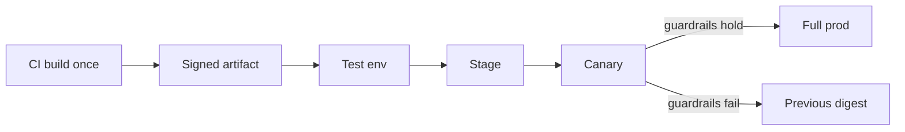

import { ConceptTemplate } from '@/features/kb/components/templates/ConceptTemplate'
import { Callout } from '@/features/kb/components/mdx/Callout'
import { ComparisonTable } from '@/features/kb/components/mdx/ComparisonTable'

export default function Layout({ children }) {
  return (
    <ConceptTemplate title="Release Management">
      {children}
    </ConceptTemplate>
  )
}

**Release management** is how change reaches users without becoming an incident. It is versioning, artifact provenance, communication, rollout policy, and rollback — not a calendar invite named “Release Friday.”

## 1. Deep Dive and Mechanics

**Immutable artifacts.** Build once, promote the same binary or image through test, stage, and prod. Rebuilding “the same commit” for prod is how config and dependency drift sneaks in.

**Train versus continuous.** Release trains (cut every Tuesday) batch change for coordination-heavy orgs. Continuous delivery ships every green main. Both need a named version and notes.

**Windows and risk.** Change freezes around peak traffic or legal events are a policy, not fear. High-risk changes get canaries, feature flags, and a dedicated owner on chat.

**Notes and comms.** What shipped, what might break, who is on point, how to roll back. Internal status page plus customer notes for user-visible change.

<Callout icon="warning" title="Hotfix culture">
If every week is an emergency patch outside the process, the process is fiction. Track hotfix rate as a quality signal.
</Callout>

## 2. Mathematical / Theoretical Foundation

**Change failure rate.** DORA: fraction of releases that cause degraded service or a rollback. Release management exists to keep this low without starving throughput.

**Blast radius.** Staged rollout is sampling. A 1 percent canary estimates prod risk; you need enough traffic for the guardrail metrics to move.

**Versioning.** Semver (MAJOR.MINOR.PATCH) is a compatibility contract. Breaking the contract without a MAJOR bump is a social bug that breaks downstream build graphs.

<ComparisonTable
  headers={['Style', 'Cadence', 'Fits']}
  rows={[
    ['Continuous deploy', 'Every green main', 'Web with flags'],
    ['Release train', 'Fixed calendar', 'Many teams, shared QA'],
    ['Manual ceremony', 'When someone is brave', 'Small or legacy'],
    ['Hotfix only', 'When prod is on fire', 'Crisis, not a plan'],
  ]}
/>

## 3. Real-World Implementation

```bash
# Promote the already-built image — do not rebuild
export VERSION=1.14.3
export DIGEST=sha256:4f2c0c1a9e8b

kubectl set image deploy/billing \
  billing="ghcr.io/acme/billing:${VERSION}@${DIGEST}"
```

Pin by digest in prod so the tag cannot move under you.

## 4. Visualizations



## 5. Interview Prep

**Q: Release versus deploy?**
**A:** Deploy is a technical act (artifact on servers). Release is making a change available to users (flag on, store publish, DNS cut). They can be hours or weeks apart.

**Q: How do you roll back a bad mobile release?**
**A:** Stores are not instant. Use staged rollout percentages, server-side kill switches, and a previous binary still compatible with the API.

**Q: Who owns the go/no-go?**
**A:** A named release owner with the authority to stop, not a group chat of shrugs. Engineering and product share the risk call.

## 6. Production Use Cases

- **Regulated industries** with change tickets and evidence packs.
- **Multi-service platforms** that must order migrations and code.
- **Consumer mobile** where the store is a second release manager.

<Callout icon="tip" title="Write the rollback first">
If you cannot name the previous digest and the command to restore it, you are not ready to roll forward.
</Callout>
