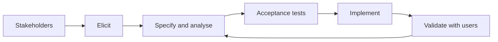

import { ConceptTemplate } from '@/features/kb/components/templates/ConceptTemplate'
import { Callout } from '@/features/kb/components/mdx/Callout'
import { ComparisonTable } from '@/features/kb/components/mdx/ComparisonTable'

export default function Layout({ children }) {
  return (
    <ConceptTemplate title="Requirements Engineering">
      {children}
    </ConceptTemplate>
  )
}

**Requirements engineering** turns stakeholder need into testable statements. It is not a 400-page spec that freezes 18 months of work. It is a living set of functional needs, quality attributes, and constraints with owners and acceptance tests.

## 1. Deep Dive and Mechanics

**Elicit.** Interviews, observation, data, competitor teardowns, support tickets. Users describe jobs-to-be-done poorly; watch them work.

**Specify.** User stories with acceptance criteria, use cases, given-when-then, quality attribute scenarios (latency under load X). Ambiguous adjectives (fast, secure, intuitive) are not requirements until they have a number or a test.

**Analyse.** Conflicts (audit-everything versus privacy), gaps, and scope. Trace each requirement to a stakeholder and later to tests and code.

**Validate and manage.** Review with the people who will live with the result. Change control that is light enough for Agile and strict enough that silent scope does not explode.

<Callout icon="warning" title="The implied requirement">
What nobody wrote down still ships as a defect. Authz, empty states, and failure modes are requirements even when the slide deck skipped them.
</Callout>

## 2. Mathematical / Theoretical Foundation

**Formal specs.** For critical cores, TLA+, Alloy, or pre/post contracts make requirements machines-checkable. Most product work uses a weaker but cheaper oracle: executable acceptance tests.

**Traceability graph.** Nodes are stakeholders, requirements, designs, tests. Missing edges are coverage holes. Impact analysis is reachability when a requirement changes.

**Priority.** WSJF and similar scores (cost of delay divided by job size) are heuristics for ordering, not physics. They beat HiPPO when applied honestly.

<ComparisonTable
  headers={['Form', 'Strength', 'Weakness']}
  rows={[
    ['User story + criteria', 'Conversation-sized', 'Easy to stay vague'],
    ['Use case', 'Actor and flow', 'Heavy for small UI tweaks'],
    ['Formal spec', 'Proof and models', 'Cost, skill'],
    ['Ticket title only', 'Speed', 'Not a requirement'],
  ]}
/>

## 3. Real-World Implementation

```gherkin
Feature: Checkout tax
  Scenario: VAT for a DE billing address
    Given a cart totalling 100.00 EUR net
    And the billing country is DE
    When the buyer pays
    Then the invoice VAT is 19.00 EUR
    And the charged total is 119.00 EUR
```

If you cannot write this, you do not yet have a requirement — you have a wish.

## 4. Visualizations



## 5. Interview Prep

**Q: Functional versus non-functional?**
**A:** Functional is what the system does. Quality attributes (latency, availability, safety) are also requirements — often the expensive ones. Constraints (must run on this browser, this regulation) bind the solution space.

**Q: How do Agile and requirements engineering coexist?**
**A:** You still elicit and test; you just do it per slice and keep a backlog, not a frozen SRS. Dual-track discovery feeds the build track.

**Q: What is a good acceptance criterion?**
**A:** Observable, unambiguous, and fail-able. “User is happy” is not. “Error rate under 0.1 percent at 1k rpm” is.

## 6. Production Use Cases

- **Regulated products** that must show requirement-to-test trace.
- **Multi-party contracts** (B2B integrations) where ambiguity becomes a lawsuit.
- **Platform APIs** whose consumers treat the spec as law.

<Callout icon="tip" title="Write the test before the estimate">
If acceptance is unclear, the estimate is fiction. Spec the check, then size the work.
</Callout>
