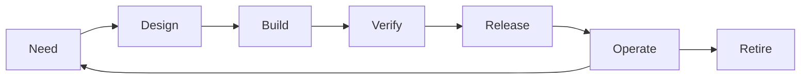

import { ConceptTemplate } from '@/features/kb/components/templates/ConceptTemplate'
import { Callout } from '@/features/kb/components/mdx/Callout'
import { ComparisonTable } from '@/features/kb/components/mdx/ComparisonTable'

export default function Layout({ children }) {
  return (
    <ConceptTemplate title="SDLC">
      {children}
    </ConceptTemplate>
  )
}

The **software development life cycle (SDLC)** is the repeating path of need, design, build, verify, release, operate, and retire. Methodologies (Waterfall, Agile, DevOps) are different schedules and feedback policies over the same phases — not different physics.

## 1. Deep Dive and Mechanics

**Phases (typical).** Requirements and discovery. Design (architecture, UX, data). Implementation. Test (unit through acceptance). Release and deploy. Operate and monitor. Maintain or retire.

**Feedback policy.** Waterfall treats phases as a one-way gate. Agile overlaps them in small increments. DevOps extends the cycle into operations with shared ownership and automation.

**Governance.** Stage gates, security reviews, and change boards sit on this cycle. The question is whether they are batch (per year) or continuous (per change).

**Artifacts.** Each phase leaves evidence: ADRs, code, tests, SBOMs, runbooks. If the only artifact is tribal memory, you do not have an SDLC — you have luck.

<Callout icon="info" title="SDLC is not a waterfall synonym">
Auditors say SDLC and mean “you have a controlled process.” That process can be trunk-based CI. Document what you actually do.
</Callout>

## 2. Mathematical / Theoretical Foundation

**V-model.** Each construction phase has a matching verification phase (requirements ↔ acceptance, design ↔ integration). It is a pairing of specification and oracle, useful even if you execute the pairs in thin vertical slices.

**Control loop.** Let x be product state and u be interventions (features, fixes). SDLC is a sampled controller. Sample rate (how often you release and measure) determines whether you can track a moving market.

**Cost of defects by phase.** Escape cost typically rises as the defect moves right. That curve is why tests and reviews exist — not because phases are sacred.

<ComparisonTable
  headers={['Model', 'Phase overlap', 'Primary risk']}
  rows={[
    ['Waterfall', 'Little', 'Late learning'],
    ['Iterative / Agile', 'High per slice', 'Undisciplined scope'],
    ['DevOps / CD', 'Build and run fused', 'Weak production controls'],
    ['Ad hoc', 'None defined', 'Unrepeatable quality'],
  ]}
/>

## 3. Real-World Implementation

```text
Lightweight SDLC checklist per change
1. Need: ticket with acceptance and owner
2. Design: ADR if the shape moved
3. Build: branch or trunk, CI green
4. Verify: tests + review
5. Release: artifact digest, flag, notes
6. Operate: dashboard and runbook touch
7. Learn: incident or metric back to the backlog
```

That is an SDLC you can audit without a 90-page procedure.

## 4. Visualizations



## 5. Interview Prep

**Q: Name the SDLC phases and where you spend time.**
**A:** Discovery and operate are the ones juniors skip in the answer. Most cost lives in maintenance and operations, not the first coding week.

**Q: How does DevOps change the SDLC?**
**A:** It does not delete test or design. It shortens the operate feedback into the same team and automates release so the cycle time drops from months to hours.

**Q: What does a regulator want to see?**
**A:** Repeatable controls: who approved what, how you tested, how you roll back, how you handle vulnerabilities. Map your real pipeline to those controls.

## 6. Production Use Cases

- **Enterprise and government** procurement language that requires an SDLC description.
- **Startups** that need a one-page cycle before they grow into chaos.
- **Multi-product orgs** standardising phase names so teams can move.

<Callout icon="tip" title="Draw the real loop">
If your slides say Waterfall but git says daily deploys, publish the git story. Fake SDLC docs fail the first audit interview.
</Callout>
