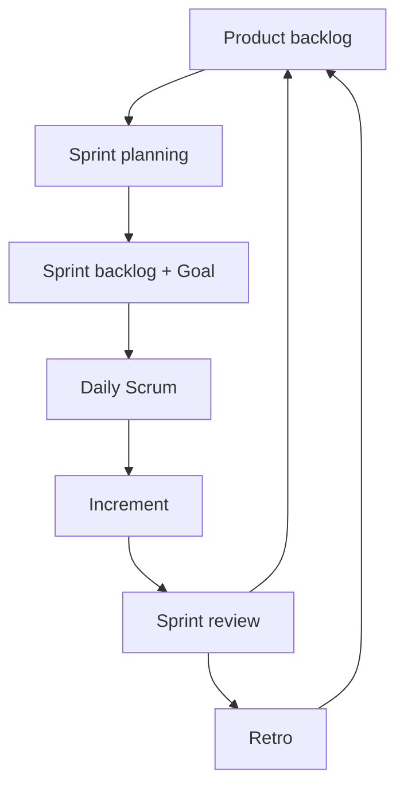

import { ConceptTemplate } from '@/features/kb/components/templates/ConceptTemplate'
import { Callout } from '@/features/kb/components/mdx/Callout'
import { ComparisonTable } from '@/features/kb/components/mdx/ComparisonTable'

export default function Layout({ children }) {
  return (
    <ConceptTemplate title="Scrum">
      {children}
    </ConceptTemplate>
  )
}

**Scrum** is a process framework from Schwaber and Sutherland. It does not tell you how to write tests. It tells you how a team inspects and adapts every sprint: plan, daily, review, retrospective, and a potentially releasable increment.

## 1. Deep Dive and Mechanics

**Roles.** Product Owner owns the backlog order and the value bet. Developers own how to build and the quality bar. Scrum Master owns the process and impediment removal — not people management by another name.

**Artifacts.** Product backlog, sprint backlog, increment. Each has a commitment: Product Goal, Sprint Goal, Definition of Done.

**Events.** Sprint (usually 1–4 weeks, closed box). Planning selects a Sprint Goal. Daily Scrum is a 15-minute sync for the developers, not a status theatre for managers. Review inspects the increment with stakeholders. Retro inspects the process.

**Done.** If it is not usable (tested, integrated), it is not an increment. “Dev complete” is not Done.

<Callout icon="warning" title="Zombie Scrum">
Ceremonies without a Sprint Goal, without a PO who can say no, and without a shippable increment are meetings wearing a Scrum sticker.
</Callout>

## 2. Mathematical / Theoretical Foundation

**Empirical process control.** Transparency, inspection, adaptation. Scrum assumes the problem is too complex for a predictive Gantt of tasks. The sprint is a sample interval.

**Sprint Goal as constraint.** Optimise for the goal, not for maximising story-point burn. Points are a capacity forecast, not a score.

**Stability.** Changing the sprint mid-flight destroys the experiment. Urgent work either waits, swaps with explicit PO trade, or tells you the sprint length is wrong (or you needed Kanban).

<ComparisonTable
  headers={['Element', 'Purpose', 'Anti-pattern']}
  rows={[
    ['Sprint Goal', 'One bet to protect', 'A shopping list of tickets'],
    ['Daily Scrum', 'Replan the next 24h', 'Round-robin status to a boss'],
    ['Review', 'Inspect the increment', 'Slide deck, no working software'],
    ['Retro', 'Change the system', 'Complaint session, no actions'],
  ]}
/>

## 3. Real-World Implementation

```text
Sprint Planning output
- Sprint Goal in one sentence
- Forecast of backlog items that serve that goal
- Definition of Done posted (tests, review, flag, docs)
- Unplanned capacity reserved if interrupt rate is known
```

If you cannot state the Sprint Goal without listing tickets, you planned a feature factory week.

## 4. Visualizations



## 5. Interview Prep

**Q: Scrum Master versus project manager?**
**A:** The SM serves the team and the framework. They do not assign tasks or own the Gantt. If they do, you have a PM titled SM.

**Q: Story points in a performance review?**
**A:** That ends Scrum. People game the numbers and stop pairing and helping. Measure outcomes and DORA, not personal burn.

**Q: Can one person be PO and SM?**
**A:** The Guide allows it in a pinch; it usually collapses into “the manager who also writes tickets.” Split when you can.

## 6. Production Use Cases

- **Product squads** with a real PO and a two-week demo to customers.
- **Regulated teams** that map sprint evidence to audit controls.
- **Scaled setups** (Nexus, LeSS) that keep Scrum at the team and add integration events — carefully.

<Callout icon="tip" title="Protect Done">
A weaker Done to look faster is how you grow a secret second sprint called “stabilise.” Keep Done honest.
</Callout>
