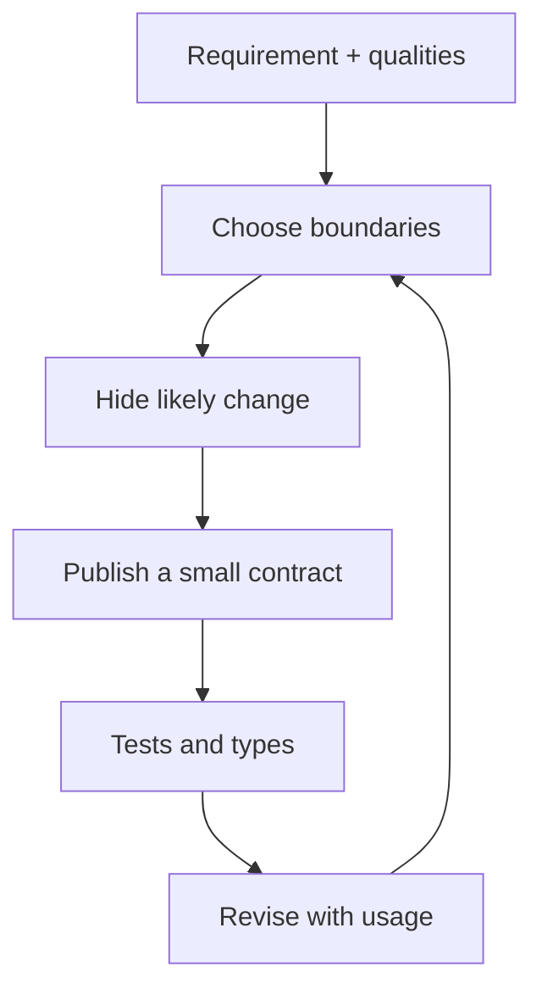

import { ConceptTemplate } from '@/features/kb/components/templates/ConceptTemplate'
import { Callout } from '@/features/kb/components/mdx/Callout'
import { ComparisonTable } from '@/features/kb/components/mdx/ComparisonTable'

export default function Layout({ children }) {
  return (
    <ConceptTemplate title="Software Design">
      {children}
    </ConceptTemplate>
  )
}

**Software design** sits between a requirement and a pile of files. It chooses boundaries, responsibilities, and invariants. Architecture is design at the scale of systems and teams; detailed design is types, functions, and schemas. Both are design.

## 1. Deep Dive and Mechanics

**Responsibilities.** What is this module allowed to know? Good design localises change: a pricing rule change should not require editing the HTTP layer and the email template.

**Interfaces.** Stable contracts (functions, events, tables) hide volatile guts. Design the interface for the caller, not as a dump of internals.

**Quality attributes.** Latency, safety, and evolvability are design inputs. A pretty class diagram that misses the SLO is incomplete.

**Iterative.** Big Design Up Front fails when the problem is unknown. You still sketch: ADRs, sequence diagrams, type sketches. Then you let tests and usage revise the sketch.

<Callout icon="info" title="Design is a conversation">
If only one person can explain why the boundary exists, the design is not yet a team artifact. Write the ADR.
</Callout>

## 2. Mathematical / Theoretical Foundation

**Information hiding (Parnas).** Modules should hide a design decision likely to change. The interface is the set of assumptions other modules may make. That is the theory behind encapsulation, not “use private fields.”

**Coupling and cohesion.** High cohesion, low coupling is a graph quality: dense internal edges, sparse external ones. Complexity metrics (cyclomatic, cognitive) are proxies, not goals.

**Types as design.** A type that cannot represent an illegal state shrinks the state space the rest of the program must consider.

<ComparisonTable
  headers={['Level', 'Question', 'Artifact']}
  rows={[
    ['Architecture', 'What are the deployable units?', 'Context and container diagrams'],
    ['Module design', 'What is hidden behind this API?', 'Package and types'],
    ['Detailed design', 'What are the invariants?', 'Functions, schemas, tests'],
    ['Incidental structure', 'What file was handy?', 'Accidental architecture'],
  ]}
/>

## 3. Real-World Implementation

```typescript
// Illegal states unrepresentable: a paid order cannot skip payment id
type Unpaid = { status: "unpaid" }
type Paid = { status: "paid"; paymentId: string }

type Order = Unpaid | Paid

function receipt(order: Paid): string {
  return order.paymentId
}
```

The compiler refuses `receipt` on an unpaid order. That is design, not decoration.

## 4. Visualizations



## 5. Interview Prep

**Q: Design versus architecture?**
**A:** Scale and consequence. Architecture is the decisions that are expensive to reverse (storage, team boundaries, consistency). Design includes those and the module-level choices.

**Q: How do you evaluate a design in an interview?**
**A:** Walk a change: new field, new channel, a spike in load. Count modules touched and failure modes. Good design keeps those lists short.

**Q: UML required?**
**A:** No. Boxes and arrows that name responsibilities are. Sequence diagrams earn their keep for protocols.

## 6. Production Use Cases

- **Greenfield** where an ADR set prevents six incompatible styles.
- **Brownfield** where you redesign a hotspot before adding the next feature.
- **API products** where the published types are the design customers buy.

<Callout icon="tip" title="Design for the next change you know">
YAGNI forbids imaginary plugins. It does not forbid a seam you already have two reasons to need.
</Callout>
