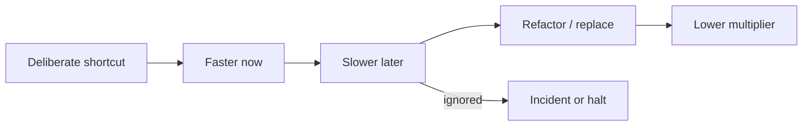

import { ConceptTemplate } from '@/features/kb/components/templates/ConceptTemplate'
import { Callout } from '@/features/kb/components/mdx/Callout'
import { ComparisonTable } from '@/features/kb/components/mdx/ComparisonTable'

export default function Layout({ children }) {
  return (
    <ConceptTemplate title="Technical Debt">
      {children}
    </ConceptTemplate>
  )
}

Ward Cunningham’s **technical debt** is a loan: you ship a design you know is incomplete to learn faster, and you repay by aligning the code with what you learned. It is not a slur for “code I dislike.” Reckless mess without a payoff plan is just mess.

## 1. Deep Dive and Mechanics

**Quadrant (Fowler).** Reckless versus prudent, deliberate versus inadvertent. Prudent deliberate debt is a conscious trade (“we will dual-write for one quarter”). Reckless inadvertent is incompetence that nobody scheduled to fix.

**Interest.** Extra time on every change, extra incidents, extra hiring ramp. If interest is near zero, it may not be debt worth paying.

**Visibility.** A debt register: item, owner, interest signal (churn, defects), repayment trigger. Invisible debt is how roadmaps lie.

**Repayment.** Refactor in the path of the next feature, scheduled campaigns, or stop-the-line when interest exceeds feature throughput.

<Callout icon="warning" title="Debt as an excuse">
Calling every cleanup technical debt empties the word. Reserve it for known gaps with a repayment story, not taste arguments.
</Callout>

## 2. Mathematical / Theoretical Foundation

**Interest rate.** Model extra effort as a multiplier m greater than 1 on changes that touch the indebted module. High-churn modules with high m dominate the portfolio — pay those first (hotspot analysis: churn × complexity).

**Option versus loan.** Some “ugly” code is a cheap option that never gets exercised; paying it is wasted. Debt that sits on the critical path is a high-rate loan.

**Principal.** The size of the rewrite. Sometimes you pay interest forever because principal (a full replace) exceeds remaining product life.

<ComparisonTable
  headers={['Kind', 'Intent', 'Payback']}
  rows={[
    ['Prudent deliberate', 'Ship to learn', 'Scheduled refactor'],
    ['Prudent inadvertent', 'We know better now', 'Redesign when touched'],
    ['Reckless deliberate', 'Ship without a plan', 'Crisis later'],
    ['Reckless inadvertent', 'Did not know', 'Training plus cleanup'],
  ]}
/>

## 3. Real-World Implementation

```markdown
# Debt item D-042
Module: billing/legacy_tax.py
Loan: hardcoded country table, copied into two services
Interest: four SEVs this year on rate changes
Trigger: next tax-year change OR any new country
Repayment: single rules service + characterisation tests
Owner: payments squad
```

Review this list in planning the same way you review features.

## 4. Visualizations



## 5. Interview Prep

**Q: Give an example of good technical debt.**
**A:** An in-memory store for an MVP with a written date to move to a real database after the first ten customers. Bad: copying production passwords into the repo to “just demo.”

**Q: How do you prioritise debt?**
**A:** Hotspots (churn × complexity), incident themes, and upcoming features that will pay interest immediately. Not a grand rewrite of the quiet module.

**Q: Is missing tests debt?**
**A:** Yes — high interest, because every change is unsafe. It is often the first principal to pay via characterisation.

## 6. Production Use Cases

- **Startup MVPs** that document the loan and the due date.
- **M&A codebases** with an explicit debt inventory before combining platforms.
- **Platform migrations** (monolith to services) treated as principal payments, not as a side hobby.

<Callout icon="tip" title="Put a date on the loan">
Undated debt is a gift to the next team. A calendar reminder or a failing TODO with a ticket is the minimum adult behaviour.
</Callout>
