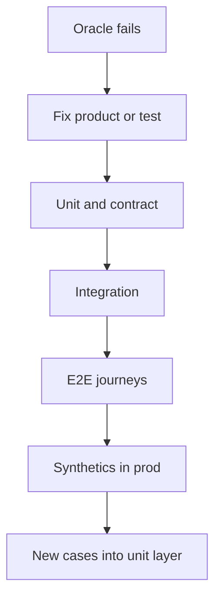

import { ConceptTemplate } from '@/features/kb/components/templates/ConceptTemplate'
import { Callout } from '@/features/kb/components/mdx/Callout'
import { ComparisonTable } from '@/features/kb/components/mdx/ComparisonTable'

export default function Layout({ children }) {
  return (
    <ConceptTemplate title="Testing">
      {children}
    </ConceptTemplate>
  )
}

**Testing** is designed criticism. You build oracles that can fail. A green bar that cannot fail is decoration. The craft is choosing what to test, at which layer, and how fast the signal returns.

## 1. Deep Dive and Mechanics

**Layers.** Unit tests pin domain rules in milliseconds. Integration tests pin adapters (DB, queues). Contract tests pin published APIs. End-to-end tests pin a few user journeys. Production tests (synthetics, canaries) pin reality.

**Risk-based.** Test the money path, authz, and migrations harder than the settings tooltip. Coverage percent is a hint, not a goal.

**Determinism.** Flakes train people to ignore red. Isolate time, randomness, and networks. Quarantine is a debt ticket, not a strategy.

**Pyramids and trophies.** Many fast tests, few slow ones. An inverted pyramid of UI clicks is a slow, brittle night watch.

<Callout icon="warning" title="Testing after it works">
Tests written when the feature is already “done” encode the implementation, not the requirement. Write the failing example first when you can.
</Callout>

## 2. Mathematical / Theoretical Foundation

**Fault versus failure.** A fault is a defect in the artifact; a failure is an incorrect observed behaviour. Tests sample the input space. Exhaustive testing is impossible for any interesting program (input space explosion).

**Partitioning.** Equivalence classes and boundary values raise the chance a sample hits a fault. Property-based tests sample many points from a specification.

**Coverage.** Statement coverage is necessary but weak; a branch can be taken without asserting the thing you care about. Mutation testing estimates whether assertions would catch a fault.

<ComparisonTable
  headers={['Layer', 'Speed', 'Best signal']}
  rows={[
    ['Unit / domain', 'ms', 'Rules and edges'],
    ['Integration', 'seconds', 'SQL, I/O, wiring'],
    ['Contract', 'seconds', 'API compatibility'],
    ['E2E / UI', 'minutes', 'A few golden paths'],
  ]}
/>

## 3. Real-World Implementation

```python
def tax_inclusive(net, rate):
    return round(net * (1 + rate), 2)

def test_de_vat():
    assert tax_inclusive(100.00, 0.19) == 119.00
```

One assertion, one rule. Do not hide this behind a 40-step Selenium script.

## 4. Visualizations



## 5. Interview Prep

**Q: How much coverage is enough?**
**A:** Enough that you will change the code. Critical modules want high branch coverage plus mutation or properties. Dead UI chrome does not.

**Q: Testing versus QA as a phase?**
**A:** QA as a late gate cannot save a design without tests. Modern QA designs strategy, charters exploratory work, and owns risk — not a week of clicking after code freeze.

**Q: Why are e2e tests flaky?**
**A:** Shared environments, timing, and too many moving parts. Keep them few and hermetic; push logic down.

## 6. Production Use Cases

- **Payments and identity** with property tests on invariants.
- **Public APIs** with consumer-driven contracts.
- **Continuous delivery** where the suite is the release gate.

<Callout icon="tip" title="Name the invariant">
If you cannot say what must stay true, you cannot write a good test. Write the sentence, then the assert.
</Callout>
