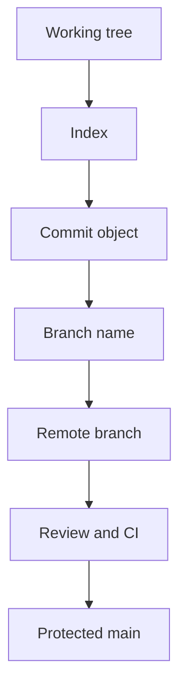

import { ConceptTemplate } from '@/features/kb/components/templates/ConceptTemplate'
import { Callout } from '@/features/kb/components/mdx/Callout'
import { ComparisonTable } from '@/features/kb/components/mdx/ComparisonTable'

export default function Layout({ children }) {
  return (
    <ConceptTemplate title="Version Control">
      {children}
    </ConceptTemplate>
  )
}

**Version control** records snapshots of a project so many people can edit without overwriting each other, and so you can explain or undo any change. Git dominates software; the ideas (history, branches, merges) predate it.

## 1. Deep Dive and Mechanics

**Snapshots, not diffs (Git).** A commit points to a tree of objects. History is a DAG. Branches are movable names. Tags are fixed names for releases.

**Collaboration.** Push and pull share objects. Pull requests add review. Conflicts are overlapping edits the tool cannot reconcile — humans merge meaning.

**Policy.** Protected main, signed commits for release tags, no force-push on shared branches. History is an audit log; rewriting published history is a social act.

**What belongs.** Source and config as code. Secrets do not. Generated artifacts usually do not. Large binaries need LFS or an artifact store.

<Callout icon="error" title="Force-push to main">
Rewriting the default branch breaks every clone, every bisect, and every release note. Recoverable with reflog on one laptop, catastrophic for the org.
</Callout>

## 2. Mathematical / Theoretical Foundation

**DAG.** Commits form a directed acyclic graph. Merge commits have multiple parents. Rebase replays commits, creating new nodes (new hashes) with similar diffs.

**Three-way merge.** Given base B and tips A and C, a merge compares A–B and C–B. Non-overlapping hunks apply; overlapping hunks conflict. Semantic conflicts (both compile, together wrong) are invisible to the algorithm.

**Content addressing.** Git object ids are hashes of content. Integrity is cryptographic; corruption or bit-flip is detectable.

<ComparisonTable
  headers={['Model', 'History', 'Typical use']}
  rows={[
    ['Git DVCS', 'Local full DAG', 'Almost all software'],
    ['Centralised (SVN)', 'Server is truth', 'Legacy enterprises'],
    ['Pessimistic lock', 'File checkout', 'Huge binaries'],
    ['Copy folders', 'Hope', 'How disasters start'],
  ]}
/>

## 3. Real-World Implementation

```bash
git switch -c fix/tax-rounding
# ... small commits with why in the body ...
git push -u origin HEAD
# open a PR; merge via the host so required checks run
```

Write commit messages for `git log` and bisect, not for yourself at 5pm.

## 4. Visualizations



## 5. Interview Prep

**Q: Merge versus rebase?**
**A:** Merge preserves the true DAG of integration. Rebase makes a linear story on a private branch. Never rebase commits other people have based work on.

**Q: What is HEAD?**
**A:** A pointer to the current commit (usually via a branch name). Detached HEAD is when you point at a raw commit.

**Q: How do you undo a bad commit on main?**
**A:** Revert (a new commit that inverts the diff) for public history. Reset only if the commit was never shared and policy allows.

## 6. Production Use Cases

- **Every team** — version control is not optional above toy scripts.
- **Compliance** using signed tags and protected branches as evidence.
- **Monorepos and polyrepos** that still share the same Git mechanics.

<Callout icon="tip" title="Commit the why">
The diff is the what. The message is the why. Six months later only the why is expensive to reconstruct.
</Callout>
