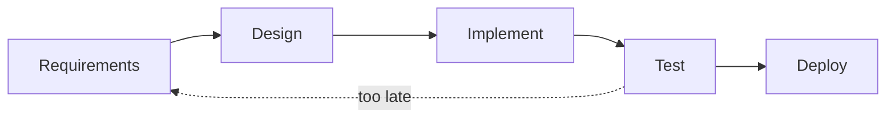

import { ConceptTemplate } from '@/features/kb/components/templates/ConceptTemplate'
import { Callout } from '@/features/kb/components/mdx/Callout'
import { ComparisonTable } from '@/features/kb/components/mdx/ComparisonTable'

export default function Layout({ children }) {
  return (
    <ConceptTemplate title="Waterfall">
      {children}
    </ConceptTemplate>
  )
}

**Waterfall** (often traced to a misreading of Royce 1970) schedules software as requirements, design, implement, test, deploy — each phase completing before the next. Royce actually warned that a single pass is risky. The industry heard the diagram.

## 1. Deep Dive and Mechanics

**Gates.** A signed requirements document unlocks design. A design review unlocks coding. A test plan unlocks QA. Change after a gate is a formal change request — expensive by design.

**Fit.** Hardware, construction-like contracts, and some safety-critical work have late change costs that dwarf software’s usual cheap compile cycle. Waterfall matches those economics if the spec is actually knowable.

**Failure mode.** When the spec is a guess, you discover the truth in system test — after most of the money is spent. Integration is a phase instead of a daily habit.

**Hybrids.** Many “waterfall” orgs run mini-waterfalls per release or sneak Agile inside a contractual waterfall wrapper (Agile on the inside, V-model documents on the outside).

<Callout icon="info" title="Royce drew arrows going back">
The famous paper includes iteration and the warning that the sequential model is “risky and invites failure.” Cite the paper, not the poster.
</Callout>

## 2. Mathematical / Theoretical Foundation

**Cost-of-change curve.** If fixing a requirements fault in production costs orders of magnitude more than fixing it in analysis (classic Boehm data for large contracted systems), heavy up-front analysis can be rational.

**Batch size.** Waterfall is one enormous batch. Variance in the estimate does not cancel; it stacks. Integration risk is back-loaded.

**V-model pairing.** Each left-side spec has a right-side test. That pairing is sound. Executing the whole left side before any right side is the gamble.

<ComparisonTable
  headers={['Property', 'Waterfall', 'Iterative']}
  rows={[
    ['Feedback', 'Late, at phase gates', 'Every increment'],
    ['Change', 'Formal, expensive', 'Expected'],
    ['Integration', 'A late phase', 'Continuous'],
    ['Contract fit', 'Fixed scope, fixed price', 'Outcome or time-and-materials'],
  ]}
/>

## 3. Real-World Implementation

```text
Gate packet (typical contracted waterfall)
- SRS signed by customer
- SDD and interface control documents
- Trace matrix: requirement to design to test
- Formal qualification test on a frozen build
- Change board for any post-sign-off edit
```

If your product is a website, this packet is usually theatre. If it is a flight computer, it is the job.

## 4. Visualizations



## 5. Interview Prep

**Q: When would you choose Waterfall?**
**A:** When the interface to the physical world is fixed, the regulator wants a frozen spec, and change really is that expensive. Not because “we are an enterprise.”

**Q: Waterfall versus Agile in one sentence?**
**A:** Waterfall bets the spec is right; Agile bets you will learn. Pick the bet that matches uncertainty.

**Q: What did Royce actually recommend?**
**A:** Do it twice if you can (a pilot), plan for iteration, and do not treat the sequential cartoon as sufficient.

## 6. Production Use Cases

- **Defence and avionics** with qualification on a frozen configuration.
- **Construction-adjacent software** (plant control) tied to physical commissioning dates.
- **Fixed-price government contracts** that still need internal iteration to survive.

<Callout icon="tip" title="Iterate inside the wrapper">
Even under a waterfall contract you can prototype, test vertically, and keep a living risk list. The documents can lag the learning — do not let them lead it blindly.
</Callout>
