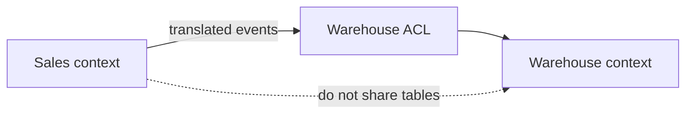

import { ConceptTemplate } from '@/features/kb/components/templates/ConceptTemplate'
import { Callout } from '@/features/kb/components/mdx/Callout'
import { ComparisonTable } from '@/features/kb/components/mdx/ComparisonTable'

export default function Layout({ children }) {
  return (
    <ConceptTemplate title="Bounded Contexts">
      {children}
    </ConceptTemplate>
  )
}

A **bounded context** is Evans’s name for a model’s validity region. Inside, “Order” has one meaning, one invariants, one team. Across the boundary you translate. You do not share one mega-model of the whole company.

## 1. Deep Dive and Mechanics

**Language first.** If Sales and Warehouse argue about what “shipped” means, you have two contexts, not a thesaurus problem. Draw the line where the dialect changes.

**Context map.** Relationships: partnership, customer/supplier, conformist, anti-corruption layer (ACL), shared kernel, separate ways, open-host service. The map is the integration architecture.

**Team alignment.** A context is a candidate service or module boundary. One team, one model, one database schema per context is the default. Shared tables across contexts are a covert shared kernel.

**Translation.** An ACL adapts another context’s model so their concepts do not leak into yours. Duplication of a field is cheaper than a false unification.

<Callout icon="warning" title="Enterprise-wide Customer table">
A single Customer entity used by billing, support, and marketing is how bounded contexts die. Those “customers” have different lifecycles and legal meanings.
</Callout>

## 2. Mathematical / Theoretical Foundation

**Partial models.** Each context is a homomorphism from a slice of the domain into software. There is no requirement that the models commute globally. Integration is a set of explicit mappings, not an identity.

**Consistency.** Invariants are closed inside the context. Cross-context rules are eventual and message-shaped, not a distributed transaction over one conceptual entity.

**Graph cut.** Good boundaries minimise translation traffic relative to internal cohesion — the same cut you want in any modularisation.

<ComparisonTable
  headers={['Relation', 'Coupling', 'Use when']}
  rows={[
    ['Anti-corruption layer', 'Low, translated', 'Legacy or another team'],
    ['Shared kernel', 'High', 'Tiny shared types, high trust'],
    ['Conformist', 'You adopt theirs', 'They will not change'],
    ['Separate ways', 'None', 'Integration is not worth it'],
  ]}
/>

## 3. Real-World Implementation

```typescript
// Warehouse context — "Order" means a pick list, not a commercial invoice
type PickOrder = {
  pickId: string
  skuQuantities: Array<[string, number]>
}

// Anti-corruption: Sales.OrderId is not our primary key
function fromSales(salesOrderId: string, lines: Array<[string, number]>): PickOrder {
  return { pickId: `wh-${salesOrderId}`, skuQuantities: lines }
}
```

Do not import Sales.Order into the warehouse module.

## 4. Visualizations



## 5. Interview Prep

**Q: Bounded context versus microservice?**
**A:** A context is a model boundary. A microservice is a deployable. They often align, but you can have several contexts in one modular monolith, or a badly split service that tears one context in half.

**Q: How do you find the boundaries?**
**A:** Event storming, language differences, and “who can change this rule?” If two groups cannot share a definition, do not share a type.

**Q: Is duplicate data always bad?**
**A:** Duplicate *meaning* is bad. Duplicate *columns* with a translator are normal at context edges.

## 6. Production Use Cases

- **After a merger** where two “Account” models must not be naively merged.
- **Modular monoliths** that keep schemas and packages per context.
- **Map before a microservices split** so you do not slice by technical layer.

<Callout icon="tip" title="Write the glossary per context">
A one-page dictionary per context beats a company-wide data model that nobody believes.
</Callout>
